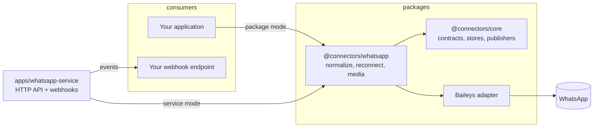

# connectors

Reusable, self-hosted integration connectors as TypeScript packages, with optional standalone services.

Each external system (WhatsApp today; Telegram, Gmail, Slack, Notion later) is implemented once as a package that speaks the shared contracts in `@connectors/core`. Any application can import the package directly, or run the thin HTTP service around it.



## Packages

| Path                      | Package                        | Purpose                                                                                                                            |
| ------------------------- | ------------------------------ | ---------------------------------------------------------------------------------------------------------------------------------- |
| `packages/core`           | `@connectors/core`             | Connector lifecycle, event contract, key-value storage (memory, filesystem), event publishers (webhook), errors, logging interface |
| `packages/config`         | `@connectors/config`           | Zod-based environment loading with readable errors                                                                                 |
| `packages/observability`  | `@connectors/observability`    | pino logger with default redaction of auth material and secrets                                                                    |
| `packages/whatsapp`       | `@connectors/whatsapp`         | Self-hosted WhatsApp connector (Baileys), normalized events, media download, text and media sending                                |
| `apps/whatsapp-service`   | `@connectors/whatsapp-service` | Small Fastify API around the connector with per-instance webhooks and Docker packaging                                             |
| `examples/whatsapp-basic` |                                | Package-mode walkthrough: pair, receive, download, reconnect                                                                       |

## Why packages, not product code

A connector knows how to talk to one external system: sessions, reconnects, message shapes, media. None of that depends on what a product does with the messages. Keeping connectors as packages means every product reuses the same tested code, product logic (AI, moderation, analytics) lives in the consumer, and the provider library (Baileys) can be replaced behind the package without touching consumers.

## Package mode vs service mode

**Package mode.** Import the connector and handle events in-process. Best when you control the runtime and want no extra network hop.

```ts
import { FileStore } from '@connectors/core';
import { createWhatsAppConnector } from '@connectors/whatsapp';

const connector = createWhatsAppConnector({
  accountId: 'main',
  storage: { auth: new FileStore('./data') },
});
connector.onPairing((p) => console.log(p));
connector.subscribe((event) => console.log(event.type, event.payload));
await connector.connect();
```

**Service mode.** Run `apps/whatsapp-service` (locally or via Docker), create instances over HTTP, receive events on a webhook. Best for polyglot stacks or when several apps share one WhatsApp account. See `docs/whatsapp-service-api.md`.

## Quick start

```bash
pnpm install
pnpm build
pnpm test
pnpm lint
pnpm dev        # watches packages and runs the service with tsx
```

Docker: `docker compose up --build` starts the service on port 3000 with auth state in `./data`.

## How WhatsApp pairing works

1. `connect()` opens a WhatsApp Web session with fresh keys.
2. WhatsApp sends QR payloads (refreshed every 20 to 60 seconds). The connector emits them through `onPairing`; you render them. With `pairing: { method: 'code', phoneNumber }` it requests an 8-character code instead.
3. After you link the device, WhatsApp closes the socket once with code 515. The connector reconnects immediately using the stored credentials.
4. From then on `connect()` resumes the session without a QR until you `logout()` or the phone unlinks the device (code 401), which clears the stored auth state.

## Persistence requirements

Only the authentication state must persist: credentials plus signal keys, written through the `KeyValueStore` you pass in. `FileStore` suits a single node; implement the same five methods over Redis, Postgres, S3 or a secrets manager for anything else. Messages and media are held in memory only; the connector never writes them.

## Privacy

The connector talks to WhatsApp and to destinations you configure, nothing else. No telemetry, crash reporting or hosted logging. The full data-flow table is in `docs/privacy.md`.

## Adding a connector

See `docs/adding-a-connector.md`. In short: a new `packages/<name>` implementing `Connector` plus `EventSource` and/or `Pollable`, an internal client adapter around the provider library, normalized events, and tests against a fake client.

## Testing

`pnpm test` runs every package with Vitest. No test contacts WhatsApp: the Baileys adapter is the only module importing the library and is replaced by a fake in tests.
