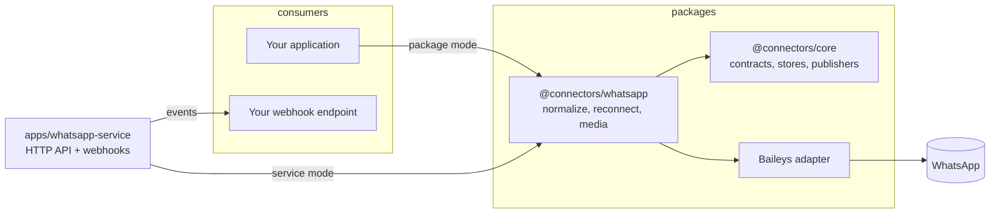

# Connectors Monorepo Implementation Plan

> **For agentic workers:** REQUIRED SUB-SKILL: Use superpowers:subagent-driven-development (recommended) or superpowers:executing-plans to implement this plan task-by-task. Steps use checkbox (`- [ ]`) syntax for tracking.

**Goal:** Build a pnpm/Turborepo TypeScript monorepo with a provider-neutral `@connectors/core`, a Baileys-backed `@connectors/whatsapp` connector, a Fastify standalone service with webhook delivery, a runnable example, tests and docs.

**Architecture:** `@connectors/core` holds contracts (lifecycle, events, storage, publishing, errors, logging) with zero runtime deps. `@connectors/whatsapp` implements those contracts and hides Baileys behind an internal `WhatsAppClient` interface so every unit test runs against a fake client. `apps/whatsapp-service` wraps the connector in a small HTTP API and forwards events to per-instance webhooks. Only auth state is persisted; message bodies and media stay in memory.

**Tech Stack:** Node >= 20 (dev on 26), TypeScript 6.0.3, pnpm 11, Turborepo 2.10, Vitest 4.1, ESLint 10 + typescript-eslint 8, Prettier 3, Zod 4.5, pino 10, Fastify 5.12, baileys 7.0.0-rc14, tsx, Docker.

**Spec:** `docs/superpowers/specs/2026-09-04-connectors-monorepo-design.md`

## Global Constraints

- ESM only everywhere: every `package.json` has `"type": "module"`; imports of local files use the `.js` extension (TypeScript `NodeNext`).
- Strict TypeScript: `strict`, `noUncheckedIndexedAccess`, `exactOptionalPropertyTypes`, `verbatimModuleSyntax` from `tsconfig.base.json`. Never add `// @ts-ignore`; use narrow casts with a comment when crossing the Baileys boundary.
- Only `packages/whatsapp/src/client/baileys-client.ts` may import `baileys`. Everything else in the WhatsApp package uses the structural types in `client/types.ts`.
- `@connectors/core` has no runtime dependencies. `@connectors/config` depends only on core and zod. `@connectors/observability` depends only on core, pino and pino-pretty.
- `@connectors/whatsapp` must not import anything from `apps/`.
- No network calls in tests. No real WhatsApp account. Webhook tests inject a fake `fetch`.
- Sensitive auth state must never be logged. Loggers passed to Baileys are children of the redacting logger at level `warn` by default.
- Nothing but auth state is written to storage by the connector. Media and message bodies are memory only unless the consumer writes them.
- Single version per third-party dependency across the workspace (pinned exact versions listed in Task 1).
- Prettier is the formatter of record: run `pnpm format` before `pnpm lint` in every task. Code in this plan is not guaranteed to be Prettier-formatted as typed.
- Every task ends with `pnpm typecheck`, the task's tests passing, `pnpm lint` clean, and a commit. Commit messages end with the two trailer lines shown in Task 1 Step 8.
- Package names: `@connectors/core`, `@connectors/config`, `@connectors/observability`, `@connectors/whatsapp`, `@connectors/whatsapp-service`, `@connectors/example-whatsapp-basic`.

---

## File Structure

```text
connectors/
  package.json                      root scripts, devDependencies
  pnpm-workspace.yaml               workspace globs + pnpm settings (overrides, peer rules)
  .npmrc
  turbo.json                        build/test/typecheck/dev/clean pipelines
  tsconfig.base.json                shared strict compiler options
  eslint.config.js                  flat config, type-aware
  .prettierrc  .prettierignore
  vitest.config.ts                  root: projects = packages/* and apps/*
  docker-compose.yml
  README.md
  docs/privacy.md  docs/adding-a-connector.md  docs/whatsapp-service-api.md
  packages/core/src/
    index.ts                        public exports
    errors.ts                       ConnectorError family, retryable helpers
    logger.ts                       Logger interface, noopLogger
    backoff.ts                      exponentialBackoff
    dedupe.ts                       EventDeduplicator (LRU + TTL)
    sleep.ts
    connector.ts                    Connector, EventSource, Pollable, guards
    status.ts                       ConnectorState/Status, healthFromStatus
    events.ts                       ConnectorEvent, buildEventId
    storage/store.ts                KeyValueStore, namespaced, jsonCodec, key validation
    storage/memory-store.ts
    storage/file-store.ts
    publishers/publisher.ts         EventPublisher
    publishers/webhook.ts           createWebhookPublisher
  packages/config/src/
    index.ts  load-config.ts  fields.ts
  packages/observability/src/
    index.ts  logger.ts  redact.ts
  packages/whatsapp/src/
    index.ts                        public exports only
    types.ts                        public types: options, message, media, pairing, events
    options.ts                      zod schema + resolveOptions
    errors.ts                       WhatsApp error classes + mapProviderError
    connector.ts                    WhatsAppConnectorImpl, createWhatsAppConnector, createConnectorWithClient
    send.ts                         chat id coercion
    client/types.ts                 WhatsAppClient, RawMessage, ClientEventMap, MediaDescriptor, AuthStore
    client/emitter.ts               TypedEmitter
    client/baileys-client.ts        BaileysClient (only Baileys importer)
    auth/serializer.ts              Buffer-aware JSON encode/decode
    auth/auth-state.ts              createAuthStore(KeyValueStore)
    connection/disconnect-reason.ts policyFor(statusCode)
    connection/state-machine.ts     ConnectionManager
    normalize/jid.ts
    normalize/message.ts
    media/descriptor.ts             extractMediaDescriptor(raw)
    media/cache.ts                  RawMessageCache (LRU + TTL)
    media/download.ts               resolve + stream + reupload retry + file helper
    testing/fake-client.ts          FakeWhatsAppClient (excluded from build)
  apps/whatsapp-service/src/
    index.ts  config.ts  server.ts  errors.ts  auth-hook.ts
    instance.ts  instance-manager.ts  publishers.ts
    routes/health.ts  routes/instances.ts  routes/messages.ts  routes/media.ts
    testing/fake-connector.ts       (excluded from build)
  apps/whatsapp-service/Dockerfile
  examples/whatsapp-basic/src/main.ts  README.md
```

---

### Task 1: Monorepo scaffold with a smoke-tested core package

**Files:**
- Create: `package.json`, `pnpm-workspace.yaml`, `.npmrc`, `turbo.json`, `tsconfig.base.json`, `tsconfig.json`, `eslint.config.js`, `.prettierrc`, `.prettierignore`, `vitest.config.ts`
- Create: `packages/core/package.json`, `packages/core/tsconfig.json`, `packages/core/tsconfig.build.json`, `packages/core/vitest.config.ts`, `packages/core/src/index.ts`, `packages/core/src/sleep.ts`, `packages/core/src/sleep.test.ts`

**Interfaces:**
- Produces: `sleep(ms: number, signal?: AbortSignal): Promise<void>` exported from `@connectors/core`; the package template every later package copies.

- [ ] **Step 1: Write root workspace files**

`package.json`:

```json
{
  "name": "connectors",
  "private": true,
  "type": "module",
  "packageManager": "pnpm@11.0.8",
  "engines": { "node": ">=20" },
  "scripts": {
    "build": "turbo run build",
    "test": "turbo run test",
    "typecheck": "turbo run typecheck",
    "dev": "turbo run dev",
    "lint": "eslint . && prettier --check .",
    "format": "prettier --write .",
    "clean": "turbo run clean"
  },
  "devDependencies": {
    "@types/node": "26.4.1",
    "eslint": "10.10.0",
    "eslint-config-prettier": "10.1.8",
    "prettier": "3.9.6",
    "turbo": "2.10.12",
    "typescript": "6.0.3",
    "typescript-eslint": "8.69.0",
    "vitest": "4.1.11"
  }
}
```

`pnpm-workspace.yaml`:

```yaml
packages:
  - 'packages/*'
  - 'apps/*'
  - 'examples/*'

autoInstallPeers: false
peerDependencyRules:
  ignoreMissing:
    - sharp
    - jimp
    - audio-decode
    - link-preview-js
onlyBuiltDependencies:
  - baileys
overrides:
  zod: 4.5.4
  pino: 10.3.1
```

`.npmrc`:

```ini
engine-strict=true
```

`turbo.json`:

```json
{
  "$schema": "https://turbo.build/schema.json",
  "tasks": {
    "build": { "dependsOn": ["^build"], "outputs": ["dist/**"] },
    "typecheck": { "dependsOn": ["^build"] },
    "test": { "dependsOn": ["^build"] },
    "dev": { "cache": false, "persistent": true },
    "clean": { "cache": false }
  }
}
```

`tsconfig.base.json`:

```json
{
  "compilerOptions": {
    "target": "ES2022",
    "lib": ["ES2022"],
    "module": "NodeNext",
    "moduleResolution": "NodeNext",
    "strict": true,
    "noUncheckedIndexedAccess": true,
    "exactOptionalPropertyTypes": true,
    "noImplicitOverride": true,
    "noFallthroughCasesInSwitch": true,
    "verbatimModuleSyntax": true,
    "isolatedModules": true,
    "esModuleInterop": true,
    "skipLibCheck": true,
    "declaration": true,
    "declarationMap": true,
    "sourceMap": true,
    "types": ["node"]
  }
}
```

`eslint.config.js`:

```js
import { defineConfig } from 'eslint/config';
import tseslint from 'typescript-eslint';
import prettier from 'eslint-config-prettier';

export default defineConfig(
  { ignores: ['**/dist/**', '**/node_modules/**', '**/.turbo/**', '**/data/**', '**/downloads/**'] },
  {
    files: ['**/*.ts'],
    extends: [tseslint.configs.recommendedTypeChecked],
    languageOptions: {
      parserOptions: { projectService: true, tsconfigRootDir: import.meta.dirname },
    },
    rules: {
      '@typescript-eslint/consistent-type-imports': ['error', { prefer: 'type-imports' }],
      '@typescript-eslint/no-floating-promises': 'error',
      '@typescript-eslint/no-unused-vars': ['error', { argsIgnorePattern: '^_' }],
    },
  },
  { files: ['**/*.js', '**/*.mjs'], extends: [tseslint.configs.disableTypeChecked] },
  prettier,
);
```

`.prettierrc`:

```json
{ "singleQuote": true, "printWidth": 100, "trailingComma": "all" }
```

`.prettierignore`:

```text
dist
node_modules
.turbo
pnpm-lock.yaml
data
downloads
docs/superpowers
```

`tsconfig.json` (root; only so ESLint's project service can type-check the root `vitest.config.ts`):

```json
{
  "extends": "./tsconfig.base.json",
  "compilerOptions": { "noEmit": true },
  "include": ["vitest.config.ts"]
}
```

`vitest.config.ts`:

```ts
import { defineConfig } from 'vitest/config';

export default defineConfig({
  test: {
    projects: ['packages/*', 'apps/*'],
  },
});
```

- [ ] **Step 2: Create the core package skeleton**

`packages/core/package.json`:

```json
{
  "name": "@connectors/core",
  "version": "0.1.0",
  "description": "Shared contracts for connectors: lifecycle, events, storage, publishing, errors, logging",
  "type": "module",
  "license": "MIT",
  "engines": { "node": ">=20" },
  "exports": {
    ".": { "types": "./dist/index.d.ts", "import": "./dist/index.js" }
  },
  "files": ["dist"],
  "scripts": {
    "build": "tsc -p tsconfig.build.json",
    "dev": "tsc -p tsconfig.build.json --watch --preserveWatchOutput",
    "typecheck": "tsc -p tsconfig.json --noEmit",
    "test": "vitest run",
    "clean": "rm -rf dist .turbo"
  }
}
```

`packages/core/tsconfig.json` (editor, tests and lint; no `rootDir` because `vitest.config.ts` sits outside `src`):

```json
{
  "extends": "../../tsconfig.base.json",
  "compilerOptions": { "noEmit": true },
  "include": ["src/**/*.ts", "vitest.config.ts"]
}
```

`packages/core/tsconfig.build.json`:

```json
{
  "extends": "../../tsconfig.base.json",
  "compilerOptions": { "rootDir": "src", "outDir": "dist" },
  "include": ["src/**/*.ts"],
  "exclude": ["src/**/*.test.ts", "src/testing/**"]
}
```

`packages/core/vitest.config.ts`:

```ts
import { defineConfig } from 'vitest/config';

export default defineConfig({
  test: { include: ['src/**/*.test.ts'] },
});
```

- [ ] **Step 3: Write the failing smoke test**

`packages/core/src/sleep.test.ts`:

```ts
import { describe, expect, it, vi } from 'vitest';
import { sleep } from './sleep.js';

describe('sleep', () => {
  it('resolves after the given delay', async () => {
    vi.useFakeTimers();
    const done = vi.fn();
    void sleep(100).then(done);
    await vi.advanceTimersByTimeAsync(99);
    expect(done).not.toHaveBeenCalled();
    await vi.advanceTimersByTimeAsync(1);
    expect(done).toHaveBeenCalled();
    vi.useRealTimers();
  });

  it('rejects when the signal aborts', async () => {
    const controller = new AbortController();
    const promise = sleep(10_000, controller.signal);
    controller.abort();
    await expect(promise).rejects.toThrow('aborted');
  });
});
```

- [ ] **Step 4: Install and run the test to see it fail**

Run: `pnpm install && pnpm --filter @connectors/core test`
Expected: install succeeds without peer warnings about sharp; the test FAILS with "Cannot find module './sleep.js'".

- [ ] **Step 5: Implement sleep and the index**

`packages/core/src/sleep.ts`:

```ts
export function sleep(ms: number, signal?: AbortSignal): Promise<void> {
  return new Promise((resolve, reject) => {
    if (signal?.aborted) {
      reject(new Error('sleep aborted'));
      return;
    }
    const onAbort = () => {
      clearTimeout(timer);
      reject(new Error('sleep aborted'));
    };
    const timer = setTimeout(() => {
      signal?.removeEventListener('abort', onAbort);
      resolve();
    }, ms);
    signal?.addEventListener('abort', onAbort, { once: true });
  });
}
```

`packages/core/src/index.ts`:

```ts
export { sleep } from './sleep.js';
```

- [ ] **Step 6: Run the whole toolchain**

Run: `pnpm build && pnpm test && pnpm typecheck && pnpm lint`
Expected: all four succeed; `packages/core/dist/index.js` and `index.d.ts` exist.

- [ ] **Step 7: Verify the ESM/exports boundary**

Run: `node -e "import('@connectors/core').then(m => console.log(Object.keys(m)))" --input-type=module` from `packages/core` (or `node --input-type=module -e "..."`).
Expected: prints `[ 'sleep' ]`.

- [ ] **Step 8: Commit**

```bash
git add -A
git commit -m "chore: scaffold pnpm/turbo monorepo with core package

Co-Authored-By: Claude Fable 5.1 <noreply@anthropic.com>
Claude-Session: https://claude.ai/code/session_01UjULQEvZegHS99tGo4BBDk"
```

---

### Task 2: Core errors, logger, backoff and deduplicator

**Files:**
- Create: `packages/core/src/errors.ts`, `packages/core/src/errors.test.ts`, `packages/core/src/logger.ts`, `packages/core/src/backoff.ts`, `packages/core/src/backoff.test.ts`, `packages/core/src/dedupe.ts`, `packages/core/src/dedupe.test.ts`
- Modify: `packages/core/src/index.ts`

**Interfaces:**
- Produces:
  - `class ConnectorError extends Error { code: string; retryable: boolean; details?: Record<string, unknown> }` with constructor `(message, { code, retryable, cause?, details? })`
  - `class AuthError`, `class ConfigError`, `class PublishError` (all non-retryable)
  - `retryable(message, code, cause?)`, `nonRetryable(message, code, cause?)`, `isRetryable(err: unknown): boolean`
  - `interface Logger { debug|info|warn|error(obj: Record<string, unknown>, msg?: string): void; (msg: string): void; child(bindings): Logger }`, `noopLogger`
  - `exponentialBackoff(policy?: BackoffPolicy): Backoff` where `Backoff = { delayFor(attempt: number): number }` (attempt is 1-based)
  - `class EventDeduplicator { constructor(options?: { maxEntries?, ttlMs?, now? }); isDuplicate(id: string): boolean; readonly size: number }`

- [ ] **Step 1: Write failing tests**

`packages/core/src/errors.test.ts`:

```ts
import { describe, expect, it } from 'vitest';
import { AuthError, ConfigError, ConnectorError, isRetryable, nonRetryable, retryable } from './errors.js';

describe('ConnectorError', () => {
  it('carries code, retryable and cause', () => {
    const cause = new Error('boom');
    const err = new ConnectorError('failed', { code: 'X', retryable: true, cause });
    expect(err.message).toBe('failed');
    expect(err.code).toBe('X');
    expect(err.retryable).toBe(true);
    expect(err.cause).toBe(cause);
    expect(err.name).toBe('ConnectorError');
    expect(err).toBeInstanceOf(Error);
  });

  it('subclasses default their codes and are non-retryable', () => {
    expect(new AuthError('need pairing').code).toBe('AUTH_REQUIRED');
    expect(new AuthError('bad', { code: 'BAD_SESSION' }).code).toBe('BAD_SESSION');
    expect(new AuthError('x').retryable).toBe(false);
    expect(new ConfigError('x').code).toBe('CONFIG_INVALID');
    expect(new AuthError('x').name).toBe('AuthError');
  });

  it('helpers build errors and isRetryable inspects them', () => {
    expect(isRetryable(retryable('a', 'A'))).toBe(true);
    expect(isRetryable(nonRetryable('b', 'B'))).toBe(false);
    expect(isRetryable(new Error('plain'))).toBe(false);
    expect(isRetryable(undefined)).toBe(false);
  });
});
```

`packages/core/src/backoff.test.ts`:

```ts
import { describe, expect, it } from 'vitest';
import { exponentialBackoff } from './backoff.js';

describe('exponentialBackoff', () => {
  it('grows by factor and caps at maxMs (no jitter)', () => {
    const b = exponentialBackoff({ initialMs: 100, maxMs: 1000, factor: 2, jitter: 0 });
    expect([1, 2, 3, 4, 5].map((n) => b.delayFor(n))).toEqual([100, 200, 400, 800, 1000]);
  });

  it('applies bounded jitter', () => {
    const low = exponentialBackoff({ initialMs: 100, jitter: 0.5, random: () => 0 });
    const high = exponentialBackoff({ initialMs: 100, jitter: 0.5, random: () => 1 });
    const mid = exponentialBackoff({ initialMs: 100, jitter: 0.5, random: () => 0.5 });
    expect(low.delayFor(1)).toBe(50);
    expect(high.delayFor(1)).toBe(150);
    expect(mid.delayFor(1)).toBe(100);
  });

  it('never exceeds maxMs even with jitter', () => {
    const b = exponentialBackoff({ initialMs: 1000, maxMs: 1000, jitter: 0.5, random: () => 1 });
    expect(b.delayFor(10)).toBe(1000);
  });
});
```

`packages/core/src/dedupe.test.ts`:

```ts
import { describe, expect, it } from 'vitest';
import { EventDeduplicator } from './dedupe.js';

describe('EventDeduplicator', () => {
  it('reports the first sight as new and later sights as duplicates', () => {
    const d = new EventDeduplicator();
    expect(d.isDuplicate('a')).toBe(false);
    expect(d.isDuplicate('a')).toBe(true);
    expect(d.isDuplicate('b')).toBe(false);
  });

  it('expires entries after ttlMs', () => {
    let now = 0;
    const d = new EventDeduplicator({ ttlMs: 100, now: () => now });
    expect(d.isDuplicate('a')).toBe(false);
    now = 99;
    expect(d.isDuplicate('a')).toBe(true);
    now = 250;
    expect(d.isDuplicate('a')).toBe(false);
  });

  it('evicts the least recently seen entry beyond maxEntries', () => {
    const d = new EventDeduplicator({ maxEntries: 2 });
    d.isDuplicate('a');
    d.isDuplicate('b');
    d.isDuplicate('a'); // refresh a, b is now oldest
    d.isDuplicate('c'); // evicts b
    expect(d.size).toBe(2);
    expect(d.isDuplicate('b')).toBe(false);
    expect(d.isDuplicate('a')).toBe(true);
  });
});
```

- [ ] **Step 2: Run tests to verify they fail**

Run: `pnpm --filter @connectors/core test`
Expected: FAIL, modules not found.

- [ ] **Step 3: Implement**

`packages/core/src/errors.ts`:

```ts
export interface ConnectorErrorOptions {
  code: string;
  retryable: boolean;
  cause?: unknown;
  details?: Record<string, unknown>;
}

export class ConnectorError extends Error {
  readonly code: string;
  readonly retryable: boolean;
  readonly details: Record<string, unknown> | undefined;

  constructor(message: string, options: ConnectorErrorOptions) {
    super(message, options.cause === undefined ? undefined : { cause: options.cause });
    this.name = new.target.name;
    this.code = options.code;
    this.retryable = options.retryable;
    this.details = options.details;
  }
}

type SubclassOptions = Partial<Omit<ConnectorErrorOptions, 'retryable'>>;

export class AuthError extends ConnectorError {
  constructor(message: string, options: SubclassOptions = {}) {
    super(message, { ...options, code: options.code ?? 'AUTH_REQUIRED', retryable: false });
  }
}

export class ConfigError extends ConnectorError {
  constructor(message: string, options: SubclassOptions = {}) {
    super(message, { ...options, code: options.code ?? 'CONFIG_INVALID', retryable: false });
  }
}

export class PublishError extends ConnectorError {
  constructor(message: string, options: SubclassOptions = {}) {
    super(message, { ...options, code: options.code ?? 'PUBLISH_FAILED', retryable: false });
  }
}

export function retryable(message: string, code: string, cause?: unknown): ConnectorError {
  return new ConnectorError(message, { code, retryable: true, cause });
}

export function nonRetryable(message: string, code: string, cause?: unknown): ConnectorError {
  return new ConnectorError(message, { code, retryable: false, cause });
}

export function isRetryable(err: unknown): boolean {
  return err instanceof ConnectorError && err.retryable;
}
```

`packages/core/src/logger.ts`:

```ts
export interface LogFn {
  (obj: Record<string, unknown>, msg?: string): void;
  (msg: string): void;
}

export interface Logger {
  debug: LogFn;
  info: LogFn;
  warn: LogFn;
  error: LogFn;
  child(bindings: Record<string, unknown>): Logger;
}

const noop: LogFn = () => undefined;

export const noopLogger: Logger = {
  debug: noop,
  info: noop,
  warn: noop,
  error: noop,
  child: () => noopLogger,
};
```

`packages/core/src/backoff.ts`:

```ts
export interface BackoffPolicy {
  initialMs?: number;
  maxMs?: number;
  factor?: number;
  /** Fraction of the delay used as +/- jitter, 0..1. */
  jitter?: number;
  random?: () => number;
}

export interface Backoff {
  /** Delay in ms before the given 1-based attempt. */
  delayFor(attempt: number): number;
}

export function exponentialBackoff(policy: BackoffPolicy = {}): Backoff {
  const initial = policy.initialMs ?? 1000;
  const max = policy.maxMs ?? 60_000;
  const factor = policy.factor ?? 2;
  const jitter = policy.jitter ?? 0.2;
  const random = policy.random ?? Math.random;
  return {
    delayFor(attempt) {
      const exponent = Math.max(0, attempt - 1);
      const base = Math.min(max, initial * factor ** exponent);
      const spread = base * jitter;
      const jittered = base - spread + random() * 2 * spread;
      return Math.min(max, Math.round(jittered));
    },
  };
}
```

`packages/core/src/dedupe.ts`:

```ts
export interface EventDeduplicatorOptions {
  maxEntries?: number;
  ttlMs?: number;
  now?: () => number;
}

/** Bounded LRU set with TTL. No timers; expiry is checked on access. */
export class EventDeduplicator {
  private readonly entries = new Map<string, number>();
  private readonly maxEntries: number;
  private readonly ttlMs: number;
  private readonly now: () => number;

  constructor(options: EventDeduplicatorOptions = {}) {
    this.maxEntries = options.maxEntries ?? 5000;
    this.ttlMs = options.ttlMs ?? 10 * 60_000;
    this.now = options.now ?? Date.now;
  }

  /** Records the id. Returns false the first time it is seen within the TTL, true afterwards. */
  isDuplicate(id: string): boolean {
    const now = this.now();
    const expiresAt = this.entries.get(id);
    if (expiresAt !== undefined) {
      this.entries.delete(id);
      if (expiresAt > now) {
        this.entries.set(id, now + this.ttlMs);
        return true;
      }
    }
    this.entries.set(id, now + this.ttlMs);
    while (this.entries.size > this.maxEntries) {
      const oldest = this.entries.keys().next().value;
      if (oldest === undefined) break;
      this.entries.delete(oldest);
    }
    return false;
  }

  get size(): number {
    return this.entries.size;
  }
}
```

Append to `packages/core/src/index.ts`:

```ts
export {
  AuthError,
  ConfigError,
  ConnectorError,
  PublishError,
  isRetryable,
  nonRetryable,
  retryable,
} from './errors.js';
export type { ConnectorErrorOptions } from './errors.js';
export { noopLogger } from './logger.js';
export type { LogFn, Logger } from './logger.js';
export { exponentialBackoff } from './backoff.js';
export type { Backoff, BackoffPolicy } from './backoff.js';
export { EventDeduplicator } from './dedupe.js';
export type { EventDeduplicatorOptions } from './dedupe.js';
```

- [ ] **Step 4: Run tests, typecheck, lint**

Run: `pnpm --filter @connectors/core test && pnpm typecheck && pnpm lint`
Expected: all PASS.

- [ ] **Step 5: Commit**

```bash
git add packages/core
git commit -m "feat(core): errors, logger, backoff and deduplicator

Co-Authored-By: Claude Fable 5.1 <noreply@anthropic.com>
Claude-Session: https://claude.ai/code/session_01UjULQEvZegHS99tGo4BBDk"
```

---

### Task 3: Core contracts and in-memory storage

**Files:**
- Create: `packages/core/src/connector.ts`, `packages/core/src/status.ts`, `packages/core/src/status.test.ts`, `packages/core/src/events.ts`, `packages/core/src/events.test.ts`, `packages/core/src/storage/store.ts`, `packages/core/src/storage/store.test.ts`, `packages/core/src/storage/memory-store.ts`, `packages/core/src/storage/memory-store.test.ts`, `packages/core/src/storage/store-contract.ts`
- Modify: `packages/core/src/index.ts`

**Interfaces:**
- Produces:
  - `interface Connector { name; accountId; connect(); disconnect(); getStatus(): Promise<ConnectorStatus> }`, `EventSource<E>`, `Pollable<E>`, `type Unsubscribe = () => void`, `isEventSource`, `isPollable`
  - `type ConnectorState`, `interface ConnectorStatus { state; since: Date; lastError?: { code; message; retryable; at: Date }; detail?: Record<string, unknown> }`, `healthFromStatus(status): HealthState`
  - `interface ConnectorEvent<T> { id; connector; accountId; externalId; type; timestamp: Date; receivedAt: Date; payload: T; raw?: unknown }`, `buildEventId({ connector, accountId, type, externalId }): string`
  - `interface KeyValueStore { get; set; delete; list(prefix); clear(prefix) }`, `SecretStore`, `StateStore`, `namespaced(store, prefix)`, `jsonCodec`, `assertValidKey(key)`, `MemoryStore`
  - `runStoreContractTests(name, factory)` in `storage/store-contract.ts` (test helper reused by FileStore tests)

- [ ] **Step 1: Write failing tests**

`packages/core/src/status.test.ts`:

```ts
import { describe, expect, it } from 'vitest';
import { healthFromStatus } from './status.js';

describe('healthFromStatus', () => {
  const at = new Date();
  it.each([
    ['connected', 'healthy'],
    ['connecting', 'degraded'],
    ['pairing', 'degraded'],
    ['reconnecting', 'degraded'],
    ['disconnected', 'unhealthy'],
    ['logged_out', 'unhealthy'],
  ] as const)('%s -> %s', (state, health) => {
    expect(healthFromStatus({ state, since: at })).toBe(health);
  });
});
```

`packages/core/src/events.test.ts`:

```ts
import { describe, expect, it } from 'vitest';
import { buildEventId } from './events.js';

describe('buildEventId', () => {
  it('joins connector, account, type and external id', () => {
    expect(
      buildEventId({ connector: 'whatsapp', accountId: 'a1', type: 'message.received', externalId: 'X' }),
    ).toBe('whatsapp:a1:message.received:X');
  });
});
```

`packages/core/src/storage/store-contract.ts` (shared contract, not a test file itself):

```ts
import { describe, expect, it } from 'vitest';
import type { KeyValueStore } from './store.js';

export function runStoreContractTests(
  name: string,
  factory: () => Promise<KeyValueStore> | KeyValueStore,
): void {
  describe(`${name} contract`, () => {
    it('returns undefined for missing keys', async () => {
      const store = await factory();
      expect(await store.get('missing')).toBeUndefined();
    });

    it('round-trips binary values', async () => {
      const store = await factory();
      const bytes = new Uint8Array([0, 1, 2, 255, 128]);
      await store.set('a/b', bytes);
      expect(Buffer.from((await store.get('a/b')) ?? [])).toEqual(Buffer.from(bytes));
    });

    it('overwrites and deletes', async () => {
      const store = await factory();
      await store.set('k', new Uint8Array([1]));
      await store.set('k', new Uint8Array([2]));
      expect(await store.get('k')).toEqual(new Uint8Array([2]));
      await store.delete('k');
      expect(await store.get('k')).toBeUndefined();
      await store.delete('k'); // idempotent
    });

    it('lists keys by prefix and clears by prefix', async () => {
      const store = await factory();
      await store.set('auth/creds', new Uint8Array([1]));
      await store.set('auth/keys/pre-key/1', new Uint8Array([1]));
      await store.set('auth/keys/session/x@y', new Uint8Array([1]));
      await store.set('other/thing', new Uint8Array([1]));
      expect((await store.list('auth/')).sort()).toEqual([
        'auth/creds',
        'auth/keys/pre-key/1',
        'auth/keys/session/x@y',
      ]);
      expect((await store.list('auth/keys/')).sort()).toEqual([
        'auth/keys/pre-key/1',
        'auth/keys/session/x@y',
      ]);
      await store.clear('auth/keys/');
      expect((await store.list('auth/')).sort()).toEqual(['auth/creds']);
      expect(await store.get('other/thing')).toBeDefined();
      await store.clear('');
      expect(await store.list('')).toEqual([]);
    });

    it('handles keys with special characters in segments', async () => {
      const store = await factory();
      const key = 'keys/sender-key/1234@g.us::5551234:1/weird %20 .. name';
      await store.set(key, new Uint8Array([7]));
      expect(await store.get(key)).toEqual(new Uint8Array([7]));
      expect(await store.list('keys/')).toEqual([key]);
    });

    it('rejects invalid keys', async () => {
      const store = await factory();
      await expect(store.set('', new Uint8Array())).rejects.toThrow('Invalid store key');
      await expect(store.set('/leading', new Uint8Array())).rejects.toThrow('Invalid store key');
      await expect(store.set('a//b', new Uint8Array())).rejects.toThrow('Invalid store key');
      await expect(store.get('trailing/')).rejects.toThrow('Invalid store key');
    });
  });
}
```

`packages/core/src/storage/memory-store.test.ts`:

```ts
import { MemoryStore } from './memory-store.js';
import { runStoreContractTests } from './store-contract.js';

runStoreContractTests('MemoryStore', () => new MemoryStore());
```

`packages/core/src/storage/store.test.ts`:

```ts
import { describe, expect, it } from 'vitest';
import { MemoryStore } from './memory-store.js';
import { jsonCodec, namespaced } from './store.js';

describe('namespaced', () => {
  it('prefixes keys and strips the prefix on list', async () => {
    const base = new MemoryStore();
    const ns = namespaced(base, 'instances/abc');
    await ns.set('auth/creds', new Uint8Array([1]));
    expect(await base.get('instances/abc/auth/creds')).toEqual(new Uint8Array([1]));
    expect(await ns.list('')).toEqual(['auth/creds']);
    expect(await ns.list('auth/')).toEqual(['auth/creds']);
    await base.set('instances/other/x', new Uint8Array([2]));
    expect(await ns.list('')).toEqual(['auth/creds']);
    await ns.clear('');
    expect(await base.list('')).toEqual(['instances/other/x']);
  });

  it('nests', async () => {
    const base = new MemoryStore();
    const inner = namespaced(namespaced(base, 'a'), 'b');
    await inner.set('c', new Uint8Array([1]));
    expect(await base.list('')).toEqual(['a/b/c']);
  });
});

describe('jsonCodec', () => {
  it('round-trips JSON values as UTF-8 bytes', () => {
    const bytes = jsonCodec.encode({ a: 1, b: 'ü' });
    expect(bytes).toBeInstanceOf(Uint8Array);
    expect(jsonCodec.decode<{ a: number; b: string }>(bytes)).toEqual({ a: 1, b: 'ü' });
  });
});
```

- [ ] **Step 2: Run tests to verify they fail**

Run: `pnpm --filter @connectors/core test`
Expected: FAIL, modules not found.

- [ ] **Step 3: Implement**

`packages/core/src/connector.ts`:

```ts
import type { ConnectorEvent } from './events.js';
import type { ConnectorStatus } from './status.js';

export type Unsubscribe = () => void;

export interface Connector {
  readonly name: string;
  readonly accountId: string;
  connect(): Promise<void>;
  disconnect(): Promise<void>;
  getStatus(): Promise<ConnectorStatus>;
}

export type EventHandler<E> = (event: E) => void | Promise<void>;

/** Push-based connectors emit events as they arrive. */
export interface EventSource<E extends ConnectorEvent = ConnectorEvent> {
  subscribe(handler: EventHandler<E>): Unsubscribe;
}

/** Pull-based connectors return whatever is new when asked. */
export interface Pollable<E extends ConnectorEvent = ConnectorEvent> {
  poll(): Promise<E[]>;
}

export function isEventSource(c: Connector): c is Connector & EventSource {
  return typeof (c as Partial<EventSource>).subscribe === 'function';
}

export function isPollable(c: Connector): c is Connector & Pollable {
  return typeof (c as Partial<Pollable>).poll === 'function';
}
```

`packages/core/src/status.ts`:

```ts
export type ConnectorState =
  | 'disconnected'
  | 'connecting'
  | 'pairing'
  | 'connected'
  | 'reconnecting'
  | 'logged_out';

export interface StatusError {
  code: string;
  message: string;
  retryable: boolean;
  at: Date;
}

export interface ConnectorStatus {
  state: ConnectorState;
  since: Date;
  lastError?: StatusError;
  detail?: Record<string, unknown>;
}

export type HealthState = 'healthy' | 'degraded' | 'unhealthy';

export function healthFromStatus(status: ConnectorStatus): HealthState {
  switch (status.state) {
    case 'connected':
      return 'healthy';
    case 'connecting':
    case 'pairing':
    case 'reconnecting':
      return 'degraded';
    case 'disconnected':
    case 'logged_out':
      return 'unhealthy';
  }
}
```

`packages/core/src/events.ts`:

```ts
export interface ConnectorEvent<TPayload = unknown> {
  /** Stable dedupe key, see buildEventId. */
  id: string;
  connector: string;
  accountId: string;
  /** Provider-side identifier (message id, etc). */
  externalId: string;
  /** Dotted event type, e.g. 'message.received'. */
  type: string;
  /** Provider timestamp. */
  timestamp: Date;
  /** When the connector produced the event. */
  receivedAt: Date;
  payload: TPayload;
  /** Opaque provider payload, present only when the consumer opted in. */
  raw?: unknown;
}

export function buildEventId(parts: {
  connector: string;
  accountId: string;
  type: string;
  externalId: string;
}): string {
  return `${parts.connector}:${parts.accountId}:${parts.type}:${parts.externalId}`;
}
```

`packages/core/src/storage/store.ts`:

```ts
export interface KeyValueStore {
  get(key: string): Promise<Uint8Array | undefined>;
  set(key: string, value: Uint8Array): Promise<void>;
  delete(key: string): Promise<void>;
  /** All keys starting with prefix (empty prefix = everything). */
  list(prefix: string): Promise<string[]>;
  /** Delete all keys starting with prefix. */
  clear(prefix: string): Promise<void>;
}

/** Role alias: credentials and other secrets. */
export type SecretStore = KeyValueStore;
/** Role alias: non-secret connector state. */
export type StateStore = KeyValueStore;

/** Keys are '/'-separated paths with non-empty segments and no leading/trailing slash. */
export function assertValidKey(key: string): void {
  if (key.length === 0 || key.startsWith('/') || key.endsWith('/') || key.includes('//')) {
    throw new Error(`Invalid store key: ${JSON.stringify(key)}`);
  }
}

/** Prefixes are either empty or valid keys optionally ending with '/'. */
export function assertValidPrefix(prefix: string): void {
  if (prefix === '') return;
  const trimmed = prefix.endsWith('/') ? prefix.slice(0, -1) : prefix;
  assertValidKey(trimmed);
}

export function namespaced(store: KeyValueStore, prefix: string): KeyValueStore {
  assertValidKey(prefix);
  const base = `${prefix}/`;
  const full = (key: string) => {
    assertValidKey(key);
    return base + key;
  };
  const fullPrefix = (p: string) => {
    assertValidPrefix(p);
    return base + p;
  };
  return {
    get: (key) => store.get(full(key)),
    set: (key, value) => store.set(full(key), value),
    delete: (key) => store.delete(full(key)),
    list: async (p) => (await store.list(fullPrefix(p))).map((k) => k.slice(base.length)),
    clear: (p) => store.clear(fullPrefix(p)),
  };
}

const encoder = new TextEncoder();
const decoder = new TextDecoder();

export const jsonCodec = {
  encode(value: unknown): Uint8Array {
    return encoder.encode(JSON.stringify(value));
  },
  decode<T>(bytes: Uint8Array): T {
    return JSON.parse(decoder.decode(bytes)) as T;
  },
};
```

`packages/core/src/storage/memory-store.ts`:

```ts
import { assertValidKey, assertValidPrefix, type KeyValueStore } from './store.js';

export class MemoryStore implements KeyValueStore {
  private readonly data = new Map<string, Uint8Array>();

  async get(key: string): Promise<Uint8Array | undefined> {
    assertValidKey(key);
    const value = this.data.get(key);
    return value === undefined ? undefined : new Uint8Array(value);
  }

  async set(key: string, value: Uint8Array): Promise<void> {
    assertValidKey(key);
    this.data.set(key, new Uint8Array(value));
  }

  async delete(key: string): Promise<void> {
    assertValidKey(key);
    this.data.delete(key);
  }

  async list(prefix: string): Promise<string[]> {
    assertValidPrefix(prefix);
    return [...this.data.keys()].filter((k) => k.startsWith(prefix));
  }

  async clear(prefix: string): Promise<void> {
    for (const key of await this.list(prefix)) this.data.delete(key);
  }
}
```

Append to `packages/core/src/index.ts`:

```ts
export { isEventSource, isPollable } from './connector.js';
export type { Connector, EventHandler, EventSource, Pollable, Unsubscribe } from './connector.js';
export { healthFromStatus } from './status.js';
export type { ConnectorState, ConnectorStatus, HealthState, StatusError } from './status.js';
export { buildEventId } from './events.js';
export type { ConnectorEvent } from './events.js';
export { assertValidKey, assertValidPrefix, jsonCodec, namespaced } from './storage/store.js';
export type { KeyValueStore, SecretStore, StateStore } from './storage/store.js';
export { MemoryStore } from './storage/memory-store.js';
```

- [ ] **Step 4: Run tests, typecheck, lint**

Run: `pnpm --filter @connectors/core test && pnpm typecheck && pnpm lint`
Expected: PASS. If ESLint flags `require-await` on the async MemoryStore methods, keep them `async` (the interface returns promises) and disable `@typescript-eslint/require-await` for that file with a one-line comment explaining why.

- [ ] **Step 5: Commit**

```bash
git add packages/core
git commit -m "feat(core): connector contracts, status, events and memory store

Co-Authored-By: Claude Fable 5.1 <noreply@anthropic.com>
Claude-Session: https://claude.ai/code/session_01UjULQEvZegHS99tGo4BBDk"
```

---

### Task 4: Core FileStore

**Files:**
- Create: `packages/core/src/storage/file-store.ts`, `packages/core/src/storage/file-store.test.ts`
- Modify: `packages/core/src/index.ts`

**Interfaces:**
- Produces: `class FileStore implements KeyValueStore { constructor(rootDir: string) }`; exported helpers `encodeSegment(s)`, `decodeSegment(s)`.

- [ ] **Step 1: Write failing tests**

`packages/core/src/storage/file-store.test.ts`:

```ts
import { mkdtemp, readdir, stat } from 'node:fs/promises';
import { tmpdir } from 'node:os';
import { join } from 'node:path';
import { describe, expect, it } from 'vitest';
import { FileStore, decodeSegment, encodeSegment } from './file-store.js';
import { runStoreContractTests } from './store-contract.js';

const freshDir = () => mkdtemp(join(tmpdir(), 'connectors-filestore-'));

runStoreContractTests('FileStore', async () => new FileStore(await freshDir()));

describe('FileStore specifics', () => {
  it('encodes segments to safe file names and decodes them back', () => {
    for (const s of ['plain', 'a b', '..', 'x@y.z', '%', 'ü', '1234@g.us::5:1']) {
      const enc = encodeSegment(s);
      expect(enc).toMatch(/^[A-Za-z0-9_%-]+$/);
      expect(decodeSegment(enc)).toBe(s);
    }
  });

  it('writes files with 0600 and directories with 0700', async () => {
    const dir = await freshDir();
    const store = new FileStore(dir);
    await store.set('auth/creds', new Uint8Array([1]));
    const file = await stat(join(dir, 'auth', 'creds'));
    const folder = await stat(join(dir, 'auth'));
    expect(file.mode & 0o777).toBe(0o600);
    expect(folder.mode & 0o777).toBe(0o700);
  });

  it('leaves no temp files behind and persists across instances', async () => {
    const dir = await freshDir();
    await new FileStore(dir).set('a/b', new Uint8Array([9]));
    expect(await readdir(join(dir, 'a'))).toEqual(['b']);
    expect(await new FileStore(dir).get('a/b')).toEqual(new Uint8Array([9]));
  });

  it('lists nothing for a missing root', async () => {
    const store = new FileStore(join(await freshDir(), 'does-not-exist'));
    expect(await store.list('')).toEqual([]);
    await store.clear('');
  });
});
```

- [ ] **Step 2: Run tests to verify they fail**

Run: `pnpm --filter @connectors/core test -- file-store`
Expected: FAIL, module not found.

- [ ] **Step 3: Implement**

`packages/core/src/storage/file-store.ts`:

```ts
import { randomBytes } from 'node:crypto';
import { mkdir, readdir, readFile, rename, rm, unlink, writeFile } from 'node:fs/promises';
import { dirname, join, relative, sep } from 'node:path';
import { assertValidKey, assertValidPrefix, type KeyValueStore } from './store.js';

const SAFE = /^[A-Za-z0-9_-]$/;
const TMP_SUFFIX = /\.[0-9a-f]{16}\.tmp$/;

export function encodeSegment(segment: string): string {
  let out = '';
  for (const ch of segment) {
    if (SAFE.test(ch)) {
      out += ch;
    } else {
      for (const byte of Buffer.from(ch, 'utf8')) {
        out += '%' + byte.toString(16).toUpperCase().padStart(2, '0');
      }
    }
  }
  return out;
}

export function decodeSegment(segment: string): string {
  return decodeURIComponent(segment);
}

/**
 * One file per key under rootDir. Segments are percent-encoded so any key is a safe path.
 * Writes are atomic (temp file + rename). Files are 0600, directories 0700.
 */
export class FileStore implements KeyValueStore {
  constructor(private readonly rootDir: string) {}

  private pathFor(key: string): string {
    assertValidKey(key);
    return join(this.rootDir, ...key.split('/').map(encodeSegment));
  }

  async get(key: string): Promise<Uint8Array | undefined> {
    try {
      return new Uint8Array(await readFile(this.pathFor(key)));
    } catch (err) {
      if (isNotFound(err)) return undefined;
      throw err;
    }
  }

  async set(key: string, value: Uint8Array): Promise<void> {
    const target = this.pathFor(key);
    await mkdir(dirname(target), { recursive: true, mode: 0o700 });
    const tmp = `${target}.${randomBytes(8).toString('hex')}.tmp`;
    try {
      await writeFile(tmp, value, { mode: 0o600 });
      await rename(tmp, target);
    } catch (err) {
      await unlink(tmp).catch(() => undefined);
      throw err;
    }
  }

  async delete(key: string): Promise<void> {
    try {
      await unlink(this.pathFor(key));
    } catch (err) {
      if (!isNotFound(err)) throw err;
    }
  }

  async list(prefix: string): Promise<string[]> {
    assertValidPrefix(prefix);
    const keys: string[] = [];
    await this.walk(this.rootDir, keys);
    return keys.filter((k) => k.startsWith(prefix));
  }

  async clear(prefix: string): Promise<void> {
    assertValidPrefix(prefix);
    if (prefix === '') {
      await rm(this.rootDir, { recursive: true, force: true });
      return;
    }
    for (const key of await this.list(prefix)) await this.delete(key);
  }

  private async walk(dir: string, out: string[]): Promise<void> {
    let entries;
    try {
      entries = await readdir(dir, { withFileTypes: true });
    } catch (err) {
      if (isNotFound(err)) return;
      throw err;
    }
    for (const entry of entries) {
      const full = join(dir, entry.name);
      if (entry.isDirectory()) {
        await this.walk(full, out);
      } else if (entry.isFile() && !TMP_SUFFIX.test(entry.name)) {
        out.push(relative(this.rootDir, full).split(sep).map(decodeSegment).join('/'));
      }
    }
  }
}

function isNotFound(err: unknown): boolean {
  return typeof err === 'object' && err !== null && (err as { code?: string }).code === 'ENOENT';
}
```

Append to `packages/core/src/index.ts`:

```ts
export { FileStore, decodeSegment, encodeSegment } from './storage/file-store.js';
```

- [ ] **Step 4: Run tests, typecheck, lint**

Run: `pnpm --filter @connectors/core test && pnpm typecheck && pnpm lint`
Expected: PASS.

- [ ] **Step 5: Commit**

```bash
git add packages/core
git commit -m "feat(core): filesystem key-value store with atomic writes

Co-Authored-By: Claude Fable 5.1 <noreply@anthropic.com>
Claude-Session: https://claude.ai/code/session_01UjULQEvZegHS99tGo4BBDk"
```

---

### Task 5: Core event publisher and webhook implementation

**Files:**
- Create: `packages/core/src/publishers/publisher.ts`, `packages/core/src/publishers/webhook.ts`, `packages/core/src/publishers/webhook.test.ts`
- Modify: `packages/core/src/index.ts`

**Interfaces:**
- Produces: `interface EventPublisher { publish(event: ConnectorEvent): Promise<void>; close?(): Promise<void> }`, `createWebhookPublisher(options: WebhookPublisherOptions): EventPublisher`, `signWebhookBody(secret, body): string` (hex HMAC-SHA256; consumers verify with it).

- [ ] **Step 1: Write failing tests**

`packages/core/src/publishers/webhook.test.ts`:

```ts
import { createHmac } from 'node:crypto';
import { describe, expect, it, vi } from 'vitest';
import type { ConnectorEvent } from '../events.js';
import { PublishError } from '../errors.js';
import { createWebhookPublisher, signWebhookBody } from './webhook.js';

const event: ConnectorEvent = {
  id: 'whatsapp:a:message.received:1',
  connector: 'whatsapp',
  accountId: 'a',
  externalId: '1',
  type: 'message.received',
  timestamp: new Date('2026-01-01T00:00:00Z'),
  receivedAt: new Date('2026-01-01T00:00:01Z'),
  payload: { hello: 'world' },
};

function fakeFetch(responses: Array<number | Error>) {
  const calls: Array<{ url: string; init: RequestInit }> = [];
  const fetchFn = vi.fn(async (url: string | URL | Request, init?: RequestInit) => {
    calls.push({ url: String(url), init: init ?? {} });
    const next = responses.shift();
    if (next instanceof Error) throw next;
    return new Response(null, { status: next ?? 200 });
  });
  return { fetchFn: fetchFn as unknown as typeof fetch, calls };
}

describe('createWebhookPublisher', () => {
  it('posts JSON with event headers and a signature', async () => {
    const { fetchFn, calls } = fakeFetch([200]);
    const publisher = createWebhookPublisher({ url: 'https://example.test/hook', secret: 's3', fetch: fetchFn });
    await publisher.publish(event);
    expect(calls).toHaveLength(1);
    const { url, init } = calls[0]!;
    expect(url).toBe('https://example.test/hook');
    expect(init.method).toBe('POST');
    const headers = new Headers(init.headers);
    expect(headers.get('content-type')).toBe('application/json');
    expect(headers.get('x-connectors-event')).toBe('message.received');
    expect(headers.get('x-connectors-delivery')).toMatch(/[0-9a-f-]{36}/);
    const body = init.body as string;
    expect(JSON.parse(body)).toMatchObject({ id: event.id, timestamp: '2026-01-01T00:00:00.000Z' });
    const expected = 'sha256=' + createHmac('sha256', 's3').update(body).digest('hex');
    expect(headers.get('x-connectors-signature')).toBe(expected);
    expect(signWebhookBody('s3', body)).toBe(expected);
  });

  it('omits the signature header without a secret', async () => {
    const { fetchFn, calls } = fakeFetch([200]);
    await createWebhookPublisher({ url: 'https://x.test', fetch: fetchFn }).publish(event);
    expect(new Headers(calls[0]!.init.headers).has('x-connectors-signature')).toBe(false);
  });

  it('retries on 5xx, 429 and network errors, then succeeds', async () => {
    const { fetchFn, calls } = fakeFetch([500, 429, new Error('ECONNRESET'), 204]);
    const publisher = createWebhookPublisher({
      url: 'https://x.test',
      fetch: fetchFn,
      maxAttempts: 4,
      backoff: { initialMs: 0, jitter: 0 },
    });
    await publisher.publish(event);
    expect(calls).toHaveLength(4);
  });

  it('does not retry other 4xx', async () => {
    const { fetchFn, calls } = fakeFetch([400]);
    const publisher = createWebhookPublisher({ url: 'https://x.test', fetch: fetchFn, maxAttempts: 3 });
    await expect(publisher.publish(event)).rejects.toBeInstanceOf(PublishError);
    expect(calls).toHaveLength(1);
  });

  it('gives up after maxAttempts with a PublishError', async () => {
    const { fetchFn, calls } = fakeFetch([503, 503, 503]);
    const publisher = createWebhookPublisher({
      url: 'https://x.test',
      fetch: fetchFn,
      maxAttempts: 3,
      backoff: { initialMs: 0, jitter: 0 },
    });
    await expect(publisher.publish(event)).rejects.toMatchObject({
      code: 'PUBLISH_FAILED',
      details: { attempts: 3, lastStatus: 503 },
    });
    expect(calls).toHaveLength(3);
  });

  it('passes an abort signal with the timeout', async () => {
    const { fetchFn, calls } = fakeFetch([200]);
    await createWebhookPublisher({ url: 'https://x.test', fetch: fetchFn, timeoutMs: 5 }).publish(event);
    expect(calls[0]!.init.signal).toBeInstanceOf(AbortSignal);
  });
});
```

- [ ] **Step 2: Run tests to verify they fail**

Run: `pnpm --filter @connectors/core test -- webhook`
Expected: FAIL, module not found.

- [ ] **Step 3: Implement**

`packages/core/src/publishers/publisher.ts`:

```ts
import type { ConnectorEvent } from '../events.js';

export interface EventPublisher {
  publish(event: ConnectorEvent): Promise<void>;
  close?(): Promise<void>;
}
```

`packages/core/src/publishers/webhook.ts`:

```ts
import { createHmac, randomUUID } from 'node:crypto';
import { exponentialBackoff, type BackoffPolicy } from '../backoff.js';
import { PublishError } from '../errors.js';
import type { ConnectorEvent } from '../events.js';
import { noopLogger, type Logger } from '../logger.js';
import { sleep } from '../sleep.js';
import type { EventPublisher } from './publisher.js';

export interface WebhookPublisherOptions {
  url: string;
  /** HMAC-SHA256 secret. Header: X-Connectors-Signature: sha256=<hex>. */
  secret?: string;
  timeoutMs?: number;
  maxAttempts?: number;
  backoff?: BackoffPolicy;
  fetch?: typeof fetch;
  logger?: Logger;
}

export function signWebhookBody(secret: string, body: string): string {
  return 'sha256=' + createHmac('sha256', secret).update(body).digest('hex');
}

function shouldRetry(status: number): boolean {
  return status >= 500 || status === 429;
}

export function createWebhookPublisher(options: WebhookPublisherOptions): EventPublisher {
  const fetchFn = options.fetch ?? globalThis.fetch;
  const timeoutMs = options.timeoutMs ?? 10_000;
  const maxAttempts = options.maxAttempts ?? 3;
  const backoff = exponentialBackoff({ initialMs: 500, maxMs: 10_000, ...options.backoff });
  const logger = (options.logger ?? noopLogger).child({ component: 'webhook-publisher' });

  return {
    async publish(event: ConnectorEvent): Promise<void> {
      const body = JSON.stringify(event);
      const headers: Record<string, string> = {
        'content-type': 'application/json',
        'x-connectors-event': event.type,
        'x-connectors-delivery': randomUUID(),
      };
      if (options.secret) headers['x-connectors-signature'] = signWebhookBody(options.secret, body);

      let lastStatus: number | undefined;
      let lastError: unknown;
      for (let attempt = 1; attempt <= maxAttempts; attempt++) {
        try {
          const res = await fetchFn(options.url, {
            method: 'POST',
            headers,
            body,
            signal: AbortSignal.timeout(timeoutMs),
          });
          if (res.ok) return;
          lastStatus = res.status;
          lastError = undefined;
          if (!shouldRetry(res.status)) {
            throw new PublishError(`Webhook rejected event with status ${res.status}`, {
              details: { attempts: attempt, lastStatus: res.status, eventId: event.id },
            });
          }
        } catch (err) {
          if (err instanceof PublishError) throw err;
          lastError = err;
          lastStatus = undefined;
        }
        logger.warn(
          { attempt, maxAttempts, eventId: event.id, status: lastStatus, err: lastError },
          'webhook delivery attempt failed',
        );
        if (attempt < maxAttempts) await sleep(backoff.delayFor(attempt));
      }
      throw new PublishError(`Webhook delivery failed after ${maxAttempts} attempts`, {
        cause: lastError,
        details: { attempts: maxAttempts, lastStatus, eventId: event.id },
      });
    },
  };
}
```

Append to `packages/core/src/index.ts`:

```ts
export type { EventPublisher } from './publishers/publisher.js';
export { createWebhookPublisher, signWebhookBody } from './publishers/webhook.js';
export type { WebhookPublisherOptions } from './publishers/webhook.js';
```

- [ ] **Step 4: Run tests, typecheck, lint**

Run: `pnpm --filter @connectors/core test && pnpm typecheck && pnpm lint`
Expected: PASS. Note: the `details` object in the `lastStatus` test must contain `lastStatus: 503`; since `exactOptionalPropertyTypes` is on, build the details object without `undefined` values if lint complains.

- [ ] **Step 5: Commit**

```bash
git add packages/core
git commit -m "feat(core): event publisher interface and webhook publisher

Co-Authored-By: Claude Fable 5.1 <noreply@anthropic.com>
Claude-Session: https://claude.ai/code/session_01UjULQEvZegHS99tGo4BBDk"
```

---

### Task 6: `@connectors/config`

**Files:**
- Create: `packages/config/package.json`, `packages/config/tsconfig.json`, `packages/config/tsconfig.build.json`, `packages/config/vitest.config.ts`, `packages/config/src/index.ts`, `packages/config/src/load-config.ts`, `packages/config/src/load-config.test.ts`, `packages/config/src/fields.ts`, `packages/config/src/fields.test.ts`

**Interfaces:**
- Consumes: `ConfigError` from core.
- Produces: `loadConfig<T extends z.ZodType>(schema: T, env?: Record<string, string | undefined>): z.infer<T>`; field schemas `logLevel`, `port(defaultPort)`, `booleanString(defaultValue)`, `optionalUrl`, `nonEmptyString`, `optionalNonEmptyString`; type `LogLevel`.

- [ ] **Step 1: Package files**

`packages/config/package.json` (same scripts/tsconfig layout as core):

```json
{
  "name": "@connectors/config",
  "version": "0.1.0",
  "description": "Environment-based configuration loading with zod",
  "type": "module",
  "license": "MIT",
  "engines": { "node": ">=20" },
  "exports": { ".": { "types": "./dist/index.d.ts", "import": "./dist/index.js" } },
  "files": ["dist"],
  "scripts": {
    "build": "tsc -p tsconfig.build.json",
    "dev": "tsc -p tsconfig.build.json --watch --preserveWatchOutput",
    "typecheck": "tsc -p tsconfig.json --noEmit",
    "test": "vitest run",
    "clean": "rm -rf dist .turbo"
  },
  "dependencies": {
    "@connectors/core": "workspace:*",
    "zod": "4.5.4"
  }
}
```

Copy `tsconfig.json`, `tsconfig.build.json`, `vitest.config.ts` verbatim from `packages/core`.

- [ ] **Step 2: Write failing tests**

`packages/config/src/load-config.test.ts`:

```ts
import { ConfigError } from '@connectors/core';
import { describe, expect, it } from 'vitest';
import { z } from 'zod';
import { booleanString, logLevel, port } from './fields.js';
import { loadConfig } from './load-config.js';

const schema = z.object({
  PORT: port(3000),
  LOG_LEVEL: logLevel,
  DEBUG: booleanString(false),
  NAME: z.string().min(1),
});

describe('loadConfig', () => {
  it('parses with defaults', () => {
    const cfg = loadConfig(schema, { NAME: 'svc' });
    expect(cfg).toEqual({ PORT: 3000, LOG_LEVEL: 'info', DEBUG: false, NAME: 'svc' });
  });

  it('coerces strings', () => {
    const cfg = loadConfig(schema, { NAME: 'svc', PORT: '8080', DEBUG: 'yes', LOG_LEVEL: 'debug' });
    expect(cfg).toEqual({ PORT: 8080, LOG_LEVEL: 'debug', DEBUG: true, NAME: 'svc' });
  });

  it('throws ConfigError listing every invalid variable', () => {
    let caught: unknown;
    try {
      loadConfig(schema, { PORT: 'abc', LOG_LEVEL: 'loud', DEBUG: 'maybe' });
    } catch (err) {
      caught = err;
    }
    expect(caught).toBeInstanceOf(ConfigError);
    const message = (caught as Error).message;
    expect(message).toContain('PORT');
    expect(message).toContain('LOG_LEVEL');
    expect(message).toContain('DEBUG');
    expect(message).toContain('NAME');
  });
});
```

`packages/config/src/fields.test.ts`:

```ts
import { describe, expect, it } from 'vitest';
import { booleanString, nonEmptyString, optionalUrl, port } from './fields.js';

describe('fields', () => {
  it('port accepts 1..65535 only', () => {
    expect(port(1).parse('65535')).toBe(65535);
    expect(port(1).safeParse('0').success).toBe(false);
    expect(port(1).safeParse('70000').success).toBe(false);
    expect(port(1).safeParse('12.5').success).toBe(false);
    expect(port(4000).parse(undefined)).toBe(4000);
  });

  it('booleanString understands common spellings', () => {
    for (const v of ['true', 'TRUE', '1', 'yes', 'on']) expect(booleanString(false).parse(v)).toBe(true);
    for (const v of ['false', '0', 'no', 'off']) expect(booleanString(true).parse(v)).toBe(false);
    expect(booleanString(true).parse(undefined)).toBe(true);
    expect(booleanString(true).safeParse('maybe').success).toBe(false);
  });

  it('optionalUrl and nonEmptyString', () => {
    expect(optionalUrl.parse(undefined)).toBeUndefined();
    expect(optionalUrl.parse('https://a.test/x')).toBe('https://a.test/x');
    expect(optionalUrl.safeParse('not a url').success).toBe(false);
    expect(nonEmptyString.safeParse('').success).toBe(false);
  });
});
```

- [ ] **Step 3: Run tests to verify they fail**

Run: `pnpm install && pnpm --filter @connectors/config test`
Expected: FAIL, modules not found.

- [ ] **Step 4: Implement**

`packages/config/src/fields.ts`:

```ts
import { z } from 'zod';

export const LOG_LEVELS = ['fatal', 'error', 'warn', 'info', 'debug', 'trace', 'silent'] as const;
export type LogLevel = (typeof LOG_LEVELS)[number];

export const logLevel = z.enum(LOG_LEVELS).default('info');

export const port = (defaultPort: number) =>
  z.preprocess(
    (v) => (v === undefined || v === '' ? defaultPort : Number(v)),
    z.number().int().min(1).max(65535),
  );

const TRUE = new Set(['true', '1', 'yes', 'on']);
const FALSE = new Set(['false', '0', 'no', 'off']);

export const booleanString = (defaultValue: boolean) =>
  z.preprocess((v) => {
    if (v === undefined || v === '') return defaultValue;
    if (typeof v !== 'string') return v;
    const s = v.trim().toLowerCase();
    if (TRUE.has(s)) return true;
    if (FALSE.has(s)) return false;
    return v;
  }, z.boolean());

export const optionalUrl = z.url().optional();
export const nonEmptyString = z.string().min(1);
export const optionalNonEmptyString = z.string().min(1).optional();
```

`packages/config/src/load-config.ts`:

```ts
import { ConfigError } from '@connectors/core';
import type { z } from 'zod';

export function loadConfig<T extends z.ZodType>(
  schema: T,
  env: Record<string, string | undefined> = process.env,
): z.infer<T> {
  const result = schema.safeParse(env);
  if (result.success) return result.data as z.infer<T>;
  const lines = result.error.issues.map((issue) => {
    const key = issue.path.map(String).join('.') || '(root)';
    return `  ${key}: ${issue.message}`;
  });
  throw new ConfigError(`Invalid configuration:\n${lines.join('\n')}`, {
    details: { issues: result.error.issues },
  });
}
```

`packages/config/src/index.ts`:

```ts
export { loadConfig } from './load-config.js';
export {
  LOG_LEVELS,
  booleanString,
  logLevel,
  nonEmptyString,
  optionalNonEmptyString,
  optionalUrl,
  port,
} from './fields.js';
export type { LogLevel } from './fields.js';
```

- [ ] **Step 5: Run tests, typecheck, lint**

Run: `pnpm build && pnpm --filter @connectors/config test && pnpm typecheck && pnpm lint`
Expected: PASS. (`build` first so `@connectors/core` types resolve from `dist`.)

- [ ] **Step 6: Commit**

```bash
git add packages/config pnpm-lock.yaml
git commit -m "feat(config): zod-based environment loading

Co-Authored-By: Claude Fable 5.1 <noreply@anthropic.com>
Claude-Session: https://claude.ai/code/session_01UjULQEvZegHS99tGo4BBDk"
```

---

### Task 7: `@connectors/observability`

**Files:**
- Create: `packages/observability/package.json`, `tsconfig.json`, `tsconfig.build.json`, `vitest.config.ts`, `src/index.ts`, `src/redact.ts`, `src/logger.ts`, `src/logger.test.ts`

**Interfaces:**
- Consumes: `Logger` from core, `LogLevel` from config.
- Produces: `createLogger(options?: LoggerOptions): Logger`, `createPinoLogger(options?: LoggerOptions): pino.Logger` (same instance type; the service needs the pino instance for Fastify), `DEFAULT_REDACT_PATHS: readonly string[]`, `LoggerOptions = { name?; level?: LogLevel; pretty?: boolean; redact?: string[]; destination?: NodeJS.WritableStream }`.

- [ ] **Step 1: Package files**

`packages/observability/package.json`:

```json
{
  "name": "@connectors/observability",
  "version": "0.1.0",
  "description": "Structured logging with secret redaction",
  "type": "module",
  "license": "MIT",
  "engines": { "node": ">=20" },
  "exports": { ".": { "types": "./dist/index.d.ts", "import": "./dist/index.js" } },
  "files": ["dist"],
  "scripts": {
    "build": "tsc -p tsconfig.build.json",
    "dev": "tsc -p tsconfig.build.json --watch --preserveWatchOutput",
    "typecheck": "tsc -p tsconfig.json --noEmit",
    "test": "vitest run",
    "clean": "rm -rf dist .turbo"
  },
  "dependencies": {
    "@connectors/config": "workspace:*",
    "@connectors/core": "workspace:*",
    "pino": "10.3.1",
    "pino-pretty": "13.1.3"
  }
}
```

Copy the three tsconfig/vitest files from core.

- [ ] **Step 2: Write failing test**

`packages/observability/src/logger.test.ts`:

```ts
import { Writable } from 'node:stream';
import { describe, expect, it } from 'vitest';
import type { Logger } from '@connectors/core';
import { createLogger } from './logger.js';

function capture() {
  const lines: string[] = [];
  const stream = new Writable({
    write(chunk, _enc, cb) {
      lines.push(String(chunk));
      cb();
    },
  });
  return { stream, lines, last: () => JSON.parse(lines.at(-1) ?? '{}') as Record<string, unknown> };
}

describe('createLogger', () => {
  it('writes JSON lines with name and level', () => {
    const c = capture();
    const logger = createLogger({ name: 'test', level: 'debug', destination: c.stream });
    logger.info({ a: 1 }, 'hello');
    expect(c.last()).toMatchObject({ name: 'test', a: 1, msg: 'hello', level: 30 });
  });

  it('redacts auth material and secrets by default', () => {
    const c = capture();
    const logger = createLogger({ destination: c.stream });
    logger.info(
      {
        creds: { noiseKey: 'x' },
        keys: { 'pre-key': {} },
        message: { mediaKey: 'k' },
        req: { headers: { authorization: 'Bearer t' } },
        secret: 's',
        apiKey: 'k',
        nested: { privKey: 'p', public: 'q' },
        safe: 'visible',
      },
      'm',
    );
    const line = c.last();
    expect(line.creds).toBe('[REDACTED]');
    expect(line.keys).toBe('[REDACTED]');
    expect((line.message as Record<string, unknown>).mediaKey).toBe('[REDACTED]');
    expect(((line.req as Record<string, unknown>).headers as Record<string, unknown>).authorization).toBe('[REDACTED]');
    expect(line.secret).toBe('[REDACTED]');
    expect(line.apiKey).toBe('[REDACTED]');
    expect((line.nested as Record<string, unknown>).privKey).toBe('[REDACTED]');
    expect(line.safe).toBe('visible');
  });

  it('child loggers keep bindings and satisfy the core Logger interface', () => {
    const c = capture();
    const logger: Logger = createLogger({ destination: c.stream });
    const child = logger.child({ component: 'x' });
    child.warn('careful');
    expect(c.last()).toMatchObject({ component: 'x', msg: 'careful', level: 40 });
  });

  it('respects level', () => {
    const c = capture();
    const logger = createLogger({ level: 'warn', destination: c.stream });
    logger.info('hidden');
    expect(c.lines).toHaveLength(0);
  });
});
```

- [ ] **Step 3: Run test to verify it fails**

Run: `pnpm install && pnpm --filter @connectors/observability test`
Expected: FAIL, module not found.

- [ ] **Step 4: Implement**

`packages/observability/src/redact.ts`:

```ts
/** pino redact paths that cover WhatsApp auth state, media keys and generic secrets. */
export const DEFAULT_REDACT_PATHS: readonly string[] = [
  'creds',
  'keys',
  'authState',
  'noiseKey',
  'pairingEphemeralKeyPair',
  'signedIdentityKey',
  'signedPreKey',
  'advSecretKey',
  'mediaKey',
  '*.mediaKey',
  '*.privKey',
  '*.private',
  '*.public',
  'secret',
  '*.secret',
  'apiKey',
  'authorization',
  'headers.authorization',
  'req.headers.authorization',
];
```

`packages/observability/src/logger.ts`:

```ts
import type { LogLevel } from '@connectors/config';
import type { Logger } from '@connectors/core';
import { pino, type Logger as PinoLogger } from 'pino';
import { DEFAULT_REDACT_PATHS } from './redact.js';

export interface LoggerOptions {
  name?: string;
  level?: LogLevel;
  /** Human-readable output via pino-pretty (development only). */
  pretty?: boolean;
  /** Extra redact paths appended to DEFAULT_REDACT_PATHS. */
  redact?: string[];
  /** Custom destination stream; mainly for tests. Ignored when pretty is true. */
  destination?: NodeJS.WritableStream;
}

export function createPinoLogger(options: LoggerOptions = {}): PinoLogger {
  const base = {
    level: options.level ?? 'info',
    redact: { paths: [...DEFAULT_REDACT_PATHS, ...(options.redact ?? [])], censor: '[REDACTED]' },
    ...(options.name === undefined ? {} : { name: options.name }),
  };
  if (options.pretty) {
    return pino({ ...base, transport: { target: 'pino-pretty', options: { colorize: true } } });
  }
  return options.destination ? pino(base, options.destination) : pino(base);
}

export function createLogger(options: LoggerOptions = {}): Logger {
  return createPinoLogger(options);
}
```

`packages/observability/src/index.ts`:

```ts
export { createLogger, createPinoLogger } from './logger.js';
export type { LoggerOptions } from './logger.js';
export { DEFAULT_REDACT_PATHS } from './redact.js';
```

- [ ] **Step 5: Run tests, typecheck, lint**

Run: `pnpm build && pnpm --filter @connectors/observability test && pnpm typecheck && pnpm lint`
Expected: PASS. If `createLogger` fails to typecheck because pino's `Logger` is not assignable to core `Logger`, wrap it: `return createPinoLogger(options) as unknown as Logger;` is NOT acceptable; instead adjust core's `LogFn` overloads to match pino's `(obj: object, msg?: string, ...args: unknown[])` and `(msg: string, ...args: unknown[])` signatures and re-run core tests.

- [ ] **Step 6: Commit**

```bash
git add packages/observability pnpm-lock.yaml
git commit -m "feat(observability): pino logger with default secret redaction

Co-Authored-By: Claude Fable 5.1 <noreply@anthropic.com>
Claude-Session: https://claude.ai/code/session_01UjULQEvZegHS99tGo4BBDk"
```

---

### Task 8: WhatsApp package scaffold, public types, options and errors

**Files:**
- Create: `packages/whatsapp/package.json`, `tsconfig.json`, `tsconfig.build.json`, `vitest.config.ts`, `src/index.ts`, `src/types.ts`, `src/options.ts`, `src/options.test.ts`, `src/errors.ts`, `src/errors.test.ts`

**Interfaces:**
- Consumes: `KeyValueStore`, `Logger`, `ConnectorError`, `AuthError`, `ConfigError`, `ConnectorEvent`, `ConnectorStatus`, `Connector`, `EventSource`, `Unsubscribe` from core.
- Produces:
  - Public types in `src/types.ts` (verbatim below): `WhatsAppConnectorOptions`, `PairingState`, `WhatsAppMessage`, `MessageContent`, `MediaRef`, `MediaSource`, `MediaKind`, `OutgoingMedia`, `SentMessage`, `WhatsAppEvent`, `WhatsAppMessageEvent`, `WhatsAppConnectionEvent`, `WhatsAppConnector`.
  - `resolveOptions(input: WhatsAppConnectorOptions): ResolvedOptions` and type `ResolvedOptions` (all defaults filled).
  - Errors: `ConnectionReplacedError` (code `CONNECTION_REPLACED`), `MediaUnavailableError` (code `MEDIA_UNAVAILABLE`, `details.reason: 'expired' | 'not-cached' | 'no-media'`), `NotConnectedError` (code `NOT_CONNECTED`), `mapDisconnectError(statusCode: number | undefined, cause?: unknown): ConnectorError`, `statusCodeOf(err: unknown): number | undefined`.

- [ ] **Step 1: Package files**

`packages/whatsapp/package.json`:

```json
{
  "name": "@connectors/whatsapp",
  "version": "0.1.0",
  "description": "Self-hosted WhatsApp connector (Baileys) exposing normalized events",
  "type": "module",
  "license": "MIT",
  "engines": { "node": ">=20" },
  "exports": { ".": { "types": "./dist/index.d.ts", "import": "./dist/index.js" } },
  "files": ["dist"],
  "scripts": {
    "build": "tsc -p tsconfig.build.json",
    "dev": "tsc -p tsconfig.build.json --watch --preserveWatchOutput",
    "typecheck": "tsc -p tsconfig.json --noEmit",
    "test": "vitest run",
    "clean": "rm -rf dist .turbo"
  },
  "dependencies": {
    "@connectors/core": "workspace:*",
    "baileys": "7.0.0-rc14",
    "zod": "4.5.4"
  }
}
```

Copy `tsconfig.json`, `tsconfig.build.json` (its `exclude` already drops `src/testing/**`), `vitest.config.ts` from core.

- [ ] **Step 2: Write the public types**

`packages/whatsapp/src/types.ts`:

```ts
import type { Readable } from 'node:stream';
import type {
  Connector,
  ConnectorEvent,
  ConnectorStatus,
  EventSource,
  KeyValueStore,
  Logger,
  Unsubscribe,
} from '@connectors/core';

export type WhatsAppLogLevel = 'fatal' | 'error' | 'warn' | 'info' | 'debug' | 'trace' | 'silent';

export type PairingMethod = { method: 'qr' } | { method: 'code'; phoneNumber: string };

export interface WhatsAppConnectorOptions {
  accountId: string;
  storage: { auth: KeyValueStore };
  logger?: Logger;
  /** Default: { method: 'qr' }. Phone number is digits with country code, no '+'. */
  pairing?: PairingMethod;
  reconnect?: { initialDelayMs?: number; maxDelayMs?: number; maxAttempts?: number | null };
  /** Emit message.sent for messages sent from this account. Default true. */
  includeOwnMessages?: boolean;
  /** Emit messages delivered as history sync. Default false. */
  includeHistory?: boolean;
  /** Attach the raw provider message to each event. Default false. */
  includeRaw?: boolean;
  dedupe?: { maxEntries?: number; ttlMs?: number };
  /** In-memory cache of recent raw messages used for media download and quoting. */
  mediaCache?: { maxEntries?: number; ttlMs?: number };
  browser?: { os: string; name: string; version?: string };
  /** Default false: the phone keeps receiving notifications. */
  markOnlineOnConnect?: boolean;
  /** Default false: never contacts GitHub for the latest WhatsApp Web version. */
  fetchLatestVersion?: boolean;
  waWebVersion?: [number, number, number];
  /** Level for the underlying provider's logger. Default 'warn'. */
  providerLogLevel?: WhatsAppLogLevel;
}

export type PairingState =
  | { method: 'qr'; qr: string; issuedAt: Date }
  | { method: 'code'; code: string; phoneNumber: string; issuedAt: Date };

export type ChatType = 'direct' | 'group' | 'broadcast' | 'status' | 'newsletter';
export type MediaKind = 'image' | 'video' | 'audio' | 'document' | 'sticker';

export interface MediaRef {
  kind: MediaKind;
  mimetype: string;
  sizeBytes?: number;
  /** hex */
  sha256?: string;
  fileName?: string;
  width?: number;
  height?: number;
  durationSeconds?: number;
  /** Key into the connector's in-memory media cache. */
  messageId: string;
}

export type MessageContent =
  | { kind: 'text'; text: string }
  | { kind: 'image'; caption?: string; media: MediaRef }
  | { kind: 'video'; caption?: string; media: MediaRef; isGif: boolean }
  | { kind: 'audio'; media: MediaRef; isVoiceNote: boolean }
  | { kind: 'document'; caption?: string; media: MediaRef }
  | { kind: 'sticker'; media: MediaRef; isAnimated: boolean }
  | { kind: 'contact'; contacts: { displayName: string; vcard: string }[] }
  | {
      kind: 'location';
      latitude: number;
      longitude: number;
      name?: string;
      address?: string;
      isLive: boolean;
    }
  | { kind: 'reaction'; emoji: string; targetMessageId: string }
  | { kind: 'unsupported'; providerType: string };

export interface MessageSender {
  /** Normalized JID (phone-number or LID form, whichever WhatsApp addressed). */
  id: string;
  phoneNumber?: string;
  lid?: string;
  displayName?: string;
}

export interface WhatsAppMessage {
  messageId: string;
  chatId: string;
  chatType: ChatType;
  direction: 'inbound' | 'outbound';
  sender: MessageSender;
  timestamp: Date;
  content: MessageContent;
  quoted?: { messageId: string; senderId?: string };
  mentions: string[];
  isViewOnce: boolean;
  isEdit: boolean;
  isForwarded: boolean;
  ephemeralExpirationSeconds?: number;
}

export type WhatsAppMessageEvent = ConnectorEvent<WhatsAppMessage> & {
  connector: 'whatsapp';
  type: 'message.received' | 'message.sent';
};
export type WhatsAppConnectionEvent = ConnectorEvent<ConnectorStatus> & {
  connector: 'whatsapp';
  type: 'connection.updated';
};
export type WhatsAppEvent = WhatsAppMessageEvent | WhatsAppConnectionEvent;

/** Either a MediaRef from an event, or a raw payload the consumer stored (requires includeRaw). */
export type MediaSource = { messageId: string } | { raw: unknown };

export type OutgoingMedia =
  | { kind: 'image'; data: Buffer | Readable; mimetype: string; caption?: string }
  | { kind: 'video'; data: Buffer | Readable; mimetype: string; caption?: string }
  | { kind: 'audio'; data: Buffer | Readable; mimetype: string; voiceNote?: boolean }
  | { kind: 'document'; data: Buffer | Readable; mimetype: string; fileName: string; caption?: string };

export interface SentMessage {
  messageId: string;
  chatId: string;
  timestamp: Date;
}

export interface SendOptions {
  quotedMessageId?: string;
}

export interface WhatsAppConnector extends Connector, EventSource<WhatsAppEvent> {
  readonly name: 'whatsapp';
  onPairing(handler: (pairing: PairingState) => void): Unsubscribe;
  getPairing(): PairingState | null;
  /** Unlink this device on WhatsApp and clear stored auth state. */
  logout(): Promise<void>;
  sendText(chatId: string, text: string, options?: SendOptions): Promise<SentMessage>;
  sendMedia(chatId: string, media: OutgoingMedia, options?: SendOptions): Promise<SentMessage>;
  downloadMedia(source: MediaSource): Promise<Readable>;
  downloadMediaToFile(source: MediaSource, filePath: string): Promise<{ path: string; bytes: number }>;
  /** Metadata for a cached media message, or undefined if unknown/expired. */
  describeMedia(messageId: string): MediaRef | undefined;
}
```

- [ ] **Step 3: Write failing tests for options and errors**

`packages/whatsapp/src/options.test.ts`:

```ts
import { ConfigError, MemoryStore } from '@connectors/core';
import { describe, expect, it } from 'vitest';
import { resolveOptions } from './options.js';

describe('resolveOptions', () => {
  it('fills defaults', () => {
    const r = resolveOptions({ accountId: 'a', storage: { auth: new MemoryStore() } });
    expect(r.pairing).toEqual({ method: 'qr' });
    expect(r.reconnect).toEqual({ initialDelayMs: 1000, maxDelayMs: 60_000, maxAttempts: null });
    expect(r.includeOwnMessages).toBe(true);
    expect(r.includeHistory).toBe(false);
    expect(r.includeRaw).toBe(false);
    expect(r.dedupe).toEqual({ maxEntries: 5000, ttlMs: 600_000 });
    expect(r.mediaCache).toEqual({ maxEntries: 5000, ttlMs: 86_400_000 });
    expect(r.markOnlineOnConnect).toBe(false);
    expect(r.fetchLatestVersion).toBe(false);
    expect(r.providerLogLevel).toBe('warn');
    expect(r.storage.auth).toBeInstanceOf(MemoryStore);
  });

  it('keeps explicit values and partial nested objects', () => {
    const r = resolveOptions({
      accountId: 'a',
      storage: { auth: new MemoryStore() },
      pairing: { method: 'code', phoneNumber: '972501234567' },
      reconnect: { maxAttempts: 3 },
      waWebVersion: [2, 3000, 1],
    });
    expect(r.pairing).toEqual({ method: 'code', phoneNumber: '972501234567' });
    expect(r.reconnect).toEqual({ initialDelayMs: 1000, maxDelayMs: 60_000, maxAttempts: 3 });
    expect(r.waWebVersion).toEqual([2, 3000, 1]);
  });

  it('rejects bad input with ConfigError', () => {
    expect(() => resolveOptions({ accountId: '', storage: { auth: new MemoryStore() } })).toThrow(ConfigError);
    expect(() =>
      resolveOptions({
        accountId: 'a',
        storage: { auth: new MemoryStore() },
        pairing: { method: 'code', phoneNumber: '+972 50' },
      }),
    ).toThrow(ConfigError);
    expect(() =>
      resolveOptions({ accountId: 'a', storage: { auth: {} as never } }),
    ).toThrow(ConfigError);
  });
});
```

`packages/whatsapp/src/errors.test.ts`:

```ts
import { AuthError } from '@connectors/core';
import { describe, expect, it } from 'vitest';
import { ConnectionReplacedError, mapDisconnectError, statusCodeOf } from './errors.js';

describe('mapDisconnectError', () => {
  it.each([
    [401, AuthError, 'AUTH_REQUIRED', false],
    [403, AuthError, 'AUTH_REQUIRED', false],
    [419, AuthError, 'AUTH_REQUIRED', false],
    [500, AuthError, 'BAD_SESSION', false],
    [440, ConnectionReplacedError, 'CONNECTION_REPLACED', false],
    [515, undefined, 'RESTART_REQUIRED', true],
    [408, undefined, 'CONNECTION_LOST', true],
    [428, undefined, 'CONNECTION_LOST', true],
    [503, undefined, 'CONNECTION_LOST', true],
    [undefined, undefined, 'CONNECTION_LOST', true],
    [418, undefined, 'UNKNOWN', false],
  ])('maps %s', (code, cls, expectedCode, retryable) => {
    const err = mapDisconnectError(code, new Error('x'));
    if (cls) expect(err).toBeInstanceOf(cls);
    expect(err.code).toBe(expectedCode);
    expect(err.retryable).toBe(retryable);
    expect(err.cause).toBeInstanceOf(Error);
  });
});

describe('statusCodeOf', () => {
  it('reads Boom-style output.statusCode', () => {
    expect(statusCodeOf({ output: { statusCode: 515 } })).toBe(515);
    expect(statusCodeOf(new Error('x'))).toBeUndefined();
    expect(statusCodeOf(undefined)).toBeUndefined();
  });
});
```

- [ ] **Step 4: Run tests to verify they fail**

Run: `pnpm install && pnpm --filter @connectors/whatsapp test`
Expected: FAIL, modules not found.

- [ ] **Step 5: Implement options and errors**

`packages/whatsapp/src/options.ts`:

```ts
import { ConfigError, type KeyValueStore, type Logger } from '@connectors/core';
import { z } from 'zod';
import type { WhatsAppConnectorOptions } from './types.js';

const isStore = (v: unknown): v is KeyValueStore =>
  typeof v === 'object' && v !== null && typeof (v as KeyValueStore).get === 'function';
const isLogger = (v: unknown): v is Logger =>
  typeof v === 'object' && v !== null && typeof (v as Logger).child === 'function';

const cacheSchema = (maxEntries: number, ttlMs: number) =>
  z
    .object({
      maxEntries: z.number().int().positive().default(maxEntries),
      ttlMs: z.number().int().positive().default(ttlMs),
    })
    .prefault({});

export const optionsSchema = z.object({
  accountId: z.string().min(1),
  storage: z.object({ auth: z.custom<KeyValueStore>(isStore, 'auth store must implement KeyValueStore') }),
  logger: z.custom<Logger>(isLogger).optional(),
  pairing: z
    .discriminatedUnion('method', [
      z.object({ method: z.literal('qr') }),
      z.object({ method: z.literal('code'), phoneNumber: z.string().regex(/^\d{6,15}$/) }),
    ])
    .default({ method: 'qr' }),
  reconnect: z
    .object({
      initialDelayMs: z.number().int().positive().default(1000),
      maxDelayMs: z.number().int().positive().default(60_000),
      maxAttempts: z.number().int().positive().nullable().default(null),
    })
    .prefault({}),
  includeOwnMessages: z.boolean().default(true),
  includeHistory: z.boolean().default(false),
  includeRaw: z.boolean().default(false),
  dedupe: cacheSchema(5000, 600_000),
  mediaCache: cacheSchema(5000, 86_400_000),
  browser: z.object({ os: z.string().min(1), name: z.string().min(1), version: z.string().optional() }).optional(),
  markOnlineOnConnect: z.boolean().default(false),
  fetchLatestVersion: z.boolean().default(false),
  waWebVersion: z.tuple([z.number().int(), z.number().int(), z.number().int()]).optional(),
  providerLogLevel: z.enum(['fatal', 'error', 'warn', 'info', 'debug', 'trace', 'silent']).default('warn'),
});

export type ResolvedOptions = z.infer<typeof optionsSchema>;

export function resolveOptions(input: WhatsAppConnectorOptions): ResolvedOptions {
  const result = optionsSchema.safeParse(input);
  if (result.success) return result.data;
  const lines = result.error.issues.map((i) => `  ${i.path.map(String).join('.') || '(root)'}: ${i.message}`);
  throw new ConfigError(`Invalid WhatsApp connector options:\n${lines.join('\n')}`);
}
```

`packages/whatsapp/src/errors.ts`:

```ts
import { AuthError, ConnectorError } from '@connectors/core';

export class ConnectionReplacedError extends ConnectorError {
  constructor(cause?: unknown) {
    super('Connection replaced by another WhatsApp Web session', {
      code: 'CONNECTION_REPLACED',
      retryable: false,
      cause,
    });
  }
}

export type MediaUnavailableReason = 'expired' | 'not-cached' | 'no-media';

export class MediaUnavailableError extends ConnectorError {
  readonly reason: MediaUnavailableReason;
  constructor(reason: MediaUnavailableReason, message: string, cause?: unknown) {
    super(message, { code: 'MEDIA_UNAVAILABLE', retryable: false, cause, details: { reason } });
    this.reason = reason;
  }
}

export class NotConnectedError extends ConnectorError {
  constructor(state: string) {
    super(`WhatsApp connector is not connected (state: ${state})`, {
      code: 'NOT_CONNECTED',
      retryable: false,
      details: { state },
    });
  }
}

/** Reads a Boom-style HTTP status code from a provider error without depending on Boom. */
export function statusCodeOf(err: unknown): number | undefined {
  if (typeof err !== 'object' || err === null) return undefined;
  const output = (err as { output?: { statusCode?: unknown } }).output;
  return typeof output?.statusCode === 'number' ? output.statusCode : undefined;
}

export function mapDisconnectError(statusCode: number | undefined, cause?: unknown): ConnectorError {
  switch (statusCode) {
    case 401:
    case 403:
    case 419:
      return new AuthError('WhatsApp session is logged out; pairing is required', { cause });
    case 500:
      return new AuthError('WhatsApp session is invalid (bad session); pairing is required', {
        code: 'BAD_SESSION',
        cause,
      });
    case 440:
      return new ConnectionReplacedError(cause);
    case 515:
      return new ConnectorError('WhatsApp requested a restart', { code: 'RESTART_REQUIRED', retryable: true, cause });
    case undefined:
    case 408:
    case 428:
    case 503:
      return new ConnectorError('WhatsApp connection lost', { code: 'CONNECTION_LOST', retryable: true, cause });
    default:
      return new ConnectorError(`WhatsApp connection closed with status ${statusCode}`, {
        code: 'UNKNOWN',
        retryable: false,
        cause,
        details: { statusCode },
      });
  }
}
```

`packages/whatsapp/src/index.ts` (for now, types and errors only; Task 14 adds the factory):

```ts
export type * from './types.js';
export { ConnectionReplacedError, MediaUnavailableError, NotConnectedError } from './errors.js';
export type { MediaUnavailableReason } from './errors.js';
```

- [ ] **Step 6: Run tests, typecheck, lint**

Run: `pnpm build && pnpm --filter @connectors/whatsapp test && pnpm typecheck && pnpm lint`
Expected: PASS. Confirm `pnpm install` printed no warning about missing `sharp`.

- [ ] **Step 7: Commit**

```bash
git add packages/whatsapp pnpm-lock.yaml
git commit -m "feat(whatsapp): package scaffold, public types, options and errors

Co-Authored-By: Claude Fable 5.1 <noreply@anthropic.com>
Claude-Session: https://claude.ai/code/session_01UjULQEvZegHS99tGo4BBDk"
```

---

### Task 9: WhatsApp client interface, typed emitter and fake client

**Files:**
- Create: `packages/whatsapp/src/client/types.ts`, `packages/whatsapp/src/client/emitter.ts`, `packages/whatsapp/src/client/emitter.test.ts`, `packages/whatsapp/src/testing/fake-client.ts`

**Interfaces:**
- Produces (verbatim below): `RawMessage` and friends, `MediaDescriptor`, `AuthStore`, `ClientEventMap`, `ClientConnectionUpdate`, `WhatsAppClient`, `WhatsAppClientFactory`, `TypedEmitter<Map>`, `FakeWhatsAppClient`.

- [ ] **Step 1: Write the failing emitter test**

`packages/whatsapp/src/client/emitter.test.ts`:

```ts
import { describe, expect, it } from 'vitest';
import { TypedEmitter } from './emitter.js';

describe('TypedEmitter', () => {
  it('dispatches to handlers and supports unsubscribe', () => {
    const e = new TypedEmitter<{ a: number; b: string }>();
    const seen: number[] = [];
    const off = e.on('a', (n) => seen.push(n));
    e.emit('a', 1);
    off();
    e.emit('a', 2);
    expect(seen).toEqual([1]);
  });

  it('isolates handler errors', () => {
    const e = new TypedEmitter<{ a: number }>();
    const seen: number[] = [];
    e.on('a', () => {
      throw new Error('bad');
    });
    e.on('a', (n) => seen.push(n));
    expect(() => e.emit('a', 1)).not.toThrow();
    expect(seen).toEqual([1]);
  });

  it('removeAll clears everything', () => {
    const e = new TypedEmitter<{ a: number }>();
    let n = 0;
    e.on('a', () => n++);
    e.removeAll();
    e.emit('a', 1);
    expect(n).toBe(0);
  });
});
```

- [ ] **Step 2: Run test to verify it fails**

Run: `pnpm --filter @connectors/whatsapp test -- emitter`
Expected: FAIL, module not found.

- [ ] **Step 3: Implement the emitter, client types and fake client**

`packages/whatsapp/src/client/emitter.ts`:

```ts
import type { Unsubscribe } from '@connectors/core';

type Handler<T> = (payload: T) => void;

export class TypedEmitter<Map extends Record<string, unknown>> {
  private readonly handlers = new Map<keyof Map, Set<Handler<never>>>();
  private readonly onError: (err: unknown) => void;

  constructor(onError: (err: unknown) => void = () => undefined) {
    this.onError = onError;
  }

  on<E extends keyof Map>(event: E, handler: Handler<Map[E]>): Unsubscribe {
    let set = this.handlers.get(event);
    if (!set) {
      set = new Set();
      this.handlers.set(event, set);
    }
    set.add(handler as Handler<never>);
    return () => {
      set.delete(handler as Handler<never>);
    };
  }

  emit<E extends keyof Map>(event: E, payload: Map[E]): void {
    const set = this.handlers.get(event);
    if (!set) return;
    for (const handler of [...set]) {
      try {
        (handler as Handler<Map[E]>)(payload);
      } catch (err) {
        this.onError(err);
      }
    }
  }

  removeAll(): void {
    this.handlers.clear();
  }
}
```

`packages/whatsapp/src/client/types.ts`:

```ts
import type { Readable } from 'node:stream';
import type { Unsubscribe } from '@connectors/core';
import type { MediaKind, OutgoingMedia } from '../types.js';

/** Structural subset of the provider's message shape that this package reads. */
export interface LongLike {
  toNumber(): number;
}

export interface RawMessageKey {
  remoteJid?: string | null;
  fromMe?: boolean | null;
  id?: string | null;
  participant?: string | null;
  remoteJidAlt?: string | null;
  participantAlt?: string | null;
}

export interface RawContextInfo {
  stanzaId?: string | null;
  participant?: string | null;
  mentionedJid?: string[] | null;
  isForwarded?: boolean | null;
  forwardingScore?: number | null;
  expiration?: number | null;
}

export interface RawMediaMessage {
  url?: string | null;
  directPath?: string | null;
  mediaKey?: Uint8Array | null;
  mimetype?: string | null;
  fileLength?: number | LongLike | null;
  fileSha256?: Uint8Array | null;
  fileName?: string | null;
  caption?: string | null;
  width?: number | null;
  height?: number | null;
  seconds?: number | null;
  ptt?: boolean | null;
  gifPlayback?: boolean | null;
  isAnimated?: boolean | null;
  viewOnce?: boolean | null;
  contextInfo?: RawContextInfo | null;
}

export interface RawWrapped {
  message?: RawMessageContent | null;
}

export interface RawMessageContent {
  conversation?: string | null;
  extendedTextMessage?: { text?: string | null; contextInfo?: RawContextInfo | null } | null;
  imageMessage?: RawMediaMessage | null;
  videoMessage?: RawMediaMessage | null;
  audioMessage?: RawMediaMessage | null;
  documentMessage?: RawMediaMessage | null;
  stickerMessage?: RawMediaMessage | null;
  contactMessage?: { displayName?: string | null; vcard?: string | null; contextInfo?: RawContextInfo | null } | null;
  contactsArrayMessage?: {
    displayName?: string | null;
    contacts?: Array<{ displayName?: string | null; vcard?: string | null }> | null;
    contextInfo?: RawContextInfo | null;
  } | null;
  locationMessage?: {
    degreesLatitude?: number | null;
    degreesLongitude?: number | null;
    name?: string | null;
    address?: string | null;
    contextInfo?: RawContextInfo | null;
  } | null;
  liveLocationMessage?: {
    degreesLatitude?: number | null;
    degreesLongitude?: number | null;
    caption?: string | null;
    contextInfo?: RawContextInfo | null;
  } | null;
  reactionMessage?: { key?: RawMessageKey | null; text?: string | null } | null;
  ephemeralMessage?: RawWrapped | null;
  viewOnceMessage?: RawWrapped | null;
  viewOnceMessageV2?: RawWrapped | null;
  viewOnceMessageV2Extension?: RawWrapped | null;
  editedMessage?: RawWrapped | null;
  documentWithCaptionMessage?: RawWrapped | null;
  protocolMessage?: unknown;
  senderKeyDistributionMessage?: unknown;
  [other: string]: unknown;
}

export interface RawMessage {
  key: RawMessageKey;
  message?: RawMessageContent | null;
  messageTimestamp?: number | LongLike | null;
  pushName?: string | null;
  messageStubType?: number | null;
}

/** What the client needs to fetch and decrypt one media item. */
export interface MediaDescriptor {
  kind: MediaKind;
  mediaKey: Uint8Array;
  directPath: string;
  url?: string;
  mimetype: string;
}

/** Persistence facade handed to the client. Values are opaque JSON-able objects. */
export interface AuthStore {
  loadCreds(): Promise<Record<string, unknown> | undefined>;
  saveCreds(creds: Record<string, unknown>): Promise<void>;
  getKeys(type: string, ids: string[]): Promise<Record<string, unknown>>;
  setKeys(data: Record<string, Record<string, unknown | null>>): Promise<void>;
  clearKeys(): Promise<void>;
  clear(): Promise<void>;
}

export interface ClientConnectionUpdate {
  status: 'connecting' | 'open' | 'close';
  statusCode?: number;
  error?: Error;
  isNewLogin?: boolean;
}

export interface ClientMessageBatch {
  messages: RawMessage[];
  type: 'notify' | 'append';
}

export interface ClientEventMap extends Record<string, unknown> {
  connection: ClientConnectionUpdate;
  qr: string;
  messages: ClientMessageBatch;
  creds: undefined;
}

/**
 * Internal provider boundary. BaileysClient is the only implementation that talks to WhatsApp.
 * start() must create a fresh underlying socket every time; stop() must tear it down.
 */
export interface WhatsAppClient {
  start(auth: AuthStore): Promise<void>;
  stop(): Promise<void>;
  on<E extends keyof ClientEventMap>(event: E, handler: (payload: ClientEventMap[E]) => void): Unsubscribe;
  isRegistered(): boolean;
  requestPairingCode(phoneNumber: string): Promise<string>;
  sendText(jid: string, text: string, quoted?: RawMessage): Promise<RawMessage>;
  sendMedia(jid: string, media: OutgoingMedia, quoted?: RawMessage): Promise<RawMessage>;
  /** Throws MediaUnavailableError('expired') on 404/410 from the media CDN. */
  downloadMedia(descriptor: MediaDescriptor): Promise<Readable>;
  requestReupload(message: RawMessage): Promise<RawMessage>;
  logout(): Promise<void>;
}

export type WhatsAppClientFactory = () => WhatsAppClient;
```

`packages/whatsapp/src/testing/fake-client.ts`:

```ts
import { Readable } from 'node:stream';
import type { Unsubscribe } from '@connectors/core';
import type { OutgoingMedia } from '../types.js';
import { TypedEmitter } from '../client/emitter.js';
import type {
  AuthStore,
  ClientEventMap,
  MediaDescriptor,
  RawMessage,
  WhatsAppClient,
} from '../client/types.js';

export class FakeWhatsAppClient implements WhatsAppClient {
  readonly emitter = new TypedEmitter<ClientEventMap>();
  readonly calls = {
    start: 0,
    stop: 0,
    logout: 0,
    pairingCodes: [] as string[],
    sentText: [] as Array<{ jid: string; text: string; quoted?: RawMessage }>,
    sentMedia: [] as Array<{ jid: string; media: OutgoingMedia; quoted?: RawMessage }>,
    downloads: [] as MediaDescriptor[],
    reuploads: [] as RawMessage[],
  };
  registered = false;
  started = false;
  auth: AuthStore | undefined;
  nextPairingCode = 'ABCD-EFGH';
  nextMessageId = 1;
  downloadImpl: (d: MediaDescriptor) => Promise<Readable> = async () => Readable.from([Buffer.from('media')]);
  reuploadImpl: (m: RawMessage) => Promise<RawMessage> = async (m) => m;
  startImpl: () => Promise<void> = async () => undefined;

  async start(auth: AuthStore): Promise<void> {
    this.calls.start++;
    this.auth = auth;
    this.started = true;
    await this.startImpl();
  }

  async stop(): Promise<void> {
    this.calls.stop++;
    this.started = false;
  }

  on<E extends keyof ClientEventMap>(event: E, handler: (payload: ClientEventMap[E]) => void): Unsubscribe {
    return this.emitter.on(event, handler);
  }

  isRegistered(): boolean {
    return this.registered;
  }

  async requestPairingCode(phoneNumber: string): Promise<string> {
    this.calls.pairingCodes.push(phoneNumber);
    return this.nextPairingCode;
  }

  async sendText(jid: string, text: string, quoted?: RawMessage): Promise<RawMessage> {
    this.calls.sentText.push(quoted ? { jid, text, quoted } : { jid, text });
    return this.sentMessage(jid, { conversation: text });
  }

  async sendMedia(jid: string, media: OutgoingMedia, quoted?: RawMessage): Promise<RawMessage> {
    this.calls.sentMedia.push(quoted ? { jid, media, quoted } : { jid, media });
    return this.sentMessage(jid, { [`${media.kind}Message`]: { mimetype: media.mimetype } });
  }

  async downloadMedia(descriptor: MediaDescriptor): Promise<Readable> {
    this.calls.downloads.push(descriptor);
    return this.downloadImpl(descriptor);
  }

  async requestReupload(message: RawMessage): Promise<RawMessage> {
    this.calls.reuploads.push(message);
    return this.reuploadImpl(message);
  }

  async logout(): Promise<void> {
    this.calls.logout++;
    this.registered = false;
  }

  // Test helpers
  emitConnecting(): void {
    this.emitter.emit('connection', { status: 'connecting' });
  }
  emitOpen(): void {
    this.registered = true;
    this.emitter.emit('connection', { status: 'open' });
  }
  emitClose(statusCode?: number): void {
    const update = statusCode === undefined ? { status: 'close' as const } : { status: 'close' as const, statusCode };
    this.emitter.emit('connection', { ...update, error: new Error(`closed ${statusCode ?? 'unknown'}`) });
  }
  emitQr(qr = 'QR-DATA'): void {
    this.emitter.emit('qr', qr);
  }
  emitMessages(messages: RawMessage[], type: 'notify' | 'append' = 'notify'): void {
    this.emitter.emit('messages', { messages, type });
  }

  private sentMessage(jid: string, content: Record<string, unknown>): RawMessage {
    return {
      key: { remoteJid: jid, fromMe: true, id: `SENT${this.nextMessageId++}` },
      message: content,
      messageTimestamp: Math.floor(Date.now() / 1000),
    };
  }
}
```

- [ ] **Step 4: Run tests, typecheck, lint**

Run: `pnpm --filter @connectors/whatsapp test && pnpm typecheck && pnpm lint`
Expected: PASS (fake client is only type-checked here; it is exercised from Task 12 on).

- [ ] **Step 5: Commit**

```bash
git add packages/whatsapp
git commit -m "feat(whatsapp): internal client interface, typed emitter and fake client

Co-Authored-By: Claude Fable 5.1 <noreply@anthropic.com>
Claude-Session: https://claude.ai/code/session_01UjULQEvZegHS99tGo4BBDk"
```

---

### Task 10: Auth serializer and auth store adapter

**Files:**
- Create: `packages/whatsapp/src/auth/serializer.ts`, `packages/whatsapp/src/auth/serializer.test.ts`, `packages/whatsapp/src/auth/auth-state.ts`, `packages/whatsapp/src/auth/auth-state.test.ts`

**Interfaces:**
- Consumes: `KeyValueStore`, `namespaced` from core; `AuthStore` from `client/types.ts`.
- Produces: `encodeAuthValue(value: unknown): Uint8Array`, `decodeAuthValue(bytes: Uint8Array): unknown`, `createAuthStore(store: KeyValueStore): AuthStore`, constants `CREDS_KEY = 'creds'`, `keyPath(type, id) = 'keys/<type>/<id>'`.

- [ ] **Step 1: Write failing tests**

`packages/whatsapp/src/auth/serializer.test.ts`:

```ts
import { describe, expect, it } from 'vitest';
import { decodeAuthValue, encodeAuthValue } from './serializer.js';

describe('auth serializer', () => {
  it('round-trips Buffers and Uint8Arrays nested in objects', () => {
    const value = {
      noiseKey: { private: Buffer.from([1, 2, 3]), public: new Uint8Array([4, 5]) },
      list: [Buffer.from('ab')],
      n: 7,
      s: 'str',
      nested: { deep: { b: Buffer.alloc(0) } },
      nil: null,
    };
    const decoded = decodeAuthValue(encodeAuthValue(value)) as typeof value;
    expect(Buffer.isBuffer(decoded.noiseKey.private)).toBe(true);
    expect(Buffer.from(decoded.noiseKey.private)).toEqual(Buffer.from([1, 2, 3]));
    expect(Buffer.from(decoded.noiseKey.public)).toEqual(Buffer.from([4, 5]));
    expect(Buffer.from(decoded.list[0]!)).toEqual(Buffer.from('ab'));
    expect(decoded.n).toBe(7);
    expect(decoded.s).toBe('str');
    expect(Buffer.from(decoded.nested.deep.b)).toEqual(Buffer.alloc(0));
    expect(decoded.nil).toBeNull();
  });

  it('uses the { type: "Buffer", data: base64 } wire format', () => {
    const json = JSON.parse(Buffer.from(encodeAuthValue({ k: Buffer.from([255]) })).toString()) as {
      k: { type: string; data: string };
    };
    expect(json.k).toEqual({ type: 'Buffer', data: '/w==' });
  });

  it('revives legacy numeric-array Buffer JSON', () => {
    const bytes = new TextEncoder().encode(JSON.stringify({ k: { type: 'Buffer', data: [1, 2] } }));
    const decoded = decodeAuthValue(bytes) as { k: Buffer };
    expect(Buffer.from(decoded.k)).toEqual(Buffer.from([1, 2]));
  });
});
```

`packages/whatsapp/src/auth/auth-state.test.ts`:

```ts
import { MemoryStore } from '@connectors/core';
import { describe, expect, it } from 'vitest';
import { createAuthStore } from './auth-state.js';

describe('createAuthStore', () => {
  it('returns undefined creds when nothing is stored', async () => {
    const auth = createAuthStore(new MemoryStore());
    expect(await auth.loadCreds()).toBeUndefined();
  });

  it('saves and loads creds with Buffers intact', async () => {
    const store = new MemoryStore();
    const auth = createAuthStore(store);
    await auth.saveCreds({ registered: true, noiseKey: { private: Buffer.from([9]) } });
    const creds = (await createAuthStore(store).loadCreds()) as { registered: boolean; noiseKey: { private: Buffer } };
    expect(creds.registered).toBe(true);
    expect(Buffer.from(creds.noiseKey.private)).toEqual(Buffer.from([9]));
    expect(await store.list('')).toEqual(['creds']);
  });

  it('sets, gets and deletes keys of any type', async () => {
    const store = new MemoryStore();
    const auth = createAuthStore(store);
    await auth.setKeys({
      'pre-key': { '1': { public: Buffer.from([1]) }, '2': { public: Buffer.from([2]) } },
      'lid-mapping': { '5551@s.whatsapp.net': '123@lid' },
      'some-future-type': { x: { anything: true } },
    });
    const pre = await auth.getKeys('pre-key', ['1', '2', '3']);
    expect(Object.keys(pre).sort()).toEqual(['1', '2']);
    expect(Buffer.from((pre['1'] as { public: Buffer }).public)).toEqual(Buffer.from([1]));
    expect(await auth.getKeys('lid-mapping', ['5551@s.whatsapp.net'])).toEqual({
      '5551@s.whatsapp.net': '123@lid',
    });
    expect(await auth.getKeys('some-future-type', ['x'])).toEqual({ x: { anything: true } });

    await auth.setKeys({ 'pre-key': { '1': null } });
    expect(await auth.getKeys('pre-key', ['1', '2'])).toEqual({ '2': { public: expect.anything() as unknown } });
    expect((await store.list('keys/pre-key/')).sort()).toEqual(['keys/pre-key/2']);
  });

  it('clearKeys keeps creds; clear removes everything', async () => {
    const store = new MemoryStore();
    const auth = createAuthStore(store);
    await auth.saveCreds({ registered: true });
    await auth.setKeys({ session: { 'a@lid': Buffer.from([1]) } });
    await auth.clearKeys();
    expect(await store.list('')).toEqual(['creds']);
    await auth.setKeys({ session: { 'a@lid': Buffer.from([1]) } });
    await auth.clear();
    expect(await store.list('')).toEqual([]);
    expect(await auth.loadCreds()).toBeUndefined();
  });
});
```

- [ ] **Step 2: Run tests to verify they fail**

Run: `pnpm --filter @connectors/whatsapp test -- auth`
Expected: FAIL, modules not found.

- [ ] **Step 3: Implement**

`packages/whatsapp/src/auth/serializer.ts`:

```ts
/**
 * JSON encoding that preserves binary values, compatible with the provider's own
 * { type: 'Buffer', data: <base64> } convention. Kept isolated so a future auth-format
 * migration only touches this file.
 */
const encoder = new TextEncoder();
const decoder = new TextDecoder();

function replacer(this: unknown, _key: string, value: unknown): unknown {
  // JSON.stringify already ran Buffer#toJSON, producing { type: 'Buffer', data: number[] }.
  if (typeof value === 'object' && value !== null) {
    const v = value as { type?: unknown; data?: unknown };
    if (v.type === 'Buffer' && Array.isArray(v.data)) {
      return { type: 'Buffer', data: Buffer.from(v.data as number[]).toString('base64') };
    }
    if (value instanceof Uint8Array) {
      return { type: 'Buffer', data: Buffer.from(value).toString('base64') };
    }
  }
  return value;
}

function reviver(this: unknown, _key: string, value: unknown): unknown {
  if (typeof value === 'object' && value !== null) {
    const v = value as { type?: unknown; data?: unknown };
    if (v.type === 'Buffer') {
      if (typeof v.data === 'string') return Buffer.from(v.data, 'base64');
      if (Array.isArray(v.data)) return Buffer.from(v.data as number[]);
    }
  }
  return value;
}

export function encodeAuthValue(value: unknown): Uint8Array {
  return encoder.encode(JSON.stringify(value, replacer));
}

export function decodeAuthValue(bytes: Uint8Array): unknown {
  return JSON.parse(decoder.decode(bytes), reviver) as unknown;
}
```

`packages/whatsapp/src/auth/auth-state.ts`:

```ts
import type { KeyValueStore } from '@connectors/core';
import type { AuthStore } from '../client/types.js';
import { decodeAuthValue, encodeAuthValue } from './serializer.js';

export const CREDS_KEY = 'creds';
export const KEYS_PREFIX = 'keys/';

export function keyPath(type: string, id: string): string {
  return `${KEYS_PREFIX}${type}/${id}`;
}

/** Adapts a KeyValueStore to the provider's auth persistence needs. Never logs values. */
export function createAuthStore(store: KeyValueStore): AuthStore {
  return {
    async loadCreds() {
      const bytes = await store.get(CREDS_KEY);
      return bytes === undefined ? undefined : (decodeAuthValue(bytes) as Record<string, unknown>);
    },
    async saveCreds(creds) {
      await store.set(CREDS_KEY, encodeAuthValue(creds));
    },
    async getKeys(type, ids) {
      const out: Record<string, unknown> = {};
      await Promise.all(
        ids.map(async (id) => {
          const bytes = await store.get(keyPath(type, id));
          if (bytes !== undefined) out[id] = decodeAuthValue(bytes);
        }),
      );
      return out;
    },
    async setKeys(data) {
      const writes: Promise<void>[] = [];
      for (const [type, entries] of Object.entries(data)) {
        for (const [id, value] of Object.entries(entries)) {
          writes.push(value === null ? store.delete(keyPath(type, id)) : store.set(keyPath(type, id), encodeAuthValue(value)));
        }
      }
      await Promise.all(writes);
    },
    async clearKeys() {
      await store.clear(KEYS_PREFIX);
    },
    async clear() {
      await store.clear('');
    },
  };
}
```

- [ ] **Step 4: Run tests, typecheck, lint**

Run: `pnpm --filter @connectors/whatsapp test && pnpm typecheck && pnpm lint`
Expected: PASS.

- [ ] **Step 5: Commit**

```bash
git add packages/whatsapp
git commit -m "feat(whatsapp): auth serializer and key-value backed auth store

Co-Authored-By: Claude Fable 5.1 <noreply@anthropic.com>
Claude-Session: https://claude.ai/code/session_01UjULQEvZegHS99tGo4BBDk"
```

---

### Task 11: JID helpers and message normalization

**Files:**
- Create: `packages/whatsapp/src/normalize/jid.ts`, `packages/whatsapp/src/normalize/jid.test.ts`, `packages/whatsapp/src/media/descriptor.ts`, `packages/whatsapp/src/normalize/message.ts`, `packages/whatsapp/src/normalize/message.test.ts`

**Interfaces:**
- Consumes: `RawMessage`, `RawMessageContent`, `RawMediaMessage`, `RawContextInfo`, `MediaDescriptor` from `client/types.ts`; public types.
- Produces:
  - `normalizeJid(jid): string`, `chatTypeOf(jid): ChatType`, `isPhoneJid(jid)`, `isLidJid(jid)`, `phoneNumberFromJid(jid): string | undefined`, `toChatJid(chatId): string` (bare digits become `<digits>@s.whatsapp.net`; strings containing `@` pass through normalized; anything else throws `ConnectorError` `INVALID_CHAT_ID`)
  - `unwrapContent(content): { content: RawMessageContent; isViewOnce: boolean; isEdit: boolean; isEphemeral: boolean }`
  - `extractMediaDescriptor(raw: RawMessage): MediaDescriptor | undefined` and `mediaRefOf(raw): MediaRef | undefined`
  - `normalizeMessage(raw: RawMessage, ctx?: { selfId?: string }): WhatsAppMessage | undefined`
  - `timestampOf(raw): Date`

- [ ] **Step 1: Write failing tests**

`packages/whatsapp/src/normalize/jid.test.ts`:

```ts
import { describe, expect, it } from 'vitest';
import { chatTypeOf, isLidJid, isPhoneJid, normalizeJid, phoneNumberFromJid, toChatJid } from './jid.js';

describe('jid helpers', () => {
  it('normalizes device suffixes and legacy servers', () => {
    expect(normalizeJid('972501234567:12@s.whatsapp.net')).toBe('972501234567@s.whatsapp.net');
    expect(normalizeJid('972501234567@c.us')).toBe('972501234567@s.whatsapp.net');
    expect(normalizeJid('123456@lid')).toBe('123456@lid');
    expect(normalizeJid('123-456@g.us')).toBe('123-456@g.us');
  });

  it('classifies chat types', () => {
    expect(chatTypeOf('1@s.whatsapp.net')).toBe('direct');
    expect(chatTypeOf('1@lid')).toBe('direct');
    expect(chatTypeOf('1@g.us')).toBe('group');
    expect(chatTypeOf('status@broadcast')).toBe('status');
    expect(chatTypeOf('123@broadcast')).toBe('broadcast');
    expect(chatTypeOf('123@newsletter')).toBe('newsletter');
  });

  it('extracts phone numbers only from phone-number JIDs', () => {
    expect(isPhoneJid('1@s.whatsapp.net')).toBe(true);
    expect(isLidJid('1@lid')).toBe(true);
    expect(phoneNumberFromJid('972501234567:3@s.whatsapp.net')).toBe('972501234567');
    expect(phoneNumberFromJid('1@lid')).toBeUndefined();
    expect(phoneNumberFromJid('1@g.us')).toBeUndefined();
  });

  it('coerces chat ids for sending', () => {
    expect(toChatJid('972501234567')).toBe('972501234567@s.whatsapp.net');
    expect(toChatJid('123@g.us')).toBe('123@g.us');
    expect(toChatJid('55@c.us')).toBe('55@s.whatsapp.net');
    expect(() => toChatJid('+972 50')).toThrow('INVALID_CHAT_ID');
    expect(() => toChatJid('')).toThrow('INVALID_CHAT_ID');
  });
});
```

`packages/whatsapp/src/normalize/message.test.ts`:

```ts
import { describe, expect, it } from 'vitest';
import type { RawMessage, RawMessageContent } from '../client/types.js';
import { extractMediaDescriptor } from '../media/descriptor.js';
import { normalizeMessage } from './message.js';

const media = {
  url: 'https://mmg.whatsapp.net/x',
  directPath: '/v/t62.7118-24/abc.enc',
  mediaKey: new Uint8Array([1, 2, 3]),
  mimetype: 'image/jpeg',
  fileLength: 1234,
  fileSha256: new Uint8Array([0xab, 0xcd]),
  width: 640,
  height: 480,
};

function raw(message: RawMessageContent, overrides: Partial<RawMessage> = {}): RawMessage {
  return {
    key: { remoteJid: '972501234567@s.whatsapp.net', fromMe: false, id: 'MSG1' },
    message,
    messageTimestamp: 1_700_000_000,
    pushName: 'Alice',
    ...overrides,
  };
}

describe('normalizeMessage', () => {
  it('normalizes a plain text message in a direct chat', () => {
    const m = normalizeMessage(raw({ conversation: 'hi' }))!;
    expect(m).toMatchObject({
      messageId: 'MSG1',
      chatId: '972501234567@s.whatsapp.net',
      chatType: 'direct',
      direction: 'inbound',
      sender: { id: '972501234567@s.whatsapp.net', phoneNumber: '972501234567', displayName: 'Alice' },
      content: { kind: 'text', text: 'hi' },
      mentions: [],
      isViewOnce: false,
      isEdit: false,
      isForwarded: false,
    });
    expect(m.timestamp.toISOString()).toBe('2023-11-14T22:13:20.000Z');
  });

  it('reads Long-like timestamps', () => {
    const m = normalizeMessage(raw({ conversation: 'x' }, { messageTimestamp: { toNumber: () => 1_700_000_001 } }))!;
    expect(m.timestamp.getTime()).toBe(1_700_000_001_000);
  });

  it('extracts quoted, mentions, forwarded and ephemeral context from extended text', () => {
    const m = normalizeMessage(
      raw({
        extendedTextMessage: {
          text: 'hey @1',
          contextInfo: {
            stanzaId: 'Q1',
            participant: '111@s.whatsapp.net',
            mentionedJid: ['111@s.whatsapp.net'],
            isForwarded: true,
            expiration: 86400,
          },
        },
      }),
    )!;
    expect(m.content).toEqual({ kind: 'text', text: 'hey @1' });
    expect(m.quoted).toEqual({ messageId: 'Q1', senderId: '111@s.whatsapp.net' });
    expect(m.mentions).toEqual(['111@s.whatsapp.net']);
    expect(m.isForwarded).toBe(true);
    expect(m.ephemeralExpirationSeconds).toBe(86400);
  });

  it('carries LID and phone number for senders addressed by LID', () => {
    const m = normalizeMessage(
      raw({ conversation: 'x' }, { key: { remoteJid: '999@lid', remoteJidAlt: '972501234567@s.whatsapp.net', fromMe: false, id: 'L1' } }),
    )!;
    expect(m.chatId).toBe('999@lid');
    expect(m.sender).toEqual({ id: '999@lid', lid: '999@lid', phoneNumber: '972501234567', displayName: 'Alice' });
  });

  it('uses the participant as sender in groups', () => {
    const m = normalizeMessage(
      raw({ conversation: 'x' }, { key: { remoteJid: '123@g.us', fromMe: false, id: 'G1', participant: '555@lid', participantAlt: '972500000000@s.whatsapp.net' } }),
    )!;
    expect(m.chatType).toBe('group');
    expect(m.sender).toEqual({ id: '555@lid', lid: '555@lid', phoneNumber: '972500000000', displayName: 'Alice' });
  });

  it('marks outbound messages and uses selfId as sender in direct chats', () => {
    const m = normalizeMessage(raw({ conversation: 'x' }, { key: { remoteJid: '1@s.whatsapp.net', fromMe: true, id: 'O1' }, pushName: null }), {
      selfId: '972509999999@s.whatsapp.net',
    })!;
    expect(m.direction).toBe('outbound');
    expect(m.sender).toEqual({ id: '972509999999@s.whatsapp.net', phoneNumber: '972509999999' });
  });

  it('normalizes image with caption and media ref', () => {
    const m = normalizeMessage(raw({ imageMessage: { ...media, caption: 'look' } }))!;
    expect(m.content).toEqual({
      kind: 'image',
      caption: 'look',
      media: { kind: 'image', mimetype: 'image/jpeg', sizeBytes: 1234, sha256: 'abcd', width: 640, height: 480, messageId: 'MSG1' },
    });
  });

  it('normalizes voice notes, video, document and sticker', () => {
    expect(normalizeMessage(raw({ audioMessage: { ...media, mimetype: 'audio/ogg; codecs=opus', ptt: true, seconds: 4 } }))!.content).toEqual({
      kind: 'audio',
      isVoiceNote: true,
      media: { kind: 'audio', mimetype: 'audio/ogg; codecs=opus', sizeBytes: 1234, sha256: 'abcd', width: 640, height: 480, durationSeconds: 4, messageId: 'MSG1' },
    });
    expect(normalizeMessage(raw({ videoMessage: { ...media, mimetype: 'video/mp4', gifPlayback: true, seconds: 2 } }))!.content).toMatchObject({ kind: 'video', isGif: true });
    expect(normalizeMessage(raw({ documentMessage: { ...media, mimetype: 'application/pdf', fileName: 'a.pdf', caption: 'c' } }))!.content).toMatchObject({
      kind: 'document',
      caption: 'c',
      media: { kind: 'document', fileName: 'a.pdf' },
    });
    expect(normalizeMessage(raw({ stickerMessage: { ...media, mimetype: 'image/webp', isAnimated: true } }))!.content).toMatchObject({ kind: 'sticker', isAnimated: true });
  });

  it('normalizes contacts, locations and reactions', () => {
    expect(normalizeMessage(raw({ contactMessage: { displayName: 'Bob', vcard: 'BEGIN:VCARD' } }))!.content).toEqual({
      kind: 'contact',
      contacts: [{ displayName: 'Bob', vcard: 'BEGIN:VCARD' }],
    });
    expect(normalizeMessage(raw({ contactsArrayMessage: { contacts: [{ displayName: 'A', vcard: 'v1' }, { vcard: 'v2' }] } }))!.content).toEqual({
      kind: 'contact',
      contacts: [{ displayName: 'A', vcard: 'v1' }, { displayName: '', vcard: 'v2' }],
    });
    expect(normalizeMessage(raw({ locationMessage: { degreesLatitude: 32.1, degreesLongitude: 34.8, name: 'TLV' } }))!.content).toEqual({
      kind: 'location', latitude: 32.1, longitude: 34.8, name: 'TLV', isLive: false,
    });
    expect(normalizeMessage(raw({ liveLocationMessage: { degreesLatitude: 1, degreesLongitude: 2 } }))!.content).toEqual({
      kind: 'location', latitude: 1, longitude: 2, isLive: true,
    });
    expect(normalizeMessage(raw({ reactionMessage: { key: { id: 'T1' }, text: '👍' } }))!.content).toEqual({ kind: 'reaction', emoji: '👍', targetMessageId: 'T1' });
  });

  it('unwraps ephemeral, view-once, edited and captioned-document wrappers', () => {
    const vo = normalizeMessage(raw({ viewOnceMessageV2: { message: { imageMessage: media } } }))!;
    expect(vo.isViewOnce).toBe(true);
    expect(vo.content.kind).toBe('image');
    const ed = normalizeMessage(raw({ editedMessage: { message: { conversation: 'fixed' } } }))!;
    expect(ed.isEdit).toBe(true);
    expect(ed.content).toEqual({ kind: 'text', text: 'fixed' });
    const eph = normalizeMessage(raw({ ephemeralMessage: { message: { extendedTextMessage: { text: 'e' } } } }))!;
    expect(eph.content).toEqual({ kind: 'text', text: 'e' });
    const doc = normalizeMessage(raw({ documentWithCaptionMessage: { message: { documentMessage: { ...media, mimetype: 'application/pdf', caption: 'cap' } } } }))!;
    expect(doc.content).toMatchObject({ kind: 'document', caption: 'cap' });
  });

  it('reports unsupported types and skips empty/protocol/stub messages', () => {
    expect(normalizeMessage(raw({ pollCreationMessageV3: { name: 'p' } }))!.content).toEqual({ kind: 'unsupported', providerType: 'pollCreationMessageV3' });
    expect(normalizeMessage(raw({ protocolMessage: { type: 0 } }))).toBeUndefined();
    expect(normalizeMessage({ key: { remoteJid: '1@s.whatsapp.net', id: 'S' }, messageStubType: 1 })).toBeUndefined();
    expect(normalizeMessage(raw({ conversation: 'x' }, { key: { remoteJid: '1@s.whatsapp.net', fromMe: false, id: null } }))).toBeUndefined();
  });
});

describe('extractMediaDescriptor', () => {
  it('returns the decryption descriptor for media messages', () => {
    const d = extractMediaDescriptor(raw({ viewOnceMessage: { message: { audioMessage: { ...media, mimetype: 'audio/ogg' } } } }));
    expect(d).toEqual({ kind: 'audio', mediaKey: new Uint8Array([1, 2, 3]), directPath: '/v/t62.7118-24/abc.enc', url: 'https://mmg.whatsapp.net/x', mimetype: 'audio/ogg' });
  });

  it('returns undefined for non-media or incomplete media', () => {
    expect(extractMediaDescriptor(raw({ conversation: 'x' }))).toBeUndefined();
    expect(extractMediaDescriptor(raw({ imageMessage: { mimetype: 'image/jpeg' } }))).toBeUndefined();
  });
});
```

- [ ] **Step 2: Run tests to verify they fail**

Run: `pnpm --filter @connectors/whatsapp test -- normalize`
Expected: FAIL, modules not found.

- [ ] **Step 3: Implement**

`packages/whatsapp/src/normalize/jid.ts`:

```ts
import { ConnectorError } from '@connectors/core';
import type { ChatType } from '../types.js';

export const USER_SERVER = 's.whatsapp.net';
export const LID_SERVER = 'lid';
export const GROUP_SERVER = 'g.us';
export const BROADCAST_SERVER = 'broadcast';
export const NEWSLETTER_SERVER = 'newsletter';

export function decodeJid(jid: string): { user: string; server: string } | undefined {
  const at = jid.indexOf('@');
  if (at <= 0) return undefined;
  const server = jid.slice(at + 1);
  const user = jid.slice(0, at).split(':')[0] ?? '';
  return { user, server: server === 'c.us' ? USER_SERVER : server };
}

export function normalizeJid(jid: string): string {
  const parts = decodeJid(jid);
  return parts ? `${parts.user}@${parts.server}` : jid;
}

export function isPhoneJid(jid: string): boolean {
  return decodeJid(jid)?.server === USER_SERVER;
}

export function isLidJid(jid: string): boolean {
  return decodeJid(jid)?.server === LID_SERVER;
}

export function phoneNumberFromJid(jid: string): string | undefined {
  const parts = decodeJid(jid);
  return parts && parts.server === USER_SERVER && /^\d+$/.test(parts.user) ? parts.user : undefined;
}

export function chatTypeOf(jid: string): ChatType {
  const server = decodeJid(jid)?.server;
  if (jid === 'status@broadcast') return 'status';
  switch (server) {
    case GROUP_SERVER:
      return 'group';
    case BROADCAST_SERVER:
      return 'broadcast';
    case NEWSLETTER_SERVER:
      return 'newsletter';
    default:
      return 'direct';
  }
}

/** Accepts a JID or a bare E.164 number without '+'. */
export function toChatJid(chatId: string): string {
  if (/^\d{5,20}$/.test(chatId)) return `${chatId}@${USER_SERVER}`;
  if (chatId.includes('@') && decodeJid(chatId)?.user) return normalizeJid(chatId);
  throw new ConnectorError(`INVALID_CHAT_ID: ${JSON.stringify(chatId)}`, {
    code: 'INVALID_CHAT_ID',
    retryable: false,
  });
}
```

`packages/whatsapp/src/media/descriptor.ts`:

```ts
import type { MediaDescriptor, RawMediaMessage, RawMessage, RawMessageContent } from '../client/types.js';
import type { MediaKind, MediaRef } from '../types.js';
import { unwrapContent } from '../normalize/message.js';

const MEDIA_FIELDS: ReadonlyArray<[keyof RawMessageContent & string, MediaKind]> = [
  ['imageMessage', 'image'],
  ['videoMessage', 'video'],
  ['audioMessage', 'audio'],
  ['documentMessage', 'document'],
  ['stickerMessage', 'sticker'],
];

export function findMedia(content: RawMessageContent): { kind: MediaKind; media: RawMediaMessage } | undefined {
  for (const [field, kind] of MEDIA_FIELDS) {
    const media = content[field] as RawMediaMessage | null | undefined;
    if (media) return { kind, media };
  }
  return undefined;
}

export function extractMediaDescriptor(raw: RawMessage): MediaDescriptor | undefined {
  if (!raw.message) return undefined;
  const found = findMedia(unwrapContent(raw.message).content);
  if (!found) return undefined;
  const { kind, media } = found;
  if (!media.mediaKey || !media.directPath || !media.mimetype) return undefined;
  const descriptor: MediaDescriptor = { kind, mediaKey: media.mediaKey, directPath: media.directPath, mimetype: media.mimetype };
  if (media.url) descriptor.url = media.url;
  return descriptor;
}

export function mediaRefOf(kind: MediaKind, media: RawMediaMessage, messageId: string): MediaRef {
  const ref: MediaRef = { kind, mimetype: media.mimetype ?? 'application/octet-stream', messageId };
  const size = media.fileLength == null ? undefined : typeof media.fileLength === 'number' ? media.fileLength : media.fileLength.toNumber();
  if (size !== undefined) ref.sizeBytes = size;
  if (media.fileSha256) ref.sha256 = Buffer.from(media.fileSha256).toString('hex');
  if (media.fileName) ref.fileName = media.fileName;
  if (media.width != null) ref.width = media.width;
  if (media.height != null) ref.height = media.height;
  if (media.seconds != null) ref.durationSeconds = media.seconds;
  return ref;
}
```

`packages/whatsapp/src/normalize/message.ts`:

```ts
import type { RawContextInfo, RawMessage, RawMessageContent } from '../client/types.js';
import { findMedia, mediaRefOf } from '../media/descriptor.js';
import type { MessageContent, MessageSender, WhatsAppMessage } from '../types.js';
import { chatTypeOf, isLidJid, normalizeJid, phoneNumberFromJid } from './jid.js';

export interface UnwrappedContent {
  content: RawMessageContent;
  isViewOnce: boolean;
  isEdit: boolean;
  isEphemeral: boolean;
}

const WRAPPERS = [
  'ephemeralMessage',
  'viewOnceMessage',
  'viewOnceMessageV2',
  'viewOnceMessageV2Extension',
  'editedMessage',
  'documentWithCaptionMessage',
] as const;

export function unwrapContent(input: RawMessageContent): UnwrappedContent {
  let content = input;
  let isViewOnce = false;
  let isEdit = false;
  let isEphemeral = false;
  for (let depth = 0; depth < 5; depth++) {
    let unwrapped = false;
    for (const wrapper of WRAPPERS) {
      const inner = content[wrapper]?.message;
      if (inner) {
        if (wrapper.startsWith('viewOnce')) isViewOnce = true;
        if (wrapper === 'editedMessage') isEdit = true;
        if (wrapper === 'ephemeralMessage') isEphemeral = true;
        content = inner;
        unwrapped = true;
        break;
      }
    }
    if (!unwrapped) break;
  }
  return { content, isViewOnce, isEdit, isEphemeral };
}

const IGNORED_TYPES = new Set(['protocolMessage', 'senderKeyDistributionMessage', 'messageContextInfo']);

function contentTypeOf(content: RawMessageContent): string | undefined {
  return Object.keys(content).find((k) => !IGNORED_TYPES.has(k) && content[k] != null);
}

export function timestampOf(raw: RawMessage): Date {
  const ts = raw.messageTimestamp;
  const seconds = ts == null ? Date.now() / 1000 : typeof ts === 'number' ? ts : ts.toNumber();
  return new Date(seconds * 1000);
}

function contextOf(content: RawMessageContent, type: string): RawContextInfo | undefined {
  const node = content[type] as { contextInfo?: RawContextInfo | null } | null | undefined;
  return node?.contextInfo ?? undefined;
}

function senderOf(primary: string, alt: string | null | undefined, displayName: string | undefined): MessageSender {
  const id = normalizeJid(primary);
  const sender: MessageSender = { id };
  const candidates = [id, alt ? normalizeJid(alt) : undefined];
  for (const c of candidates) {
    if (!c) continue;
    const phone = phoneNumberFromJid(c);
    if (phone && sender.phoneNumber === undefined) sender.phoneNumber = phone;
    if (isLidJid(c) && sender.lid === undefined) sender.lid = c;
  }
  if (displayName) sender.displayName = displayName;
  return sender;
}

function mapContent(content: RawMessageContent, type: string, messageId: string): MessageContent {
  const media = findMedia(content);
  if (media) {
    const ref = mediaRefOf(media.kind, media.media, messageId);
    const caption = media.media.caption ?? undefined;
    switch (media.kind) {
      case 'image':
        return caption === undefined ? { kind: 'image', media: ref } : { kind: 'image', caption, media: ref };
      case 'video':
        return { kind: 'video', ...(caption === undefined ? {} : { caption }), media: ref, isGif: media.media.gifPlayback === true };
      case 'audio':
        return { kind: 'audio', media: ref, isVoiceNote: media.media.ptt === true };
      case 'document':
        return caption === undefined ? { kind: 'document', media: ref } : { kind: 'document', caption, media: ref };
      case 'sticker':
        return { kind: 'sticker', media: ref, isAnimated: media.media.isAnimated === true };
    }
  }
  if (type === 'conversation') return { kind: 'text', text: content.conversation ?? '' };
  if (type === 'extendedTextMessage') return { kind: 'text', text: content.extendedTextMessage?.text ?? '' };
  if (type === 'contactMessage') {
    const c = content.contactMessage;
    return { kind: 'contact', contacts: [{ displayName: c?.displayName ?? '', vcard: c?.vcard ?? '' }] };
  }
  if (type === 'contactsArrayMessage') {
    const list = content.contactsArrayMessage?.contacts ?? [];
    return { kind: 'contact', contacts: list.map((c) => ({ displayName: c.displayName ?? '', vcard: c.vcard ?? '' })) };
  }
  if (type === 'locationMessage') {
    const l = content.locationMessage;
    return {
      kind: 'location',
      latitude: l?.degreesLatitude ?? 0,
      longitude: l?.degreesLongitude ?? 0,
      ...(l?.name ? { name: l.name } : {}),
      ...(l?.address ? { address: l.address } : {}),
      isLive: false,
    };
  }
  if (type === 'liveLocationMessage') {
    const l = content.liveLocationMessage;
    return { kind: 'location', latitude: l?.degreesLatitude ?? 0, longitude: l?.degreesLongitude ?? 0, isLive: true };
  }
  if (type === 'reactionMessage') {
    const r = content.reactionMessage;
    return { kind: 'reaction', emoji: r?.text ?? '', targetMessageId: r?.key?.id ?? '' };
  }
  return { kind: 'unsupported', providerType: type };
}

export interface NormalizeContext {
  /** Normalized JID of the connected account, used as sender for outbound direct messages. */
  selfId?: string;
}

export function normalizeMessage(raw: RawMessage, ctx: NormalizeContext = {}): WhatsAppMessage | undefined {
  const messageId = raw.key.id;
  const remoteJid = raw.key.remoteJid;
  if (!messageId || !remoteJid || !raw.message) return undefined;
  const { content, isViewOnce, isEdit, isEphemeral } = unwrapContent(raw.message);
  const type = contentTypeOf(content);
  if (!type) return undefined;

  const chatId = normalizeJid(remoteJid);
  const chatType = chatTypeOf(chatId);
  const fromMe = raw.key.fromMe === true;
  const displayName = fromMe ? undefined : (raw.pushName ?? undefined);

  let sender: MessageSender;
  if (chatType === 'group' || chatType === 'broadcast' || chatType === 'status') {
    sender = senderOf(raw.key.participant ?? (fromMe && ctx.selfId ? ctx.selfId : remoteJid), raw.key.participantAlt, displayName);
  } else if (fromMe) {
    sender = senderOf(ctx.selfId ?? remoteJid, ctx.selfId ? undefined : raw.key.remoteJidAlt, undefined);
  } else {
    sender = senderOf(remoteJid, raw.key.remoteJidAlt, displayName);
  }

  const context = contextOf(content, type);
  const message: WhatsAppMessage = {
    messageId,
    chatId,
    chatType,
    direction: fromMe ? 'outbound' : 'inbound',
    sender,
    timestamp: timestampOf(raw),
    content: mapContent(content, type, messageId),
    mentions: (context?.mentionedJid ?? []).map(normalizeJid),
    isViewOnce,
    isEdit,
    isForwarded: context?.isForwarded === true || (context?.forwardingScore ?? 0) > 0,
  };
  if (context?.stanzaId) {
    message.quoted = context.participant
      ? { messageId: context.stanzaId, senderId: normalizeJid(context.participant) }
      : { messageId: context.stanzaId };
  }
  const expiration = context?.expiration ?? undefined;
  if (expiration) message.ephemeralExpirationSeconds = expiration;
  else if (isEphemeral) message.ephemeralExpirationSeconds = 0;
  return message;
}
```

Note the circular import between `media/descriptor.ts` and `normalize/message.ts` (`unwrapContent` and `findMedia`). Both are pure function modules with no top-level evaluation that depends on the other, so ESM resolves it, but keep it explicit: `descriptor.ts` imports `unwrapContent` from `message.ts`, `message.ts` imports `findMedia`/`mediaRefOf` from `descriptor.ts`. If ESLint's `import/no-cycle` is not configured this passes; do not add that rule.

- [ ] **Step 4: Run tests, typecheck, lint**

Run: `pnpm --filter @connectors/whatsapp test && pnpm typecheck && pnpm lint`
Expected: PASS. In the "ephemeral" test the `ephemeralExpirationSeconds` becomes `0` for an ephemeral wrapper without explicit expiration; the test only asserts content, so this is fine.

- [ ] **Step 5: Commit**

```bash
git add packages/whatsapp
git commit -m "feat(whatsapp): jid helpers, media descriptor and message normalization

Co-Authored-By: Claude Fable 5.1 <noreply@anthropic.com>
Claude-Session: https://claude.ai/code/session_01UjULQEvZegHS99tGo4BBDk"
```

---

### Task 12: Media cache and download

**Files:**
- Create: `packages/whatsapp/src/media/cache.ts`, `packages/whatsapp/src/media/cache.test.ts`, `packages/whatsapp/src/media/download.ts`, `packages/whatsapp/src/media/download.test.ts`

**Interfaces:**
- Consumes: `WhatsAppClient`, `RawMessage`, `MediaDescriptor`; `extractMediaDescriptor`; `MediaUnavailableError`; `MediaSource`.
- Produces:
  - `class RawMessageCache { constructor({ maxEntries, ttlMs, now? }); set(id, raw); get(id): RawMessage | undefined; readonly size }`
  - `resolveRawMessage(source: MediaSource, cache: RawMessageCache): RawMessage` (throws `MediaUnavailableError('not-cached')`)
  - `openMediaStream(client, raw, cache): Promise<{ stream: Readable; descriptor: MediaDescriptor }>` (reupload retry once on `expired`)
  - `streamToFile(stream: Readable, filePath: string): Promise<{ path: string; bytes: number }>`

- [ ] **Step 1: Write failing tests**

`packages/whatsapp/src/media/cache.test.ts`:

```ts
import { describe, expect, it } from 'vitest';
import type { RawMessage } from '../client/types.js';
import { RawMessageCache } from './cache.js';

const raw = (id: string): RawMessage => ({ key: { id, remoteJid: '1@s.whatsapp.net' } });

describe('RawMessageCache', () => {
  it('stores and retrieves by id', () => {
    const c = new RawMessageCache({ maxEntries: 10, ttlMs: 1000 });
    c.set('a', raw('a'));
    expect(c.get('a')?.key.id).toBe('a');
    expect(c.get('b')).toBeUndefined();
  });

  it('expires by ttl and evicts by LRU', () => {
    let now = 0;
    const c = new RawMessageCache({ maxEntries: 2, ttlMs: 100, now: () => now });
    c.set('a', raw('a'));
    c.set('b', raw('b'));
    c.get('a');
    c.set('c', raw('c'));
    expect(c.get('b')).toBeUndefined();
    expect(c.get('a')).toBeDefined();
    now = 150;
    expect(c.get('a')).toBeUndefined();
    expect(c.size).toBe(1);
  });
});
```

`packages/whatsapp/src/media/download.test.ts`:

```ts
import { mkdtemp, readdir, readFile } from 'node:fs/promises';
import { tmpdir } from 'node:os';
import { join } from 'node:path';
import { Readable } from 'node:stream';
import { describe, expect, it } from 'vitest';
import type { RawMessage } from '../client/types.js';
import { MediaUnavailableError } from '../errors.js';
import { FakeWhatsAppClient } from '../testing/fake-client.js';
import { RawMessageCache } from './cache.js';
import { openMediaStream, resolveRawMessage, streamToFile } from './download.js';

const mediaRaw = (id = 'M1', directPath = '/p1'): RawMessage => ({
  key: { id, remoteJid: '1@s.whatsapp.net' },
  message: { imageMessage: { mediaKey: new Uint8Array([1]), directPath, mimetype: 'image/jpeg' } },
});

const read = async (s: Readable) => Buffer.concat(await s.toArray()).toString();

describe('resolveRawMessage', () => {
  it('reads from cache or raw, and fails when not cached', () => {
    const cache = new RawMessageCache({ maxEntries: 5, ttlMs: 1000 });
    cache.set('M1', mediaRaw());
    expect(resolveRawMessage({ messageId: 'M1' }, cache).key.id).toBe('M1');
    expect(resolveRawMessage({ raw: mediaRaw('R1') }, cache).key.id).toBe('R1');
    expect(() => resolveRawMessage({ messageId: 'nope' }, cache)).toThrow(MediaUnavailableError);
    expect(() => resolveRawMessage({ raw: { junk: true } }, cache)).toThrow(MediaUnavailableError);
  });
});

describe('openMediaStream', () => {
  it('streams decrypted media via the client', async () => {
    const client = new FakeWhatsAppClient();
    const cache = new RawMessageCache({ maxEntries: 5, ttlMs: 1000 });
    const { stream, descriptor } = await openMediaStream(client, mediaRaw(), cache);
    expect(descriptor.mimetype).toBe('image/jpeg');
    expect(await read(stream)).toBe('media');
    expect(client.calls.downloads).toHaveLength(1);
  });

  it('throws no-media for messages without media', async () => {
    const client = new FakeWhatsAppClient();
    const cache = new RawMessageCache({ maxEntries: 5, ttlMs: 1000 });
    await expect(openMediaStream(client, { key: { id: 'T' }, message: { conversation: 'x' } }, cache)).rejects.toMatchObject({ reason: 'no-media' });
  });

  it('requests a reupload once when media expired and updates the cache', async () => {
    const client = new FakeWhatsAppClient();
    const cache = new RawMessageCache({ maxEntries: 5, ttlMs: 1000 });
    cache.set('M1', mediaRaw());
    let calls = 0;
    client.downloadImpl = async (d) => {
      calls++;
      if (d.directPath === '/p1') throw new MediaUnavailableError('expired', 'gone');
      return Readable.from([Buffer.from('fresh')]);
    };
    client.reuploadImpl = async () => mediaRaw('M1', '/p2');
    const { stream } = await openMediaStream(client, mediaRaw(), cache);
    expect(await read(stream)).toBe('fresh');
    expect(calls).toBe(2);
    expect(client.calls.reuploads).toHaveLength(1);
    expect(cache.get('M1')?.message?.imageMessage?.directPath).toBe('/p2');
  });

  it('gives up if the reupload also fails', async () => {
    const client = new FakeWhatsAppClient();
    const cache = new RawMessageCache({ maxEntries: 5, ttlMs: 1000 });
    client.downloadImpl = async () => {
      throw new MediaUnavailableError('expired', 'gone');
    };
    await expect(openMediaStream(client, mediaRaw(), cache)).rejects.toMatchObject({ reason: 'expired' });
    expect(client.calls.downloads).toHaveLength(2);
  });
});

describe('streamToFile', () => {
  it('writes atomically and reports bytes', async () => {
    const dir = await mkdtemp(join(tmpdir(), 'wa-media-'));
    const target = join(dir, 'out.bin');
    const result = await streamToFile(Readable.from([Buffer.from('abc'), Buffer.from('de')]), target);
    expect(result).toEqual({ path: target, bytes: 5 });
    expect((await readFile(target)).toString()).toBe('abcde');
    expect(await readdir(dir)).toEqual(['out.bin']);
  });

  it('removes the partial file when the stream errors', async () => {
    const dir = await mkdtemp(join(tmpdir(), 'wa-media-'));
    const failing = new Readable({
      read() {
        this.push(Buffer.from('x'));
        this.destroy(new Error('stream broke'));
      },
    });
    await expect(streamToFile(failing, join(dir, 'out.bin'))).rejects.toThrow('stream broke');
    expect(await readdir(dir)).toEqual([]);
  });
});
```

- [ ] **Step 2: Run tests to verify they fail**

Run: `pnpm --filter @connectors/whatsapp test -- media`
Expected: FAIL, modules not found.

- [ ] **Step 3: Implement**

`packages/whatsapp/src/media/cache.ts`:

```ts
import type { RawMessage } from '../client/types.js';

export interface RawMessageCacheOptions {
  maxEntries: number;
  ttlMs: number;
  now?: () => number;
}

/** Bounded LRU + TTL cache of raw messages. Memory only; never persisted. */
export class RawMessageCache {
  private readonly entries = new Map<string, { raw: RawMessage; expiresAt: number }>();
  private readonly now: () => number;

  constructor(private readonly options: RawMessageCacheOptions) {
    this.now = options.now ?? Date.now;
  }

  set(id: string, raw: RawMessage): void {
    this.entries.delete(id);
    this.entries.set(id, { raw, expiresAt: this.now() + this.options.ttlMs });
    while (this.entries.size > this.options.maxEntries) {
      const oldest = this.entries.keys().next().value;
      if (oldest === undefined) break;
      this.entries.delete(oldest);
    }
  }

  get(id: string): RawMessage | undefined {
    const entry = this.entries.get(id);
    if (!entry) return undefined;
    this.entries.delete(id);
    if (entry.expiresAt <= this.now()) return undefined;
    this.entries.set(id, entry);
    return entry.raw;
  }

  get size(): number {
    return this.entries.size;
  }
}
```

`packages/whatsapp/src/media/download.ts`:

```ts
import { randomBytes } from 'node:crypto';
import { createWriteStream } from 'node:fs';
import { mkdir, rename, unlink } from 'node:fs/promises';
import { dirname } from 'node:path';
import type { Readable } from 'node:stream';
import { pipeline } from 'node:stream/promises';
import type { MediaDescriptor, RawMessage, WhatsAppClient } from '../client/types.js';
import { MediaUnavailableError } from '../errors.js';
import type { MediaSource } from '../types.js';
import type { RawMessageCache } from './cache.js';
import { extractMediaDescriptor } from './descriptor.js';

function isRawMessage(v: unknown): v is RawMessage {
  return typeof v === 'object' && v !== null && typeof (v as RawMessage).key === 'object';
}

export function resolveRawMessage(source: MediaSource, cache: RawMessageCache): RawMessage {
  if ('raw' in source) {
    if (!isRawMessage(source.raw)) {
      throw new MediaUnavailableError('no-media', 'The supplied raw payload is not a WhatsApp message');
    }
    return source.raw;
  }
  const raw = cache.get(source.messageId);
  if (!raw) {
    throw new MediaUnavailableError(
      'not-cached',
      `Message ${source.messageId} is not in the media cache (it expired, was evicted, or arrived before a restart)`,
    );
  }
  return raw;
}

export async function openMediaStream(
  client: WhatsAppClient,
  raw: RawMessage,
  cache: RawMessageCache,
): Promise<{ stream: Readable; descriptor: MediaDescriptor }> {
  const descriptor = extractMediaDescriptor(raw);
  if (!descriptor) throw new MediaUnavailableError('no-media', 'Message does not contain downloadable media');
  try {
    return { stream: await client.downloadMedia(descriptor), descriptor };
  } catch (err) {
    if (!(err instanceof MediaUnavailableError) || err.reason !== 'expired') throw err;
    const refreshed = await client.requestReupload(raw);
    const id = refreshed.key.id;
    if (id) cache.set(id, refreshed);
    const fresh = extractMediaDescriptor(refreshed);
    if (!fresh) throw err;
    return { stream: await client.downloadMedia(fresh), descriptor: fresh };
  }
}

/** Streams into a temp file next to the target and renames on success. */
export async function streamToFile(stream: Readable, filePath: string): Promise<{ path: string; bytes: number }> {
  await mkdir(dirname(filePath), { recursive: true });
  const partial = `${filePath}.${randomBytes(6).toString('hex')}.part`;
  let bytes = 0;
  try {
    const out = createWriteStream(partial, { mode: 0o600 });
    stream.on('data', (chunk: Buffer | string) => {
      bytes += Buffer.byteLength(chunk);
    });
    await pipeline(stream, out);
    await rename(partial, filePath);
    return { path: filePath, bytes };
  } catch (err) {
    await unlink(partial).catch(() => undefined);
    throw err;
  }
}
```

- [ ] **Step 4: Run tests, typecheck, lint**

Run: `pnpm --filter @connectors/whatsapp test && pnpm typecheck && pnpm lint`
Expected: PASS.

- [ ] **Step 5: Commit**

```bash
git add packages/whatsapp
git commit -m "feat(whatsapp): raw message cache and streaming media download

Co-Authored-By: Claude Fable 5.1 <noreply@anthropic.com>
Claude-Session: https://claude.ai/code/session_01UjULQEvZegHS99tGo4BBDk"
```

---

### Task 13: Connection state machine

**Files:**
- Create: `packages/whatsapp/src/connection/disconnect-reason.ts`, `packages/whatsapp/src/connection/disconnect-reason.test.ts`, `packages/whatsapp/src/connection/state-machine.ts`, `packages/whatsapp/src/connection/state-machine.test.ts`

**Interfaces:**
- Consumes: `WhatsAppClient`, `AuthStore`, `ResolvedOptions`, `mapDisconnectError`, `statusCodeOf`, core `exponentialBackoff`, `ConnectorStatus`, `Logger`.
- Produces:
  - `type DisconnectPolicy = 'reconnect-now' | 'reconnect-backoff' | 'logged-out' | 'stop'`, `policyFor(statusCode?: number): DisconnectPolicy`
  - `class ConnectionManager { constructor(deps: { client; auth; logger; options; random? }); getStatus(): ConnectorStatus; getPairing(): PairingState | null; onStatus(l): Unsubscribe; onPairing(l): Unsubscribe; connect(); disconnect(); logout() }`

- [ ] **Step 1: Write failing tests**

`packages/whatsapp/src/connection/disconnect-reason.test.ts`:

```ts
import { describe, expect, it } from 'vitest';
import { policyFor } from './disconnect-reason.js';

describe('policyFor', () => {
  it.each([
    [515, 'reconnect-now'],
    [401, 'logged-out'],
    [403, 'logged-out'],
    [419, 'logged-out'],
    [500, 'logged-out'],
    [440, 'stop'],
    [408, 'reconnect-backoff'],
    [428, 'reconnect-backoff'],
    [503, 'reconnect-backoff'],
    [418, 'reconnect-backoff'],
    [undefined, 'reconnect-backoff'],
  ] as const)('%s -> %s', (code, policy) => {
    expect(policyFor(code)).toBe(policy);
  });
});
```

`packages/whatsapp/src/connection/state-machine.test.ts`:

```ts
import { MemoryStore, noopLogger } from '@connectors/core';
import { afterEach, beforeEach, describe, expect, it, vi } from 'vitest';
import { createAuthStore } from '../auth/auth-state.js';
import { resolveOptions } from '../options.js';
import { FakeWhatsAppClient } from '../testing/fake-client.js';
import type { WhatsAppConnectorOptions } from '../types.js';
import { ConnectionManager } from './state-machine.js';

function setup(overrides: Partial<WhatsAppConnectorOptions> = {}) {
  const client = new FakeWhatsAppClient();
  const store = new MemoryStore();
  const auth = createAuthStore(store);
  const options = resolveOptions({
    accountId: 'a',
    storage: { auth: store },
    reconnect: { initialDelayMs: 100, maxDelayMs: 1000 },
    ...overrides,
  });
  const manager = new ConnectionManager({ client, auth, logger: noopLogger, options, random: () => 0.5 });
  const states: string[] = [];
  manager.onStatus((s) => states.push(s.state));
  return { client, store, auth, options, manager, states };
}

const flush = () => new Promise((r) => setImmediate(r));

describe('ConnectionManager', () => {
  beforeEach(() => vi.useFakeTimers({ toFake: ['setTimeout', 'clearTimeout'] }));
  afterEach(() => vi.useRealTimers());

  it('walks connecting -> pairing (qr) -> connected', async () => {
    const { client, manager, states } = setup();
    const pairings: unknown[] = [];
    manager.onPairing((p) => pairings.push(p));
    await manager.connect();
    expect(client.calls.start).toBe(1);
    expect(manager.getStatus().state).toBe('connecting');
    client.emitQr('QR1');
    expect(manager.getStatus().state).toBe('pairing');
    expect(manager.getPairing()).toMatchObject({ method: 'qr', qr: 'QR1' });
    client.emitQr('QR2');
    expect(manager.getPairing()).toMatchObject({ method: 'qr', qr: 'QR2' });
    expect(pairings).toHaveLength(2);
    client.emitOpen();
    expect(manager.getStatus().state).toBe('connected');
    expect(manager.getPairing()).toBeNull();
    expect(states).toEqual(['connecting', 'pairing', 'connected']);
  });

  it('ignores qr updates once registered and connect() is idempotent', async () => {
    const { client, manager } = setup();
    client.registered = true;
    await manager.connect();
    await manager.connect();
    expect(client.calls.start).toBe(1);
    client.emitQr();
    expect(manager.getStatus().state).toBe('connecting');
  });

  it('requests a pairing code once per socket when method is code', async () => {
    const { client, manager } = setup({ pairing: { method: 'code', phoneNumber: '972501234567' } });
    await manager.connect();
    client.emitQr();
    client.emitQr();
    await flush();
    expect(client.calls.pairingCodes).toEqual(['972501234567']);
    expect(manager.getPairing()).toMatchObject({ method: 'code', code: 'ABCD-EFGH', phoneNumber: '972501234567' });
    // QR timeout (408) restarts the socket; the code must be requested again on the new socket.
    client.emitClose(408);
    await vi.advanceTimersByTimeAsync(100);
    await flush();
    expect(client.calls.start).toBe(2);
    client.emitQr();
    await flush();
    expect(client.calls.pairingCodes).toHaveLength(2);
  });

  it('restarts immediately on 515', async () => {
    const { client, manager, states } = setup();
    await manager.connect();
    client.emitOpen();
    client.emitClose(515);
    await flush();
    expect(client.calls.stop).toBe(1);
    expect(client.calls.start).toBe(2);
    expect(states).toEqual(['connecting', 'connected', 'reconnecting', 'connecting']);
    client.emitOpen();
    expect(manager.getStatus().state).toBe('connected');
  });

  it('clears auth and stops on 401', async () => {
    const { client, manager, store } = setup();
    await store.set('creds', new Uint8Array([1]));
    await manager.connect();
    client.emitClose(401);
    await flush();
    const status = manager.getStatus();
    expect(status.state).toBe('logged_out');
    expect(status.lastError).toMatchObject({ code: 'AUTH_REQUIRED', retryable: false });
    expect(await store.list('')).toEqual([]);
    await vi.advanceTimersByTimeAsync(10_000);
    expect(client.calls.start).toBe(1);
  });

  it('stops on 440 without touching auth', async () => {
    const { client, manager, store } = setup();
    await store.set('creds', new Uint8Array([1]));
    await manager.connect();
    client.emitClose(440);
    await flush();
    expect(manager.getStatus()).toMatchObject({ state: 'disconnected', lastError: { code: 'CONNECTION_REPLACED' } });
    expect(await store.list('')).toEqual(['creds']);
    expect(client.calls.start).toBe(1);
  });

  it('reconnects with exponential backoff on other closes', async () => {
    const { client, manager } = setup();
    await manager.connect();
    client.emitClose(428);
    await flush();
    expect(manager.getStatus()).toMatchObject({ state: 'reconnecting', lastError: { code: 'CONNECTION_LOST', retryable: true }, detail: { reconnectAttempt: 1 } });
    await vi.advanceTimersByTimeAsync(99);
    expect(client.calls.start).toBe(1);
    await vi.advanceTimersByTimeAsync(1);
    await flush();
    expect(client.calls.start).toBe(2);
    client.emitClose();
    await flush();
    await vi.advanceTimersByTimeAsync(199);
    expect(client.calls.start).toBe(2);
    await vi.advanceTimersByTimeAsync(1);
    await flush();
    expect(client.calls.start).toBe(3);
    client.emitOpen();
    expect(manager.getStatus().detail).toMatchObject({ reconnectAttempt: 0 });
  });

  it('gives up after maxAttempts', async () => {
    const { client, manager } = setup({ reconnect: { initialDelayMs: 10, maxAttempts: 2 } });
    await manager.connect();
    client.emitClose(428);
    await vi.advanceTimersByTimeAsync(10);
    await flush();
    client.emitClose(428);
    await vi.advanceTimersByTimeAsync(20);
    await flush();
    client.emitClose(428);
    await flush();
    expect(manager.getStatus()).toMatchObject({ state: 'disconnected', lastError: { retryable: true } });
    await vi.advanceTimersByTimeAsync(10_000);
    expect(client.calls.start).toBe(3);
  });

  it('disconnect() cancels a pending reconnect and ignores late close events', async () => {
    const { client, manager } = setup();
    await manager.connect();
    client.emitClose(428);
    await flush();
    await manager.disconnect();
    expect(manager.getStatus().state).toBe('disconnected');
    await vi.advanceTimersByTimeAsync(10_000);
    expect(client.calls.start).toBe(1);
    client.emitClose(428);
    await flush();
    expect(manager.getStatus().state).toBe('disconnected');
    expect(client.calls.start).toBe(1);
  });

  it('logout() unlinks, clears auth and lands in logged_out', async () => {
    const { client, manager, store } = setup();
    await store.set('creds', new Uint8Array([1]));
    await manager.connect();
    client.emitOpen();
    await manager.logout();
    expect(client.calls.logout).toBe(1);
    expect(client.calls.stop).toBe(1);
    expect(await store.list('')).toEqual([]);
    expect(manager.getStatus().state).toBe('logged_out');
  });

  it('treats a failing start() as a close', async () => {
    const { client, manager } = setup();
    client.startImpl = async () => {
      throw Object.assign(new Error('boom'), { output: { statusCode: 503 } });
    };
    await manager.connect();
    await flush();
    expect(manager.getStatus()).toMatchObject({ state: 'reconnecting', lastError: { code: 'CONNECTION_LOST' } });
  });
});
```

- [ ] **Step 2: Run tests to verify they fail**

Run: `pnpm --filter @connectors/whatsapp test -- connection`
Expected: FAIL, modules not found.

- [ ] **Step 3: Implement**

`packages/whatsapp/src/connection/disconnect-reason.ts`:

```ts
export type DisconnectPolicy = 'reconnect-now' | 'reconnect-backoff' | 'logged-out' | 'stop';

/**
 * WhatsApp close codes: 515 restart required (normal after pairing), 401/403/419 logged out,
 * 500 bad session, 440 replaced by another session, everything else transient.
 */
export function policyFor(statusCode?: number): DisconnectPolicy {
  switch (statusCode) {
    case 515:
      return 'reconnect-now';
    case 401:
    case 403:
    case 419:
    case 500:
      return 'logged-out';
    case 440:
      return 'stop';
    default:
      return 'reconnect-backoff';
  }
}
```

`packages/whatsapp/src/connection/state-machine.ts`:

```ts
import {
  exponentialBackoff,
  type Backoff,
  type ConnectorError,
  type ConnectorState,
  type ConnectorStatus,
  type Logger,
  type Unsubscribe,
} from '@connectors/core';
import type { AuthStore, ClientConnectionUpdate, WhatsAppClient } from '../client/types.js';
import { mapDisconnectError, statusCodeOf } from '../errors.js';
import type { ResolvedOptions } from '../options.js';
import type { PairingState } from '../types.js';
import { policyFor } from './disconnect-reason.js';

export interface ConnectionManagerDeps {
  client: WhatsAppClient;
  auth: AuthStore;
  logger: Logger;
  options: ResolvedOptions;
  random?: () => number;
}

export class ConnectionManager {
  private status: ConnectorStatus = { state: 'disconnected', since: new Date() };
  private pairing: PairingState | null = null;
  private attempt = 0;
  private reconnectTimer: NodeJS.Timeout | undefined;
  private manualStop = false;
  private pairingCodeRequested = false;
  private readonly backoff: Backoff;
  private readonly logger: Logger;
  private readonly statusListeners = new Set<(status: ConnectorStatus) => void>();
  private readonly pairingListeners = new Set<(pairing: PairingState) => void>();

  constructor(private readonly deps: ConnectionManagerDeps) {
    this.logger = deps.logger.child({ component: 'connection' });
    const random = deps.random;
    this.backoff = exponentialBackoff({
      initialMs: deps.options.reconnect.initialDelayMs,
      maxMs: deps.options.reconnect.maxDelayMs,
      ...(random ? { random } : {}),
    });
    deps.client.on('connection', (update) => this.onConnection(update));
    deps.client.on('qr', (qr) => this.onQr(qr));
  }

  getStatus(): ConnectorStatus {
    return { ...this.status, ...(this.status.detail ? { detail: { ...this.status.detail } } : {}) };
  }

  getPairing(): PairingState | null {
    return this.pairing;
  }

  onStatus(listener: (status: ConnectorStatus) => void): Unsubscribe {
    this.statusListeners.add(listener);
    return () => this.statusListeners.delete(listener);
  }

  onPairing(listener: (pairing: PairingState) => void): Unsubscribe {
    this.pairingListeners.add(listener);
    return () => this.pairingListeners.delete(listener);
  }

  async connect(): Promise<void> {
    if (this.status.state !== 'disconnected' && this.status.state !== 'logged_out') return;
    this.manualStop = false;
    this.attempt = 0;
    this.pairingCodeRequested = false;
    this.setState('connecting');
    await this.startClient();
  }

  async disconnect(): Promise<void> {
    this.manualStop = true;
    this.clearTimer();
    this.pairing = null;
    await this.deps.client.stop();
    this.setState('disconnected');
  }

  async logout(): Promise<void> {
    this.manualStop = true;
    this.clearTimer();
    this.pairing = null;
    try {
      await this.deps.client.logout();
    } catch (err) {
      this.logger.warn({ err }, 'logout request failed; clearing local auth anyway');
    }
    await this.deps.client.stop();
    await this.deps.auth.clear();
    this.setState('logged_out');
  }

  private async startClient(): Promise<void> {
    try {
      await this.deps.client.start(this.deps.auth);
    } catch (err) {
      this.logger.error({ err }, 'failed to start WhatsApp client');
      await this.handleClose(statusCodeOf(err), err);
    }
  }

  private onQr(qr: string): void {
    if (this.manualStop || this.deps.client.isRegistered()) return;
    if (this.status.state !== 'pairing') this.setState('pairing');
    const pairing = this.deps.options.pairing;
    if (pairing.method === 'qr') {
      this.setPairing({ method: 'qr', qr, issuedAt: new Date() });
      return;
    }
    if (this.pairingCodeRequested) return;
    this.pairingCodeRequested = true;
    this.deps.client
      .requestPairingCode(pairing.phoneNumber)
      .then((code) => {
        if (this.manualStop) return;
        this.setPairing({ method: 'code', code, phoneNumber: pairing.phoneNumber, issuedAt: new Date() });
      })
      .catch((err: unknown) => {
        this.logger.error({ err }, 'pairing code request failed');
        this.pairingCodeRequested = false;
      });
  }

  private onConnection(update: ClientConnectionUpdate): void {
    if (this.manualStop) return;
    switch (update.status) {
      case 'connecting':
        if (this.status.state !== 'pairing' && this.status.state !== 'connecting') this.setState('connecting');
        return;
      case 'open':
        this.attempt = 0;
        this.pairing = null;
        this.pairingCodeRequested = false;
        this.setState('connected');
        return;
      case 'close':
        void this.handleClose(update.statusCode, update.error);
        return;
    }
  }

  private async handleClose(statusCode: number | undefined, cause: unknown): Promise<void> {
    if (this.manualStop) return;
    const error = mapDisconnectError(statusCode, cause);
    const policy = policyFor(statusCode);
    this.pairing = null;
    this.logger.info({ statusCode, policy, code: error.code }, 'WhatsApp connection closed');
    switch (policy) {
      case 'reconnect-now':
        this.setState('reconnecting', error);
        await this.restart();
        return;
      case 'reconnect-backoff': {
        this.attempt += 1;
        const max = this.deps.options.reconnect.maxAttempts;
        if (max !== null && this.attempt > max) {
          await this.deps.client.stop();
          this.setState('disconnected', error);
          return;
        }
        this.setState('reconnecting', error);
        const delay = this.backoff.delayFor(this.attempt);
        this.clearTimer();
        this.reconnectTimer = setTimeout(() => {
          this.reconnectTimer = undefined;
          void this.restart();
        }, delay);
        return;
      }
      case 'logged-out':
        await this.deps.client.stop();
        await this.deps.auth.clear();
        this.setState('logged_out', error);
        return;
      case 'stop':
        await this.deps.client.stop();
        this.setState('disconnected', error);
        return;
    }
  }

  private async restart(): Promise<void> {
    if (this.manualStop) return;
    await this.deps.client.stop();
    if (this.manualStop) return;
    this.pairingCodeRequested = false;
    this.setState('connecting', this.status.lastError);
    await this.startClient();
  }

  private clearTimer(): void {
    if (this.reconnectTimer) clearTimeout(this.reconnectTimer);
    this.reconnectTimer = undefined;
  }

  private setState(state: ConnectorState, error?: ConnectorError | ConnectorStatus['lastError']): void {
    const lastError =
      error === undefined
        ? undefined
        : 'at' in error
          ? error
          : { code: error.code, message: error.message, retryable: error.retryable, at: new Date() };
    this.status = {
      state,
      since: new Date(),
      ...(lastError ? { lastError } : {}),
      detail: { reconnectAttempt: this.attempt, pairing: state === 'pairing' },
    };
    for (const listener of [...this.statusListeners]) listener(this.getStatus());
  }

  private setPairing(pairing: PairingState): void {
    this.pairing = pairing;
    for (const listener of [...this.pairingListeners]) listener(pairing);
  }
}
```

- [ ] **Step 4: Run tests, typecheck, lint**

Run: `pnpm --filter @connectors/whatsapp test && pnpm typecheck && pnpm lint`
Expected: PASS. If a timing test is flaky, the culprit is usually a missing `await flush()` after emitting a close (handleClose is async); add it rather than loosening assertions.

- [ ] **Step 5: Commit**

```bash
git add packages/whatsapp
git commit -m "feat(whatsapp): connection state machine with reconnect policy

Co-Authored-By: Claude Fable 5.1 <noreply@anthropic.com>
Claude-Session: https://claude.ai/code/session_01UjULQEvZegHS99tGo4BBDk"
```

---

### Task 14: Connector wiring (events, dedupe, send, media) and public factory

**Files:**
- Create: `packages/whatsapp/src/connector.ts`, `packages/whatsapp/src/connector.test.ts`
- Modify: `packages/whatsapp/src/client/types.ts` (add `selfJid()` to `WhatsAppClient`), `packages/whatsapp/src/testing/fake-client.ts` (implement it), `packages/whatsapp/src/index.ts`

**Interfaces:**
- Consumes: everything from Tasks 8 to 13.
- Produces:
  - `WhatsAppClient.selfJid(): string | undefined` (new method; fake exposes settable `self` field)
  - `interface ConnectorInternals { clientFactory: (ctx: { logger: Logger; options: ResolvedOptions }) => WhatsAppClient; random?: () => number }`
  - `createConnectorWithClient(options: WhatsAppConnectorOptions, internals: ConnectorInternals): WhatsAppConnector` (internal, used by tests and by `index.ts`)
  - `index.ts` exports `createWhatsAppConnector` (Task 15 fills in the Baileys factory; until then it throws a clear error)

- [ ] **Step 1: Extend the client interface**

In `packages/whatsapp/src/client/types.ts`, add to `WhatsAppClient` after `isRegistered()`:

```ts
  /** Normalized JID of the connected account, once known. */
  selfJid(): string | undefined;
```

In `packages/whatsapp/src/testing/fake-client.ts`, add a field and method:

```ts
  self: string | undefined = '972509999999@s.whatsapp.net';

  selfJid(): string | undefined {
    return this.self;
  }
```

- [ ] **Step 2: Write failing tests**

`packages/whatsapp/src/connector.test.ts`:

```ts
import { Readable } from 'node:stream';
import { MemoryStore, noopLogger } from '@connectors/core';
import { describe, expect, it } from 'vitest';
import type { RawMessage } from './client/types.js';
import { createConnectorWithClient } from './connector.js';
import { NotConnectedError } from './errors.js';
import { FakeWhatsAppClient } from './testing/fake-client.js';
import type { WhatsAppConnectorOptions, WhatsAppEvent, WhatsAppMessageEvent } from './types.js';

function setup(overrides: Partial<WhatsAppConnectorOptions> = {}) {
  const client = new FakeWhatsAppClient();
  const store = new MemoryStore();
  const connector = createConnectorWithClient(
    { accountId: 'acct', storage: { auth: store }, logger: noopLogger, ...overrides },
    { clientFactory: () => client, random: () => 0.5 },
  );
  const events: WhatsAppEvent[] = [];
  connector.subscribe((e) => {
    events.push(e);
  });
  const messages = () => events.filter((e): e is WhatsAppMessageEvent => e.type !== 'connection.updated');
  return { client, store, connector, events, messages };
}

const text = (id: string, extra: Partial<RawMessage['key']> = {}): RawMessage => ({
  key: { remoteJid: '972501234567@s.whatsapp.net', fromMe: false, id, ...extra },
  message: { conversation: `hello ${id}` },
  messageTimestamp: 1_700_000_000,
  pushName: 'Alice',
});

const image = (id: string): RawMessage => ({
  key: { remoteJid: '972501234567@s.whatsapp.net', fromMe: false, id },
  message: { imageMessage: { mediaKey: new Uint8Array([1]), directPath: '/p', url: 'https://mmg/x', mimetype: 'image/jpeg', fileLength: 10 } },
  messageTimestamp: 1_700_000_000,
});

const flush = () => new Promise((r) => setImmediate(r));

async function connected(overrides: Partial<WhatsAppConnectorOptions> = {}) {
  const s = setup(overrides);
  await s.connector.connect();
  s.client.emitOpen();
  await flush();
  return s;
}

describe('WhatsApp connector', () => {
  it('exposes identity and forwards lifecycle to the client', async () => {
    const { connector, client } = setup();
    expect(connector.name).toBe('whatsapp');
    expect(connector.accountId).toBe('acct');
    expect((await connector.getStatus()).state).toBe('disconnected');
    await connector.connect();
    expect(client.calls.start).toBe(1);
    await connector.disconnect();
    expect((await connector.getStatus()).state).toBe('disconnected');
  });

  it('namespaces auth storage per account', async () => {
    const { connector, client, store } = setup();
    await connector.connect();
    await client.auth!.saveCreds({ registered: true });
    expect(await store.list('')).toEqual(['whatsapp/acct/auth/creds']);
  });

  it('emits connection.updated events', async () => {
    const { connector, client, events } = setup();
    await connector.connect();
    client.emitOpen();
    await flush();
    const types = events.map((e) => e.type);
    expect(types).toEqual(['connection.updated', 'connection.updated']);
    expect(events[1]).toMatchObject({ connector: 'whatsapp', accountId: 'acct', payload: { state: 'connected' } });
    expect((await connector.getStatus()).detail).toMatchObject({ phoneNumber: '972509999999' });
  });

  it('emits normalized message.received without raw by default', async () => {
    const { client, messages } = await connected();
    client.emitMessages([text('M1')]);
    await flush();
    expect(messages()).toHaveLength(1);
    const e = messages()[0]!;
    expect(e).toMatchObject({
      id: 'whatsapp:acct:message.received:M1',
      externalId: 'M1',
      type: 'message.received',
      payload: { messageId: 'M1', content: { kind: 'text', text: 'hello M1' }, direction: 'inbound' },
    });
    expect(e.raw).toBeUndefined();
    expect(e.timestamp.getTime()).toBe(1_700_000_000_000);
  });

  it('attaches raw when includeRaw is set', async () => {
    const { client, messages } = await connected({ includeRaw: true });
    client.emitMessages([text('M1')]);
    await flush();
    expect(messages()[0]!.raw).toMatchObject({ key: { id: 'M1' } });
  });

  it('drops duplicates and history batches by default', async () => {
    const { client, messages } = await connected();
    client.emitMessages([text('M1'), text('M1')]);
    client.emitMessages([text('M1')]);
    client.emitMessages([text('H1')], 'append');
    await flush();
    expect(messages().map((e) => e.externalId)).toEqual(['M1']);
  });

  it('includes history when asked', async () => {
    const { client, messages } = await connected({ includeHistory: true });
    client.emitMessages([text('H1')], 'append');
    await flush();
    expect(messages().map((e) => e.externalId)).toEqual(['H1']);
  });

  it('emits message.sent for own messages unless disabled', async () => {
    const a = await connected();
    a.client.emitMessages([text('O1', { fromMe: true })]);
    await flush();
    expect(a.messages()[0]).toMatchObject({ type: 'message.sent', payload: { direction: 'outbound', sender: { id: '972509999999@s.whatsapp.net' } } });

    const b = await connected({ includeOwnMessages: false });
    b.client.emitMessages([text('O1', { fromMe: true })]);
    await flush();
    expect(b.messages()).toHaveLength(0);
  });

  it('isolates subscriber failures', async () => {
    const { client, connector, messages } = await connected();
    connector.subscribe(() => {
      throw new Error('consumer bug');
    });
    client.emitMessages([text('M1')]);
    await flush();
    expect(messages()).toHaveLength(1);
  });

  it('refuses to send when not connected', async () => {
    const { connector } = setup();
    await expect(connector.sendText('972501234567', 'hi')).rejects.toBeInstanceOf(NotConnectedError);
  });

  it('sends text with chat id coercion and quoting from the cache', async () => {
    const { client, connector } = await connected();
    client.emitMessages([text('Q1')]);
    await flush();
    const sent = await connector.sendText('972501234567', 'hi', { quotedMessageId: 'Q1' });
    expect(client.calls.sentText[0]).toMatchObject({ jid: '972501234567@s.whatsapp.net', text: 'hi', quoted: { key: { id: 'Q1' } } });
    expect(sent).toMatchObject({ messageId: 'SENT1', chatId: '972501234567@s.whatsapp.net' });
    expect(sent.timestamp).toBeInstanceOf(Date);
  });

  it('sends media', async () => {
    const { client, connector } = await connected();
    await connector.sendMedia('123@g.us', { kind: 'image', data: Buffer.from('img'), mimetype: 'image/png', caption: 'c' });
    expect(client.calls.sentMedia[0]).toMatchObject({ jid: '123@g.us', media: { kind: 'image', mimetype: 'image/png', caption: 'c' } });
  });

  it('downloads media referenced by an event and describes cached media', async () => {
    const { client, connector, messages } = await connected();
    client.downloadImpl = async () => Readable.from([Buffer.from('bytes')]);
    client.emitMessages([image('I1')]);
    await flush();
    const content = messages()[0]!.payload.content;
    expect(content.kind).toBe('image');
    if (content.kind !== 'image') throw new Error('unreachable');
    const stream = await connector.downloadMedia(content.media);
    expect(Buffer.concat(await stream.toArray()).toString()).toBe('bytes');
    expect(connector.describeMedia('I1')).toMatchObject({ kind: 'image', mimetype: 'image/jpeg', sizeBytes: 10, messageId: 'I1' });
    expect(connector.describeMedia('nope')).toBeUndefined();
    await expect(connector.downloadMedia({ messageId: 'nope' })).rejects.toMatchObject({ code: 'MEDIA_UNAVAILABLE' });
  });

  it('logout clears auth and reports logged_out', async () => {
    const { client, connector, store } = await connected();
    await client.auth!.saveCreds({ registered: true });
    await connector.logout();
    expect(client.calls.logout).toBe(1);
    expect(await store.list('')).toEqual([]);
    expect((await connector.getStatus()).state).toBe('logged_out');
  });
});
```

- [ ] **Step 3: Run tests to verify they fail**

Run: `pnpm --filter @connectors/whatsapp test -- connector`
Expected: FAIL, module not found.

- [ ] **Step 4: Implement**

`packages/whatsapp/src/connector.ts`:

```ts
import type { Readable } from 'node:stream';
import {
  EventDeduplicator,
  buildEventId,
  encodeSegment,
  namespaced,
  noopLogger,
  nonRetryable,
  type ConnectorStatus,
  type EventHandler,
  type Logger,
  type Unsubscribe,
} from '@connectors/core';
import { createAuthStore } from './auth/auth-state.js';
import type { ClientMessageBatch, RawMessage, WhatsAppClient } from './client/types.js';
import { ConnectionManager } from './connection/state-machine.js';
import { NotConnectedError } from './errors.js';
import { RawMessageCache } from './media/cache.js';
import { findMedia, mediaRefOf } from './media/descriptor.js';
import { openMediaStream, resolveRawMessage, streamToFile } from './media/download.js';
import { normalizeJid, phoneNumberFromJid, toChatJid } from './normalize/jid.js';
import { normalizeMessage, timestampOf, unwrapContent } from './normalize/message.js';
import { resolveOptions, type ResolvedOptions } from './options.js';
import type {
  MediaRef,
  MediaSource,
  OutgoingMedia,
  PairingState,
  SendOptions,
  SentMessage,
  WhatsAppConnector,
  WhatsAppConnectorOptions,
  WhatsAppEvent,
  WhatsAppMessageEvent,
} from './types.js';

export interface ConnectorInternals {
  clientFactory: (ctx: { logger: Logger; options: ResolvedOptions }) => WhatsAppClient;
  random?: () => number;
}

class WhatsAppConnectorImpl implements WhatsAppConnector {
  readonly name = 'whatsapp' as const;
  readonly accountId: string;
  private readonly logger: Logger;
  private readonly client: WhatsAppClient;
  private readonly manager: ConnectionManager;
  private readonly dedupe: EventDeduplicator;
  private readonly cache: RawMessageCache;
  private readonly subscribers = new Set<EventHandler<WhatsAppEvent>>();

  constructor(
    private readonly options: ResolvedOptions,
    internals: ConnectorInternals,
  ) {
    this.accountId = options.accountId;
    this.logger = (options.logger ?? noopLogger).child({ connector: 'whatsapp', accountId: this.accountId });
    const auth = createAuthStore(namespaced(options.storage.auth, `whatsapp/${encodeSegment(this.accountId)}/auth`));
    this.client = internals.clientFactory({ logger: this.logger, options });
    this.dedupe = new EventDeduplicator(options.dedupe);
    this.cache = new RawMessageCache(options.mediaCache);
    this.manager = new ConnectionManager({
      client: this.client,
      auth,
      logger: this.logger,
      options,
      ...(internals.random ? { random: internals.random } : {}),
    });
    this.manager.onStatus((status) => this.emitStatus(status));
    this.client.on('messages', (batch) => void this.handleBatch(batch));
  }

  subscribe(handler: EventHandler<WhatsAppEvent>): Unsubscribe {
    this.subscribers.add(handler);
    return () => this.subscribers.delete(handler);
  }

  onPairing(handler: (pairing: PairingState) => void): Unsubscribe {
    return this.manager.onPairing(handler);
  }

  getPairing(): PairingState | null {
    return this.manager.getPairing();
  }

  connect(): Promise<void> {
    return this.manager.connect();
  }

  disconnect(): Promise<void> {
    return this.manager.disconnect();
  }

  logout(): Promise<void> {
    return this.manager.logout();
  }

  async getStatus(): Promise<ConnectorStatus> {
    return this.withIdentity(this.manager.getStatus());
  }

  async sendText(chatId: string, text: string, options: SendOptions = {}): Promise<SentMessage> {
    this.ensureConnected();
    const jid = toChatJid(chatId);
    const raw = await this.client.sendText(jid, text, this.quoted(options));
    return this.toSent(raw, jid);
  }

  async sendMedia(chatId: string, media: OutgoingMedia, options: SendOptions = {}): Promise<SentMessage> {
    this.ensureConnected();
    const jid = toChatJid(chatId);
    const raw = await this.client.sendMedia(jid, media, this.quoted(options));
    return this.toSent(raw, jid);
  }

  async downloadMedia(source: MediaSource): Promise<Readable> {
    const raw = resolveRawMessage(source, this.cache);
    const { stream } = await openMediaStream(this.client, raw, this.cache);
    return stream;
  }

  async downloadMediaToFile(source: MediaSource, filePath: string): Promise<{ path: string; bytes: number }> {
    return streamToFile(await this.downloadMedia(source), filePath);
  }

  describeMedia(messageId: string): MediaRef | undefined {
    const raw = this.cache.get(messageId);
    if (!raw?.message) return undefined;
    const found = findMedia(unwrapContent(raw.message).content);
    return found ? mediaRefOf(found.kind, found.media, messageId) : undefined;
  }

  private selfId(): string | undefined {
    const jid = this.client.selfJid();
    return jid ? normalizeJid(jid) : undefined;
  }

  private withIdentity(status: ConnectorStatus): ConnectorStatus {
    const self = this.selfId();
    const phone = self ? phoneNumberFromJid(self) : undefined;
    return {
      ...status,
      detail: { ...status.detail, ...(self ? { selfId: self } : {}), ...(phone ? { phoneNumber: phone } : {}) },
    };
  }

  private ensureConnected(): void {
    const { state } = this.manager.getStatus();
    if (state !== 'connected') throw new NotConnectedError(state);
  }

  private quoted(options: SendOptions): RawMessage | undefined {
    return options.quotedMessageId ? this.cache.get(options.quotedMessageId) : undefined;
  }

  private toSent(raw: RawMessage, jid: string): SentMessage {
    const messageId = raw.key.id;
    if (!messageId) throw nonRetryable('Provider returned a message without an id', 'SEND_FAILED');
    return { messageId, chatId: jid, timestamp: timestampOf(raw) };
  }

  private async handleBatch(batch: ClientMessageBatch): Promise<void> {
    if (batch.type === 'append' && !this.options.includeHistory) return;
    for (const raw of batch.messages) {
      const id = raw.key.id;
      if (!id) continue;
      if (this.dedupe.isDuplicate(`${this.accountId}:${id}`)) {
        this.logger.debug({ messageId: id }, 'duplicate message dropped');
        continue;
      }
      this.cache.set(id, raw);
      const fromMe = raw.key.fromMe === true;
      if (fromMe && !this.options.includeOwnMessages) continue;
      const selfId = this.selfId();
      const payload = normalizeMessage(raw, selfId ? { selfId } : {});
      if (!payload) continue;
      const type = fromMe ? 'message.sent' : 'message.received';
      const event: WhatsAppMessageEvent = {
        id: buildEventId({ connector: 'whatsapp', accountId: this.accountId, type, externalId: id }),
        connector: 'whatsapp',
        accountId: this.accountId,
        externalId: id,
        type,
        timestamp: payload.timestamp,
        receivedAt: new Date(),
        payload,
        ...(this.options.includeRaw ? { raw } : {}),
      };
      await this.dispatch(event);
    }
  }

  private emitStatus(status: ConnectorStatus): void {
    const full = this.withIdentity(status);
    void this.dispatch({
      id: buildEventId({ connector: 'whatsapp', accountId: this.accountId, type: 'connection.updated', externalId: full.since.toISOString() }),
      connector: 'whatsapp',
      accountId: this.accountId,
      externalId: full.since.toISOString(),
      type: 'connection.updated',
      timestamp: full.since,
      receivedAt: new Date(),
      payload: full,
    });
  }

  private async dispatch(event: WhatsAppEvent): Promise<void> {
    for (const handler of [...this.subscribers]) {
      try {
        await handler(event);
      } catch (err) {
        this.logger.error({ err, eventId: event.id }, 'event handler failed');
      }
    }
  }
}

export function createConnectorWithClient(
  options: WhatsAppConnectorOptions,
  internals: ConnectorInternals,
): WhatsAppConnector {
  return new WhatsAppConnectorImpl(resolveOptions(options), internals);
}
```

Replace `packages/whatsapp/src/index.ts` with:

```ts
import { createConnectorWithClient } from './connector.js';
import type { WhatsAppConnector, WhatsAppConnectorOptions } from './types.js';

export type * from './types.js';
export { ConnectionReplacedError, MediaUnavailableError, NotConnectedError } from './errors.js';
export type { MediaUnavailableReason } from './errors.js';

/** Creates a WhatsApp connector backed by the built-in provider client. */
export function createWhatsAppConnector(options: WhatsAppConnectorOptions): WhatsAppConnector {
  return createConnectorWithClient(options, {
    clientFactory: () => {
      throw new Error('Provider client not wired yet (Task 15)');
    },
  });
}
```

- [ ] **Step 5: Run tests, typecheck, lint**

Run: `pnpm --filter @connectors/whatsapp test && pnpm typecheck && pnpm lint`
Expected: PASS.

- [ ] **Step 6: Commit**

```bash
git add packages/whatsapp
git commit -m "feat(whatsapp): connector wiring with events, dedupe, send and media

Co-Authored-By: Claude Fable 5.1 <noreply@anthropic.com>
Claude-Session: https://claude.ai/code/session_01UjULQEvZegHS99tGo4BBDk"
```

---

### Task 15: Baileys client adapter

**Files:**
- Create: `packages/whatsapp/src/client/baileys-mapping.ts`, `packages/whatsapp/src/client/baileys-mapping.test.ts`, `packages/whatsapp/src/client/baileys-client.ts`
- Modify: `packages/whatsapp/src/index.ts`

**Interfaces:**
- Consumes: `WhatsAppClient`, `AuthStore`, `ClientEventMap`, `TypedEmitter`, `ResolvedOptions`, `MediaUnavailableError`, `statusCodeOf`, `nonRetryable`.
- Produces:
  - `baileys-mapping.ts` (no Baileys import): `toProviderLogger(logger: Logger, level: WhatsAppLogLevel): ProviderLogger`, `browserTuple(browser?: ResolvedOptions['browser']): [string, string, string] | undefined`, `toOutgoingContent(media: OutgoingMedia): Record<string, unknown>`
  - `BaileysClient implements WhatsAppClient` with `constructor(ctx: { logger: Logger; options: ResolvedOptions })`
  - `createWhatsAppConnector` now uses `BaileysClient`.

- [ ] **Step 1: Write failing mapping tests**

`packages/whatsapp/src/client/baileys-mapping.test.ts`:

```ts
import { Readable } from 'node:stream';
import { describe, expect, it, vi } from 'vitest';
import type { Logger } from '@connectors/core';
import { browserTuple, toOutgoingContent, toProviderLogger } from './baileys-mapping.js';

function spyLogger(): Logger & { calls: string[] } {
  const calls: string[] = [];
  const mk = (lvl: string) => ((..._args: unknown[]) => calls.push(lvl)) as Logger['debug'];
  const logger = { calls, debug: mk('debug'), info: mk('info'), warn: mk('warn'), error: mk('error'), child: vi.fn() };
  logger.child.mockReturnValue(logger);
  return logger as unknown as Logger & { calls: string[] };
}

describe('toProviderLogger', () => {
  it('filters below the configured level and maps trace to debug', () => {
    const base = spyLogger();
    const p = toProviderLogger(base, 'warn');
    p.trace({}, 'x');
    p.debug({}, 'x');
    p.info({}, 'x');
    p.warn({}, 'x');
    p.error({}, 'x');
    expect(base.calls).toEqual(['warn', 'error']);
    expect(p.level).toBe('warn');
    expect(toProviderLogger(base, 'silent').level).toBe('silent');
    const all = toProviderLogger(spyLogger(), 'trace');
    all.trace('t');
    expect(all.child({ a: 1 }).level).toBe('trace');
  });
});

describe('browserTuple', () => {
  it('returns undefined without an override (the client then uses the provider default) and honours overrides', () => {
    expect(browserTuple(undefined)).toBeUndefined();
    expect(browserTuple({ os: 'Ubuntu', name: 'Firefox', version: '120' })).toEqual(['Ubuntu', 'Firefox', '120']);
    expect(browserTuple({ os: 'Ubuntu', name: 'Firefox' })).toEqual(['Ubuntu', 'Firefox', '']);
  });
});

describe('toOutgoingContent', () => {
  it('maps every media kind, buffers and streams', () => {
    const buf = Buffer.from('x');
    const stream = Readable.from(['x']);
    expect(toOutgoingContent({ kind: 'image', data: buf, mimetype: 'image/png', caption: 'c' })).toEqual({ image: buf, mimetype: 'image/png', caption: 'c' });
    expect(toOutgoingContent({ kind: 'video', data: stream, mimetype: 'video/mp4' })).toEqual({ video: { stream }, mimetype: 'video/mp4' });
    expect(toOutgoingContent({ kind: 'audio', data: buf, mimetype: 'audio/ogg; codecs=opus', voiceNote: true })).toEqual({ audio: buf, mimetype: 'audio/ogg; codecs=opus', ptt: true });
    expect(toOutgoingContent({ kind: 'document', data: buf, mimetype: 'application/pdf', fileName: 'a.pdf', caption: 'c' })).toEqual({ document: buf, mimetype: 'application/pdf', fileName: 'a.pdf', caption: 'c' });
  });
});
```

- [ ] **Step 2: Run tests to verify they fail**

Run: `pnpm --filter @connectors/whatsapp test -- baileys-mapping`
Expected: FAIL, module not found.

- [ ] **Step 3: Implement the mapping module**

`packages/whatsapp/src/client/baileys-mapping.ts`:

```ts
import type { Logger } from '@connectors/core';
import type { ResolvedOptions } from '../options.js';
import type { OutgoingMedia, WhatsAppLogLevel } from '../types.js';

/** Structural equivalent of the provider's ILogger; kept here so this file stays provider-free. */
export interface ProviderLogger {
  level: string;
  child(bindings: Record<string, unknown>): ProviderLogger;
  trace(obj: unknown, msg?: string): void;
  debug(obj: unknown, msg?: string): void;
  info(obj: unknown, msg?: string): void;
  warn(obj: unknown, msg?: string): void;
  error(obj: unknown, msg?: string): void;
}

const LEVEL_RANK: Record<WhatsAppLogLevel, number> = {
  trace: 10,
  debug: 20,
  info: 30,
  warn: 40,
  error: 50,
  fatal: 60,
  silent: Infinity,
};

export function toProviderLogger(logger: Logger, level: WhatsAppLogLevel): ProviderLogger {
  const threshold = LEVEL_RANK[level];
  const forward =
    (rank: number, method: 'debug' | 'info' | 'warn' | 'error') =>
    (obj: unknown, msg?: string): void => {
      if (rank < threshold) return;
      if (typeof obj === 'string') logger[method](obj);
      else if (typeof obj === 'object' && obj !== null) logger[method](obj as Record<string, unknown>, msg);
      else logger[method]({ value: obj }, msg);
    };
  return {
    level,
    child: (bindings) => toProviderLogger(logger.child(bindings), level),
    trace: forward(LEVEL_RANK.trace, 'debug'),
    debug: forward(LEVEL_RANK.debug, 'debug'),
    info: forward(LEVEL_RANK.info, 'info'),
    warn: forward(LEVEL_RANK.warn, 'warn'),
    error: forward(LEVEL_RANK.error, 'error'),
  };
}

export function browserTuple(browser: ResolvedOptions['browser']): [string, string, string] | undefined {
  if (!browser) return undefined;
  return [browser.os, browser.name, browser.version ?? ''];
}

function upload(data: OutgoingMedia['data']): Buffer | { stream: NodeJS.ReadableStream } {
  return Buffer.isBuffer(data) ? data : { stream: data };
}

/** Builds the provider's AnyMessageContent for media; the caller casts at the boundary. */
export function toOutgoingContent(media: OutgoingMedia): Record<string, unknown> {
  switch (media.kind) {
    case 'image':
      return { image: upload(media.data), mimetype: media.mimetype, ...(media.caption === undefined ? {} : { caption: media.caption }) };
    case 'video':
      return { video: upload(media.data), mimetype: media.mimetype, ...(media.caption === undefined ? {} : { caption: media.caption }) };
    case 'audio':
      return { audio: upload(media.data), mimetype: media.mimetype, ptt: media.voiceNote === true };
    case 'document':
      return {
        document: upload(media.data),
        mimetype: media.mimetype,
        fileName: media.fileName,
        ...(media.caption === undefined ? {} : { caption: media.caption }),
      };
  }
}
```

- [ ] **Step 4: Implement the Baileys client**

`packages/whatsapp/src/client/baileys-client.ts`:

```ts
import type { Readable } from 'node:stream';
import { nonRetryable, type Logger, type Unsubscribe } from '@connectors/core';
import makeWASocket, {
  Browsers,
  downloadContentFromMessage,
  fetchLatestBaileysVersion,
  initAuthCreds,
  makeCacheableSignalKeyStore,
  proto,
  type AnyMessageContent,
  type AuthenticationCreds,
  type MediaType,
  type SignalDataSet,
  type SignalDataTypeMap,
  type SignalKeyStore,
  type WAMessage,
  type WASocket,
} from 'baileys';
import { MediaUnavailableError, statusCodeOf } from '../errors.js';
import type { ResolvedOptions } from '../options.js';
import type { OutgoingMedia } from '../types.js';
import { browserTuple, toOutgoingContent, toProviderLogger, type ProviderLogger } from './baileys-mapping.js';
import { TypedEmitter } from './emitter.js';
import type { AuthStore, ClientEventMap, MediaDescriptor, RawMessage, WhatsAppClient } from './types.js';

/**
 * The only module that imports the provider library. Everything it exposes is expressed in the
 * structural types from ./types.ts so the rest of the package never sees provider types.
 */
export class BaileysClient implements WhatsAppClient {
  private readonly emitter: TypedEmitter<ClientEventMap>;
  private readonly logger: Logger;
  private readonly providerLogger: ProviderLogger;
  private readonly options: ResolvedOptions;
  private sock: WASocket | undefined;
  private creds: AuthenticationCreds | undefined;

  constructor(ctx: { logger: Logger; options: ResolvedOptions }) {
    this.logger = ctx.logger.child({ component: 'baileys-client' });
    this.providerLogger = toProviderLogger(ctx.logger.child({ component: 'baileys' }), ctx.options.providerLogLevel);
    this.options = ctx.options;
    this.emitter = new TypedEmitter<ClientEventMap>((err) => this.logger.error({ err }, 'client event handler failed'));
  }

  async start(auth: AuthStore): Promise<void> {
    await this.stop();
    const creds = ((await auth.loadCreds()) as AuthenticationCreds | undefined) ?? initAuthCreds();
    this.creds = creds;

    const keys: SignalKeyStore = {
      get: async <T extends keyof SignalDataTypeMap>(type: T, ids: string[]) => {
        const data = await auth.getKeys(type, ids);
        if (type === 'app-state-sync-key') {
          for (const id of Object.keys(data)) {
            data[id] = proto.Message.AppStateSyncKeyData.fromObject(data[id] as Record<string, unknown>);
          }
        }
        return data as { [id: string]: SignalDataTypeMap[T] };
      },
      set: (data: SignalDataSet) => auth.setKeys(data as Record<string, Record<string, unknown | null>>),
      clear: () => auth.clearKeys(),
    };

    const version = this.options.fetchLatestVersion
      ? (await fetchLatestBaileysVersion()).version
      : this.options.waWebVersion;

    const sock = makeWASocket({
      auth: { creds, keys: makeCacheableSignalKeyStore(keys, this.providerLogger) },
      logger: this.providerLogger,
      browser: browserTuple(this.options.browser) ?? Browsers.macOS('Chrome'),
      ...(version ? { version } : {}),
      markOnlineOnConnect: this.options.markOnlineOnConnect,
      syncFullHistory: false,
      generateHighQualityLinkPreview: false,
      getMessage: async () => undefined,
    });
    this.sock = sock;

    sock.ev.on('creds.update', () => {
      auth
        .saveCreds(creds as unknown as Record<string, unknown>)
        .then(() => this.emitter.emit('creds', undefined))
        .catch((err: unknown) => this.logger.error({ err }, 'failed to persist credentials'));
    });
    sock.ev.on('connection.update', (update) => {
      if (update.qr) this.emitter.emit('qr', update.qr);
      if (!update.connection) return;
      const error = update.lastDisconnect?.error;
      const statusCode = statusCodeOf(error);
      this.emitter.emit('connection', {
        status: update.connection,
        ...(statusCode === undefined ? {} : { statusCode }),
        ...(error ? { error } : {}),
        ...(update.isNewLogin === undefined ? {} : { isNewLogin: update.isNewLogin }),
      });
    });
    sock.ev.on('messages.upsert', ({ messages, type }) => {
      // WAMessage is a superset of RawMessage; the cast narrows to the fields this package reads.
      this.emitter.emit('messages', { messages: messages as unknown as RawMessage[], type });
    });
  }

  async stop(): Promise<void> {
    const sock = this.sock;
    if (!sock) return;
    this.sock = undefined;
    sock.ev.removeAllListeners('connection.update');
    sock.ev.removeAllListeners('creds.update');
    sock.ev.removeAllListeners('messages.upsert');
    try {
      await sock.end(undefined);
    } catch (err) {
      this.logger.debug({ err }, 'error while ending socket');
    }
  }

  on<E extends keyof ClientEventMap>(event: E, handler: (payload: ClientEventMap[E]) => void): Unsubscribe {
    return this.emitter.on(event, handler);
  }

  isRegistered(): boolean {
    return this.creds?.registered === true;
  }

  selfJid(): string | undefined {
    return this.creds?.me?.id;
  }

  async requestPairingCode(phoneNumber: string): Promise<string> {
    return this.requireSocket().requestPairingCode(phoneNumber);
  }

  async sendText(jid: string, text: string, quoted?: RawMessage): Promise<RawMessage> {
    const result = await this.requireSocket().sendMessage(
      jid,
      { text, linkPreview: null },
      quoted ? { quoted: quoted as unknown as WAMessage } : undefined,
    );
    return this.sentOrThrow(result);
  }

  async sendMedia(jid: string, media: OutgoingMedia, quoted?: RawMessage): Promise<RawMessage> {
    const content = toOutgoingContent(media) as unknown as AnyMessageContent;
    const result = await this.requireSocket().sendMessage(jid, content, quoted ? { quoted: quoted as unknown as WAMessage } : undefined);
    return this.sentOrThrow(result);
  }

  async downloadMedia(descriptor: MediaDescriptor): Promise<Readable> {
    try {
      return await downloadContentFromMessage(
        { mediaKey: descriptor.mediaKey, directPath: descriptor.directPath, url: descriptor.url ?? null },
        descriptor.kind as MediaType,
      );
    } catch (err) {
      const code = statusCodeOf(err);
      if (code === 404 || code === 410 || /\b(404|410)\b/.test(String((err as Error).message))) {
        throw new MediaUnavailableError('expired', 'Media is no longer available on WhatsApp servers', err);
      }
      throw err;
    }
  }

  async requestReupload(message: RawMessage): Promise<RawMessage> {
    const updated = await this.requireSocket().updateMediaMessage(message as unknown as WAMessage);
    return updated as unknown as RawMessage;
  }

  async logout(): Promise<void> {
    await this.requireSocket().logout();
  }

  private requireSocket(): WASocket {
    if (!this.sock) throw nonRetryable('WhatsApp socket is not started', 'NOT_CONNECTED');
    return this.sock;
  }

  private sentOrThrow(result: WAMessage | undefined): RawMessage {
    if (!result) throw nonRetryable('Provider did not return the sent message', 'SEND_FAILED');
    return result as unknown as RawMessage;
  }
}
```

Update `packages/whatsapp/src/index.ts` so `createWhatsAppConnector` uses the real client:

```ts
import { BaileysClient } from './client/baileys-client.js';
import { createConnectorWithClient } from './connector.js';
import type { WhatsAppConnector, WhatsAppConnectorOptions } from './types.js';

export type * from './types.js';
export { ConnectionReplacedError, MediaUnavailableError, NotConnectedError } from './errors.js';
export type { MediaUnavailableReason } from './errors.js';

/** Creates a WhatsApp connector backed by Baileys. Consumers never touch Baileys directly. */
export function createWhatsAppConnector(options: WhatsAppConnectorOptions): WhatsAppConnector {
  return createConnectorWithClient(options, { clientFactory: (ctx) => new BaileysClient(ctx) });
}
```

- [ ] **Step 5: Typecheck against the real Baileys types, then test and lint**

Run: `pnpm build && pnpm --filter @connectors/whatsapp test && pnpm typecheck && pnpm lint`
Expected: PASS. Type errors here are expected on first pass because Baileys' types are the ground truth; fix them at the boundary in `baileys-client.ts` only. Known spots: `keys.get` generic (use the signature shown), `sendMessage` third argument (`MiscMessageGenerationOptions`), and `downloadContentFromMessage`'s `DownloadableMessage` accepting `null` for `url`.

- [ ] **Step 6: Smoke-import the built package**

Run from repo root: `node --input-type=module -e "import('@connectors/whatsapp').then(m => console.log(typeof m.createWhatsAppConnector))"` executed inside `packages/whatsapp` (`cd packages/whatsapp && node --input-type=module -e "..."`).
Expected: prints `function` with no warnings about missing optional modules.

- [ ] **Step 7: Confirm the boundary rule**

Run: `grep -rl "from 'baileys'" packages/whatsapp/src`
Expected: exactly one line: `packages/whatsapp/src/client/baileys-client.ts`.

- [ ] **Step 8: Commit**

```bash
git add packages/whatsapp
git commit -m "feat(whatsapp): Baileys client adapter behind the internal boundary

Co-Authored-By: Claude Fable 5.1 <noreply@anthropic.com>
Claude-Session: https://claude.ai/code/session_01UjULQEvZegHS99tGo4BBDk"
```

---

### Task 16: Service scaffold, config, error mapping, auth hook and health route

**Files:**
- Create: `apps/whatsapp-service/package.json`, `tsconfig.json`, `tsconfig.build.json`, `vitest.config.ts`, `src/config.ts`, `src/config.test.ts`, `src/errors.ts`, `src/errors.test.ts`, `src/auth-hook.ts`, `src/routes/health.ts`, `src/server.ts`, `src/server.test.ts`, `src/testing/fake-connector.ts`

**Interfaces:**
- Consumes: `loadConfig` and fields from config; `createPinoLogger`; core errors; `WhatsAppConnector` and friends from whatsapp.
- Produces:
  - `loadServiceConfig(env?): ServiceConfig` with fields `PORT, HOST, DATA_DIR, LOG_LEVEL, LOG_PRETTY, API_KEY?, WEBHOOK_URL?, WEBHOOK_SECRET?, WA_FETCH_LATEST_VERSION`
  - `class HttpError extends Error { statusCode; code; retryable }`, `NotFoundError`, `ConflictError`, `ValidationError`, `toHttpError(err: unknown): HttpError`, `parseWith<T>(schema, value): T` (throws `ValidationError`)
  - `apiKeyHook(apiKey: string | undefined)` Fastify `onRequest` hook
  - `buildServer(deps: { manager: InstanceManager; config: ServiceConfig; logger: PinoLogger }): FastifyInstance` (Task 17 supplies `InstanceManager`; this task defines the minimal interface it needs: `list(): Instance[]`)
  - `FakeWhatsAppConnector` test double (`src/testing/fake-connector.ts`)

- [ ] **Step 1: Package files**

`apps/whatsapp-service/package.json`:

```json
{
  "name": "@connectors/whatsapp-service",
  "version": "0.1.0",
  "private": true,
  "description": "Standalone HTTP service wrapping @connectors/whatsapp",
  "type": "module",
  "engines": { "node": ">=20" },
  "scripts": {
    "build": "tsc -p tsconfig.build.json",
    "dev": "tsx watch src/index.ts",
    "start": "node dist/index.js",
    "typecheck": "tsc -p tsconfig.json --noEmit",
    "test": "vitest run",
    "clean": "rm -rf dist .turbo"
  },
  "dependencies": {
    "@connectors/config": "workspace:*",
    "@connectors/core": "workspace:*",
    "@connectors/observability": "workspace:*",
    "@connectors/whatsapp": "workspace:*",
    "fastify": "5.12.3",
    "pino": "10.3.1",
    "qrcode": "1.5.4",
    "zod": "4.5.4"
  },
  "devDependencies": {
    "@types/qrcode": "1.5.6",
    "tsx": "4.23.13"
  }
}
```

Copy `tsconfig.json`, `tsconfig.build.json`, `vitest.config.ts` from `packages/core` (the build config's `exclude` already drops `src/testing/**` and tests).

- [ ] **Step 2: Write failing tests**

`apps/whatsapp-service/src/config.test.ts`:

```ts
import { ConfigError } from '@connectors/core';
import { describe, expect, it } from 'vitest';
import { loadServiceConfig } from './config.js';

describe('loadServiceConfig', () => {
  it('applies defaults', () => {
    expect(loadServiceConfig({})).toEqual({
      PORT: 3000,
      HOST: '0.0.0.0',
      DATA_DIR: './data',
      LOG_LEVEL: 'info',
      LOG_PRETTY: false,
      WA_FETCH_LATEST_VERSION: false,
    });
  });

  it('reads overrides', () => {
    const cfg = loadServiceConfig({ PORT: '8080', API_KEY: 'k', WEBHOOK_URL: 'https://h.test/x', WEBHOOK_SECRET: 's', LOG_PRETTY: 'true' });
    expect(cfg).toMatchObject({ PORT: 8080, API_KEY: 'k', WEBHOOK_URL: 'https://h.test/x', WEBHOOK_SECRET: 's', LOG_PRETTY: true });
  });

  it('rejects invalid values', () => {
    expect(() => loadServiceConfig({ WEBHOOK_URL: 'nope' })).toThrow(ConfigError);
    expect(() => loadServiceConfig({ PORT: '0' })).toThrow(ConfigError);
  });
});
```

`apps/whatsapp-service/src/errors.test.ts`:

```ts
import { AuthError, ConfigError, ConnectorError } from '@connectors/core';
import { MediaUnavailableError, NotConnectedError } from '@connectors/whatsapp';
import { describe, expect, it } from 'vitest';
import { z } from 'zod';
import { ConflictError, NotFoundError, ValidationError, parseWith, toHttpError } from './errors.js';

describe('toHttpError', () => {
  it.each([
    [new NotFoundError('instance'), 404, 'NOT_FOUND'],
    [new ConflictError('exists'), 409, 'CONFLICT'],
    [new ValidationError('bad'), 400, 'VALIDATION'],
    [new NotConnectedError('pairing'), 409, 'NOT_CONNECTED'],
    [new MediaUnavailableError('not-cached', 'x'), 404, 'MEDIA_UNAVAILABLE'],
    [new AuthError('x'), 409, 'AUTH_REQUIRED'],
    [new ConfigError('x'), 400, 'CONFIG_INVALID'],
    [new ConnectorError('x', { code: 'INVALID_CHAT_ID', retryable: false }), 400, 'INVALID_CHAT_ID'],
    [new ConnectorError('x', { code: 'SOMETHING', retryable: true }), 500, 'SOMETHING'],
    [new Error('plain'), 500, 'INTERNAL'],
  ])('%s -> %i %s', (err, status, code) => {
    const http = toHttpError(err);
    expect(http.statusCode).toBe(status);
    expect(http.code).toBe(code);
  });

  it('hides internal error messages', () => {
    expect(toHttpError(new Error('secret detail')).message).toBe('Internal error');
  });
});

describe('parseWith', () => {
  it('returns parsed data or throws ValidationError with field details', () => {
    const schema = z.object({ to: z.string().min(1) });
    expect(parseWith(schema, { to: 'x' })).toEqual({ to: 'x' });
    expect(() => parseWith(schema, { to: '' })).toThrow(ValidationError);
    expect(() => parseWith(schema, {})).toThrow(/to/);
  });
});
```

`apps/whatsapp-service/src/server.test.ts`:

```ts
import { describe, expect, it } from 'vitest';
import { loadServiceConfig } from './config.js';
import { buildServer } from './server.js';
import { createPinoLogger } from '@connectors/observability';
import { FakeWhatsAppConnector } from './testing/fake-connector.js';

function app(env: Record<string, string> = {}, instances: FakeWhatsAppConnector[] = []) {
  const manager = {
    list: () => instances.map((connector, i) => ({ definition: { id: `i${i}` }, connector })),
  };
  return buildServer({
    manager: manager as never,
    config: loadServiceConfig(env),
    logger: createPinoLogger({ level: 'silent' }),
  });
}

describe('server basics', () => {
  it('reports health with instance counts', async () => {
    const a = new FakeWhatsAppConnector('a');
    const b = new FakeWhatsAppConnector('b');
    await a.connect();
    const res = await app({}, [a, b]).inject({ method: 'GET', url: '/health' });
    expect(res.statusCode).toBe(200);
    expect(res.json()).toEqual({ status: 'ok', instances: { total: 2, connected: 1 } });
  });

  it('enforces the API key everywhere except /health', async () => {
    const server = app({ API_KEY: 'topsecret' });
    expect((await server.inject({ method: 'GET', url: '/health' })).statusCode).toBe(200);
    const denied = await server.inject({ method: 'GET', url: '/instances/x' });
    expect(denied.statusCode).toBe(401);
    expect(denied.json()).toEqual({ error: { code: 'UNAUTHORIZED', message: 'Missing or invalid API key', retryable: false } });
    const wrong = await server.inject({ method: 'GET', url: '/instances/x', headers: { authorization: 'Bearer nope' } });
    expect(wrong.statusCode).toBe(401);
  });

  it('returns a JSON 404 for unknown routes', async () => {
    const res = await app().inject({ method: 'GET', url: '/nope' });
    expect(res.statusCode).toBe(404);
    expect(res.json()).toMatchObject({ error: { code: 'NOT_FOUND' } });
  });
});
```

- [ ] **Step 3: Run tests to verify they fail**

Run: `pnpm install && pnpm --filter @connectors/whatsapp-service test`
Expected: FAIL, modules not found.

- [ ] **Step 4: Implement**

`apps/whatsapp-service/src/config.ts`:

```ts
import { booleanString, loadConfig, logLevel, optionalNonEmptyString, optionalUrl, port } from '@connectors/config';
import { z } from 'zod';

export const serviceConfigSchema = z.object({
  PORT: port(3000),
  HOST: z.string().min(1).default('0.0.0.0'),
  DATA_DIR: z.string().min(1).default('./data'),
  LOG_LEVEL: logLevel,
  LOG_PRETTY: booleanString(false),
  API_KEY: optionalNonEmptyString,
  WEBHOOK_URL: optionalUrl,
  WEBHOOK_SECRET: optionalNonEmptyString,
  WA_FETCH_LATEST_VERSION: booleanString(false),
});

export type ServiceConfig = z.infer<typeof serviceConfigSchema>;

export function loadServiceConfig(env: Record<string, string | undefined> = process.env): ServiceConfig {
  return loadConfig(serviceConfigSchema, env);
}
```

`apps/whatsapp-service/src/errors.ts`:

```ts
import { ConnectorError } from '@connectors/core';
import type { z } from 'zod';

export class HttpError extends Error {
  constructor(
    readonly statusCode: number,
    readonly code: string,
    message: string,
    readonly retryable = false,
  ) {
    super(message);
    this.name = new.target.name;
  }

  toBody(): { error: { code: string; message: string; retryable: boolean } } {
    return { error: { code: this.code, message: this.message, retryable: this.retryable } };
  }
}

export class NotFoundError extends HttpError {
  constructor(what: string) {
    super(404, 'NOT_FOUND', `${what} not found`);
  }
}

export class ConflictError extends HttpError {
  constructor(message: string) {
    super(409, 'CONFLICT', message);
  }
}

export class ValidationError extends HttpError {
  constructor(message: string) {
    super(400, 'VALIDATION', message);
  }
}

export class UnauthorizedError extends HttpError {
  constructor() {
    super(401, 'UNAUTHORIZED', 'Missing or invalid API key');
  }
}

const CONNECTOR_STATUS: Record<string, number> = {
  NOT_CONNECTED: 409,
  AUTH_REQUIRED: 409,
  BAD_SESSION: 409,
  MEDIA_UNAVAILABLE: 404,
  INVALID_CHAT_ID: 400,
  CONFIG_INVALID: 400,
};

export function toHttpError(err: unknown): HttpError {
  if (err instanceof HttpError) return err;
  if (err instanceof ConnectorError) {
    return new HttpError(CONNECTOR_STATUS[err.code] ?? 500, err.code, err.message, err.retryable);
  }
  return new HttpError(500, 'INTERNAL', 'Internal error');
}

export function parseWith<T extends z.ZodType>(schema: T, value: unknown): z.infer<T> {
  const result = schema.safeParse(value);
  if (result.success) return result.data as z.infer<T>;
  const lines = result.error.issues.map((i) => `${i.path.map(String).join('.') || 'body'}: ${i.message}`);
  throw new ValidationError(lines.join('; '));
}
```

`apps/whatsapp-service/src/auth-hook.ts`:

```ts
import { timingSafeEqual } from 'node:crypto';
import type { onRequestHookHandler } from 'fastify';
import { UnauthorizedError } from './errors.js';

function equal(a: string, b: string): boolean {
  const ab = Buffer.from(a);
  const bb = Buffer.from(b);
  return ab.length === bb.length && timingSafeEqual(ab, bb);
}

export function apiKeyHook(apiKey: string | undefined): onRequestHookHandler {
  return (request, _reply, done) => {
    if (!apiKey || request.url === '/health' || request.url.startsWith('/health?')) {
      done();
      return;
    }
    const header = request.headers.authorization ?? '';
    const token = header.startsWith('Bearer ') ? header.slice('Bearer '.length) : '';
    done(token && equal(token, apiKey) ? undefined : new UnauthorizedError());
  };
}
```

`apps/whatsapp-service/src/routes/health.ts`:

```ts
import type { FastifyInstance } from 'fastify';
import type { InstanceManagerLike } from '../server.js';

export function healthRoutes(app: FastifyInstance, manager: InstanceManagerLike): void {
  app.get('/health', async () => {
    const instances = manager.list();
    const statuses = await Promise.all(instances.map((i) => i.connector.getStatus()));
    const connected = statuses.filter((s) => s.state === 'connected').length;
    return { status: 'ok', instances: { total: instances.length, connected } };
  });
}
```

`apps/whatsapp-service/src/server.ts` (routes for instances, messages and media are registered in Tasks 17 and 18; leave the two commented registration lines in place now so the diff later is one line each):

```ts
import type { WhatsAppConnector } from '@connectors/whatsapp';
import Fastify, { type FastifyInstance } from 'fastify';
import type { Logger as PinoLogger } from 'pino';
import { apiKeyHook } from './auth-hook.js';
import type { ServiceConfig } from './config.js';
import { HttpError, NotFoundError, toHttpError } from './errors.js';
import { healthRoutes } from './routes/health.js';

/** The slice of InstanceManager the HTTP layer needs; the real class (Task 17) satisfies it. */
export interface InstanceManagerLike {
  list(): Array<{ definition: { id: string }; connector: WhatsAppConnector }>;
}

export interface ServerDeps {
  manager: InstanceManagerLike;
  config: ServiceConfig;
  logger: PinoLogger;
}

export function buildServer(deps: ServerDeps): FastifyInstance {
  const app = Fastify({ loggerInstance: deps.logger, disableRequestLogging: true });

  app.addHook('onRequest', apiKeyHook(deps.config.API_KEY));

  app.setNotFoundHandler((_request, reply) => {
    const err = new NotFoundError('Route');
    void reply.code(err.statusCode).send(err.toBody());
  });

  app.setErrorHandler((error, request, reply) => {
    const http = toHttpError(error);
    if (http.statusCode >= 500) request.log.error({ err: error }, 'request failed');
    else if (!(error instanceof HttpError)) request.log.warn({ err: error }, 'request rejected');
    void reply.code(http.statusCode).send(http.toBody());
  });

  healthRoutes(app, deps.manager);
  // instanceRoutes(app, deps) — Task 17
  // messageRoutes(app, deps); mediaRoutes(app, deps) — Task 18

  return app;
}
```

`apps/whatsapp-service/src/testing/fake-connector.ts`:

```ts
import { Readable } from 'node:stream';
import type { ConnectorStatus, EventHandler, Unsubscribe } from '@connectors/core';
import type {
  MediaRef,
  MediaSource,
  OutgoingMedia,
  PairingState,
  SendOptions,
  SentMessage,
  WhatsAppConnector,
  WhatsAppEvent,
} from '@connectors/whatsapp';
import { MediaUnavailableError, NotConnectedError } from '@connectors/whatsapp';

export class FakeWhatsAppConnector implements WhatsAppConnector {
  readonly name = 'whatsapp' as const;
  status: ConnectorStatus = { state: 'disconnected', since: new Date('2026-01-01T00:00:00Z') };
  pairing: PairingState | null = null;
  media = new Map<string, MediaRef>();
  mediaBody = 'media-bytes';
  readonly calls = { connect: 0, disconnect: 0, logout: 0, sentText: [] as unknown[], sentMedia: [] as unknown[] };
  private readonly subscribers = new Set<EventHandler<WhatsAppEvent>>();
  private readonly pairingListeners = new Set<(p: PairingState) => void>();
  connectBehavior: 'connect' | 'pair' = 'connect';

  constructor(readonly accountId: string) {}

  subscribe(handler: EventHandler<WhatsAppEvent>): Unsubscribe {
    this.subscribers.add(handler);
    return () => this.subscribers.delete(handler);
  }

  async emit(event: WhatsAppEvent): Promise<void> {
    for (const h of this.subscribers) await h(event);
  }

  onPairing(handler: (p: PairingState) => void): Unsubscribe {
    this.pairingListeners.add(handler);
    return () => this.pairingListeners.delete(handler);
  }

  getPairing(): PairingState | null {
    return this.pairing;
  }

  async connect(): Promise<void> {
    this.calls.connect++;
    if (this.connectBehavior === 'pair') {
      this.status = { state: 'pairing', since: new Date() };
      this.pairing = { method: 'qr', qr: 'QR-RAW', issuedAt: new Date('2026-01-01T00:00:00Z') };
      for (const l of this.pairingListeners) l(this.pairing);
    } else {
      this.status = { state: 'connected', since: new Date() };
    }
  }

  async disconnect(): Promise<void> {
    this.calls.disconnect++;
    this.status = { state: 'disconnected', since: new Date() };
  }

  async logout(): Promise<void> {
    this.calls.logout++;
    this.status = { state: 'logged_out', since: new Date() };
  }

  async getStatus(): Promise<ConnectorStatus> {
    return this.status;
  }

  async sendText(chatId: string, text: string, options?: SendOptions): Promise<SentMessage> {
    this.ensureConnected();
    this.calls.sentText.push({ chatId, text, options });
    return { messageId: 'SENT1', chatId, timestamp: new Date('2026-01-01T00:00:00Z') };
  }

  async sendMedia(chatId: string, media: OutgoingMedia, options?: SendOptions): Promise<SentMessage> {
    this.ensureConnected();
    const data = Buffer.isBuffer(media.data) ? media.data : Buffer.concat(await media.data.toArray());
    this.calls.sentMedia.push({ chatId, media: { ...media, data: data.toString() }, options });
    return { messageId: 'SENT2', chatId, timestamp: new Date('2026-01-01T00:00:00Z') };
  }

  async downloadMedia(source: MediaSource): Promise<Readable> {
    if (!('messageId' in source) || !this.media.has(source.messageId)) {
      throw new MediaUnavailableError('not-cached', 'not cached');
    }
    return Readable.from([Buffer.from(this.mediaBody)]);
  }

  async downloadMediaToFile(): Promise<{ path: string; bytes: number }> {
    throw new Error('not used in service tests');
  }

  describeMedia(messageId: string): MediaRef | undefined {
    return this.media.get(messageId);
  }

  private ensureConnected(): void {
    if (this.status.state !== 'connected') throw new NotConnectedError(this.status.state);
  }
}
```

- [ ] **Step 5: Run tests, typecheck, lint**

Run: `pnpm build && pnpm --filter @connectors/whatsapp-service test && pnpm typecheck && pnpm lint`
Expected: PASS.

- [ ] **Step 6: Commit**

```bash
git add apps/whatsapp-service pnpm-lock.yaml
git commit -m "feat(service): scaffold with config, error mapping, API key hook and health

Co-Authored-By: Claude Fable 5.1 <noreply@anthropic.com>
Claude-Session: https://claude.ai/code/session_01UjULQEvZegHS99tGo4BBDk"
```

---

### Task 17: Instance manager, instance, publishers and instance routes

**Files:**
- Create: `apps/whatsapp-service/src/instance.ts`, `src/instance-manager.ts`, `src/instance-manager.test.ts`, `src/publishers.ts`, `src/publishers.test.ts`, `src/routes/instances.ts`, `src/routes/instances.test.ts`
- Modify: `apps/whatsapp-service/src/server.ts`

**Interfaces:**
- Consumes: `KeyValueStore`, `namespaced`, `jsonCodec`, `createWebhookPublisher`, `EventPublisher`; `WhatsAppConnector`, `PairingMethod`; `HttpError` family; `parseWith`.
- Produces:
  - `interface InstanceDefinition { id; createdAt: string; webhook?: { url; secret? }; pairing: PairingMethod; desiredState: 'connected' | 'disconnected' }`
  - `interface InstanceView { id; createdAt; webhook?: { url; hasSecret }; pairing; desiredState; status: ConnectorStatus }`
  - `class Instance { definition; connector; view(): Promise<InstanceView>; close(): void }`
  - `class InstanceManager { constructor(deps: { store; logger; connectorFactory(def, authStore): WhatsAppConnector; publisherFactory(def): EventPublisher | undefined }); list(); get(id); require(id); create(input); connect(id); disconnect(id); remove(id); restore(); shutdown() }`
  - `createPublisherFactory(config: Pick<ServiceConfig, 'WEBHOOK_URL' | 'WEBHOOK_SECRET'>, logger): (def) => EventPublisher | undefined`
  - `instanceRoutes(app, deps: { manager: InstanceManager })` registering `POST /instances`, `GET /instances/:id`, `GET /instances/:id/status`, `POST /instances/:id/connect`, `GET /instances/:id/pairing`, `POST /instances/:id/disconnect`, `DELETE /instances/:id`
  - `InstanceManagerLike` in `server.ts` becomes `InstanceManager`.

- [ ] **Step 1: Write failing tests**

`apps/whatsapp-service/src/instance-manager.test.ts`:

```ts
import { MemoryStore, jsonCodec, noopLogger, type ConnectorEvent, type EventPublisher } from '@connectors/core';
import { describe, expect, it } from 'vitest';
import { InstanceManager, type InstanceDefinition } from './instance-manager.js';
import { FakeWhatsAppConnector } from './testing/fake-connector.js';

function setup(store = new MemoryStore()) {
  const connectors = new Map<string, FakeWhatsAppConnector>();
  const published: ConnectorEvent[] = [];
  const publisher: EventPublisher = { publish: async (e) => void published.push(e) };
  const manager = new InstanceManager({
    store,
    logger: noopLogger,
    connectorFactory: (def) => {
      const c = new FakeWhatsAppConnector(def.id);
      connectors.set(def.id, c);
      return c;
    },
    publisherFactory: (def) => (def.webhook ? publisher : undefined),
  });
  return { manager, connectors, published, store };
}

const event: ConnectorEvent = {
  id: 'e1', connector: 'whatsapp', accountId: 'x', externalId: '1', type: 'message.received',
  timestamp: new Date(), receivedAt: new Date(), payload: {},
};

describe('InstanceManager', () => {
  it('creates, persists and auto-connects an instance', async () => {
    const { manager, connectors, store } = setup();
    const inst = await manager.create({ id: 'main', webhook: { url: 'https://h.test/x', secret: 's' } });
    expect(inst.definition).toMatchObject({ id: 'main', desiredState: 'connected', pairing: { method: 'qr' } });
    expect(connectors.get('main')!.calls.connect).toBe(1);
    const stored = jsonCodec.decode<InstanceDefinition>((await store.get('instances/main/definition'))!);
    expect(stored).toMatchObject({ id: 'main', desiredState: 'connected', webhook: { url: 'https://h.test/x', secret: 's' } });
    expect((await inst.view()).webhook).toEqual({ url: 'https://h.test/x', hasSecret: true });
  });

  it('generates ids, validates them and rejects duplicates', async () => {
    const { manager } = setup();
    const a = await manager.create({ autoConnect: false });
    expect(a.definition.id).toMatch(/^[0-9a-f-]{36}$/);
    await expect(manager.create({ id: 'bad id!' })).rejects.toMatchObject({ statusCode: 400 });
    await manager.create({ id: 'dup', autoConnect: false });
    await expect(manager.create({ id: 'dup' })).rejects.toMatchObject({ statusCode: 409 });
  });

  it('forwards connector events to the publisher', async () => {
    const { manager, connectors, published } = setup();
    await manager.create({ id: 'main', webhook: { url: 'https://h.test/x' } });
    await connectors.get('main')!.emit(event as never);
    expect(published).toEqual([event]);
  });

  it('connect/disconnect update desiredState and the connector', async () => {
    const { manager, connectors, store } = setup();
    await manager.create({ id: 'main', autoConnect: false });
    expect(connectors.get('main')!.calls.connect).toBe(0);
    await manager.connect('main');
    expect(connectors.get('main')!.calls.connect).toBe(1);
    await manager.disconnect('main');
    expect(connectors.get('main')!.calls.disconnect).toBe(1);
    const stored = jsonCodec.decode<InstanceDefinition>((await store.get('instances/main/definition'))!);
    expect(stored.desiredState).toBe('disconnected');
    expect(manager.require('main').definition.desiredState).toBe('disconnected');
    expect(() => manager.require('nope')).toThrow(/not found/);
  });

  it('remove logs out, clears storage and forgets the instance', async () => {
    const { manager, connectors, store } = setup();
    await manager.create({ id: 'main' });
    await store.set('instances/main/whatsapp/main/auth/creds', new Uint8Array([1]));
    await manager.remove('main');
    expect(connectors.get('main')!.calls.logout).toBe(1);
    expect(await store.list('instances/')).toEqual([]);
    expect(manager.get('main')).toBeUndefined();
  });

  it('restores persisted instances and reconnects those that were connected', async () => {
    const store = new MemoryStore();
    const first = setup(store);
    await first.manager.create({ id: 'on' });
    await first.manager.create({ id: 'off', autoConnect: false });

    const second = setup(store);
    await second.manager.restore();
    expect(second.manager.list().map((i) => i.definition.id).sort()).toEqual(['off', 'on']);
    expect(second.connectors.get('on')!.calls.connect).toBe(1);
    expect(second.connectors.get('off')!.calls.connect).toBe(0);
  });

  it('shutdown disconnects everything without changing desiredState', async () => {
    const { manager, connectors, store } = setup();
    await manager.create({ id: 'main' });
    await manager.shutdown();
    expect(connectors.get('main')!.calls.disconnect).toBe(1);
    const stored = jsonCodec.decode<InstanceDefinition>((await store.get('instances/main/definition'))!);
    expect(stored.desiredState).toBe('connected');
  });
});
```

`apps/whatsapp-service/src/publishers.test.ts`:

```ts
import { noopLogger } from '@connectors/core';
import { describe, expect, it } from 'vitest';
import { createPublisherFactory } from './publishers.js';

const def = (webhook?: { url: string; secret?: string }) => ({
  id: 'i', createdAt: '', pairing: { method: 'qr' as const }, desiredState: 'disconnected' as const,
  ...(webhook ? { webhook } : {}),
});

describe('createPublisherFactory', () => {
  it('prefers the instance webhook, falls back to env, else none', () => {
    const withEnv = createPublisherFactory({ WEBHOOK_URL: 'https://env.test/h', WEBHOOK_SECRET: 's' }, noopLogger);
    expect(withEnv(def({ url: 'https://inst.test/h' }))).toBeDefined();
    expect(withEnv(def())).toBeDefined();
    const noEnv = createPublisherFactory({}, noopLogger);
    expect(noEnv(def())).toBeUndefined();
    expect(noEnv(def({ url: 'https://inst.test/h' }))).toBeDefined();
  });
});
```

`apps/whatsapp-service/src/routes/instances.test.ts`:

```ts
import { MemoryStore, noopLogger } from '@connectors/core';
import { createPinoLogger } from '@connectors/observability';
import { describe, expect, it } from 'vitest';
import { loadServiceConfig } from '../config.js';
import { InstanceManager } from '../instance-manager.js';
import { buildServer } from '../server.js';
import { FakeWhatsAppConnector } from '../testing/fake-connector.js';

function setup() {
  const connectors = new Map<string, FakeWhatsAppConnector>();
  const manager = new InstanceManager({
    store: new MemoryStore(),
    logger: noopLogger,
    connectorFactory: (def) => {
      const c = new FakeWhatsAppConnector(def.id);
      connectors.set(def.id, c);
      return c;
    },
    publisherFactory: () => undefined,
  });
  const app = buildServer({ manager, config: loadServiceConfig({}), logger: createPinoLogger({ level: 'silent' }) });
  return { app, manager, connectors };
}

describe('instance routes', () => {
  it('creates and reads an instance', async () => {
    const { app } = setup();
    const created = await app.inject({ method: 'POST', url: '/instances', payload: { id: 'main', webhook: { url: 'https://h.test/x' } } });
    expect(created.statusCode).toBe(201);
    expect(created.json()).toMatchObject({ id: 'main', desiredState: 'connected', status: { state: 'connected' }, webhook: { url: 'https://h.test/x', hasSecret: false } });
    const read = await app.inject({ method: 'GET', url: '/instances/main' });
    expect(read.statusCode).toBe(200);
    expect(read.json()).toMatchObject({ id: 'main' });
    const status = await app.inject({ method: 'GET', url: '/instances/main/status' });
    expect(status.json()).toMatchObject({ state: 'connected' });
  });

  it('validates bodies and reports conflicts', async () => {
    const { app } = setup();
    expect((await app.inject({ method: 'POST', url: '/instances', payload: { webhook: { url: 'nope' } } })).statusCode).toBe(400);
    await app.inject({ method: 'POST', url: '/instances', payload: { id: 'dup' } });
    const dup = await app.inject({ method: 'POST', url: '/instances', payload: { id: 'dup' } });
    expect(dup.statusCode).toBe(409);
    expect(dup.json()).toMatchObject({ error: { code: 'CONFLICT' } });
  });

  it('404s for unknown instances', async () => {
    const { app } = setup();
    for (const url of ['/instances/x', '/instances/x/status', '/instances/x/pairing']) {
      expect((await app.inject({ method: 'GET', url })).statusCode).toBe(404);
    }
    expect((await app.inject({ method: 'POST', url: '/instances/x/connect' })).statusCode).toBe(404);
    expect((await app.inject({ method: 'DELETE', url: '/instances/x' })).statusCode).toBe(404);
  });

  it('connect, pairing, disconnect and delete', async () => {
    const { app, connectors } = setup();
    await app.inject({ method: 'POST', url: '/instances', payload: { id: 'main', autoConnect: false } });
    connectors.get('main')!.connectBehavior = 'pair';
    const none = await app.inject({ method: 'GET', url: '/instances/main/pairing' });
    expect(none.statusCode).toBe(204);
    const connect = await app.inject({ method: 'POST', url: '/instances/main/connect' });
    expect(connect.statusCode).toBe(202);
    expect(connect.json()).toMatchObject({ state: 'pairing' });
    const pairing = await app.inject({ method: 'GET', url: '/instances/main/pairing' });
    expect(pairing.statusCode).toBe(200);
    expect(pairing.json()).toMatchObject({ method: 'qr', qr: { raw: 'QR-RAW' }, issuedAt: '2026-01-01T00:00:00.000Z' });
    expect((pairing.json() as { qr: { dataUrl: string } }).qr.dataUrl).toMatch(/^data:image\/png;base64,/);
    const disconnect = await app.inject({ method: 'POST', url: '/instances/main/disconnect' });
    expect(disconnect.statusCode).toBe(200);
    expect(disconnect.json()).toMatchObject({ state: 'disconnected' });
    const del = await app.inject({ method: 'DELETE', url: '/instances/main' });
    expect(del.statusCode).toBe(204);
    expect((await app.inject({ method: 'GET', url: '/instances/main' })).statusCode).toBe(404);
  });
});
```

- [ ] **Step 2: Run tests to verify they fail**

Run: `pnpm --filter @connectors/whatsapp-service test`
Expected: FAIL, modules not found.

- [ ] **Step 3: Implement**

`apps/whatsapp-service/src/instance.ts`:

```ts
import type { ConnectorStatus, EventPublisher, Logger, Unsubscribe } from '@connectors/core';
import type { PairingMethod, WhatsAppConnector } from '@connectors/whatsapp';

export interface InstanceDefinition {
  id: string;
  createdAt: string;
  webhook?: { url: string; secret?: string };
  pairing: PairingMethod;
  desiredState: 'connected' | 'disconnected';
}

export interface InstanceView {
  id: string;
  createdAt: string;
  webhook?: { url: string; hasSecret: boolean };
  pairing: PairingMethod;
  desiredState: 'connected' | 'disconnected';
  status: ConnectorStatus;
}

export class Instance {
  private readonly unsubscribe: Unsubscribe;

  constructor(
    readonly definition: InstanceDefinition,
    readonly connector: WhatsAppConnector,
    private readonly publisher: EventPublisher | undefined,
    logger: Logger,
  ) {
    const log = logger.child({ instanceId: definition.id });
    this.unsubscribe = connector.subscribe(async (event) => {
      if (!this.publisher) return;
      try {
        await this.publisher.publish(event);
      } catch (err) {
        log.warn({ err, eventId: event.id, type: event.type }, 'event delivery failed');
      }
    });
  }

  async view(): Promise<InstanceView> {
    const { id, createdAt, pairing, desiredState, webhook } = this.definition;
    return {
      id,
      createdAt,
      ...(webhook ? { webhook: { url: webhook.url, hasSecret: Boolean(webhook.secret) } } : {}),
      pairing,
      desiredState,
      status: await this.connector.getStatus(),
    };
  }

  close(): void {
    this.unsubscribe();
    void this.publisher?.close?.();
  }
}
```

`apps/whatsapp-service/src/instance-manager.ts`:

```ts
import { randomUUID } from 'node:crypto';
import { jsonCodec, namespaced, type EventPublisher, type KeyValueStore, type Logger } from '@connectors/core';
import type { PairingMethod, WhatsAppConnector } from '@connectors/whatsapp';
import { ConflictError, NotFoundError, ValidationError } from './errors.js';
import { Instance, type InstanceDefinition } from './instance.js';

export type { InstanceDefinition, InstanceView } from './instance.js';

export interface InstanceManagerDeps {
  store: KeyValueStore;
  logger: Logger;
  connectorFactory: (definition: InstanceDefinition, authStore: KeyValueStore) => WhatsAppConnector;
  publisherFactory: (definition: InstanceDefinition) => EventPublisher | undefined;
}

export interface CreateInstanceInput {
  id?: string;
  webhook?: { url: string; secret?: string };
  pairing?: PairingMethod;
  /** Default true. */
  autoConnect?: boolean;
}

const ID_PATTERN = /^[A-Za-z0-9_-]{1,64}$/;
const definitionKey = (id: string) => `instances/${id}/definition`;

export class InstanceManager {
  private readonly instances = new Map<string, Instance>();
  private readonly logger: Logger;

  constructor(private readonly deps: InstanceManagerDeps) {
    this.logger = deps.logger.child({ component: 'instance-manager' });
  }

  list(): Instance[] {
    return [...this.instances.values()];
  }

  get(id: string): Instance | undefined {
    return this.instances.get(id);
  }

  require(id: string): Instance {
    const instance = this.instances.get(id);
    if (!instance) throw new NotFoundError(`Instance ${id}`);
    return instance;
  }

  async create(input: CreateInstanceInput): Promise<Instance> {
    const id = input.id ?? randomUUID();
    if (!ID_PATTERN.test(id)) throw new ValidationError('id must match [A-Za-z0-9_-]{1,64}');
    if (this.instances.has(id)) throw new ConflictError(`Instance ${id} already exists`);
    const definition: InstanceDefinition = {
      id,
      createdAt: new Date().toISOString(),
      pairing: input.pairing ?? { method: 'qr' },
      desiredState: 'disconnected',
      ...(input.webhook ? { webhook: input.webhook } : {}),
    };
    await this.save(definition);
    const instance = this.build(definition);
    this.instances.set(id, instance);
    if (input.autoConnect ?? true) await this.connect(id);
    return instance;
  }

  async connect(id: string): Promise<void> {
    const instance = this.require(id);
    instance.definition.desiredState = 'connected';
    await this.save(instance.definition);
    await instance.connector.connect();
  }

  async disconnect(id: string): Promise<void> {
    const instance = this.require(id);
    instance.definition.desiredState = 'disconnected';
    await this.save(instance.definition);
    await instance.connector.disconnect();
  }

  async remove(id: string): Promise<void> {
    const instance = this.require(id);
    try {
      await instance.connector.logout();
    } catch (err) {
      this.logger.warn({ err, instanceId: id }, 'logout failed during removal; clearing storage anyway');
    }
    instance.close();
    this.instances.delete(id);
    await this.deps.store.clear(`instances/${id}/`);
  }

  async restore(): Promise<void> {
    const keys = await this.deps.store.list('instances/');
    for (const key of keys) {
      if (!key.endsWith('/definition')) continue;
      const bytes = await this.deps.store.get(key);
      if (!bytes) continue;
      const definition = jsonCodec.decode<InstanceDefinition>(bytes);
      if (this.instances.has(definition.id)) continue;
      const instance = this.build(definition);
      this.instances.set(definition.id, instance);
      if (definition.desiredState === 'connected') {
        instance.connector.connect().catch((err: unknown) => {
          this.logger.error({ err, instanceId: definition.id }, 'failed to reconnect restored instance');
        });
      }
    }
    this.logger.info({ count: this.instances.size }, 'instances restored');
  }

  async shutdown(): Promise<void> {
    await Promise.all(
      this.list().map(async (instance) => {
        await instance.connector.disconnect().catch((err: unknown) => {
          this.logger.warn({ err, instanceId: instance.definition.id }, 'disconnect failed during shutdown');
        });
        instance.close();
      }),
    );
  }

  private build(definition: InstanceDefinition): Instance {
    const authStore = namespaced(this.deps.store, `instances/${definition.id}`);
    const connector = this.deps.connectorFactory(definition, authStore);
    const publisher = this.deps.publisherFactory(definition);
    return new Instance(definition, connector, publisher, this.logger);
  }

  private async save(definition: InstanceDefinition): Promise<void> {
    await this.deps.store.set(definitionKey(definition.id), jsonCodec.encode(definition));
  }
}
```

`apps/whatsapp-service/src/publishers.ts`:

```ts
import { createWebhookPublisher, type EventPublisher, type Logger } from '@connectors/core';
import type { ServiceConfig } from './config.js';
import type { InstanceDefinition } from './instance.js';

export function createPublisherFactory(
  config: Partial<Pick<ServiceConfig, 'WEBHOOK_URL' | 'WEBHOOK_SECRET'>>,
  logger: Logger,
): (definition: InstanceDefinition) => EventPublisher | undefined {
  return (definition) => {
    const url = definition.webhook?.url ?? config.WEBHOOK_URL;
    if (!url) return undefined;
    const secret = definition.webhook ? definition.webhook.secret : config.WEBHOOK_SECRET;
    return createWebhookPublisher({ url, ...(secret ? { secret } : {}), logger: logger.child({ instanceId: definition.id }) });
  };
}
```

`apps/whatsapp-service/src/routes/instances.ts`:

```ts
import type { FastifyInstance } from 'fastify';
import * as QRCode from 'qrcode';
import { z } from 'zod';
import { parseWith } from '../errors.js';
import type { InstanceManager } from '../instance-manager.js';

const pairingSchema = z.discriminatedUnion('method', [
  z.object({ method: z.literal('qr') }),
  z.object({ method: z.literal('code'), phoneNumber: z.string().regex(/^\d{6,15}$/) }),
]);

const createSchema = z.object({
  id: z.string().regex(/^[A-Za-z0-9_-]{1,64}$/).optional(),
  webhook: z.object({ url: z.url(), secret: z.string().min(1).optional() }).optional(),
  pairing: pairingSchema.optional(),
  autoConnect: z.boolean().optional(),
});

const paramsSchema = z.object({ id: z.string().min(1) });

export function instanceRoutes(app: FastifyInstance, deps: { manager: InstanceManager }): void {
  const { manager } = deps;
  const idOf = (params: unknown) => parseWith(paramsSchema, params).id;

  app.post('/instances', async (request, reply) => {
    const body = parseWith(createSchema, request.body ?? {});
    const instance = await manager.create(body);
    return reply.code(201).send(await instance.view());
  });

  app.get('/instances/:id', async (request) => manager.require(idOf(request.params)).view());

  app.get('/instances/:id/status', async (request) => manager.require(idOf(request.params)).connector.getStatus());

  app.post('/instances/:id/connect', async (request, reply) => {
    const id = idOf(request.params);
    await manager.connect(id);
    return reply.code(202).send(await manager.require(id).connector.getStatus());
  });

  app.get('/instances/:id/pairing', async (request, reply) => {
    const pairing = manager.require(idOf(request.params)).connector.getPairing();
    if (!pairing) return reply.code(204).send();
    if (pairing.method === 'qr') {
      return {
        method: 'qr',
        qr: { raw: pairing.qr, dataUrl: await QRCode.toDataURL(pairing.qr) },
        issuedAt: pairing.issuedAt,
      };
    }
    return { method: 'code', code: pairing.code, phoneNumber: pairing.phoneNumber, issuedAt: pairing.issuedAt };
  });

  app.post('/instances/:id/disconnect', async (request) => {
    const id = idOf(request.params);
    await manager.disconnect(id);
    return manager.require(id).connector.getStatus();
  });

  app.delete('/instances/:id', async (request, reply) => {
    await manager.remove(idOf(request.params));
    return reply.code(204).send();
  });
}
```

In `apps/whatsapp-service/src/server.ts`: replace the `InstanceManagerLike` interface with `import type { InstanceManager } from './instance-manager.js';`, change `ServerDeps.manager` to `InstanceManager`, update `routes/health.ts` to take `InstanceManager`, import `instanceRoutes` and replace the `// instanceRoutes(app, deps) — Task 17` comment with `instanceRoutes(app, deps);`. Update `server.test.ts` to build a real `InstanceManager` (copy the `setup()` from `routes/instances.test.ts`) instead of the ad-hoc `manager` object.

- [ ] **Step 4: Run tests, typecheck, lint**

Run: `pnpm --filter @connectors/whatsapp-service test && pnpm typecheck && pnpm lint`
Expected: PASS.

- [ ] **Step 5: Commit**

```bash
git add apps/whatsapp-service
git commit -m "feat(service): instance manager with persistence, webhooks and instance routes

Co-Authored-By: Claude Fable 5.1 <noreply@anthropic.com>
Claude-Session: https://claude.ai/code/session_01UjULQEvZegHS99tGo4BBDk"
```

---

### Task 18: Message and media routes

**Files:**
- Create: `apps/whatsapp-service/src/routes/messages.ts`, `src/routes/messages.test.ts`, `src/routes/media.ts`, `src/routes/media.test.ts`
- Modify: `apps/whatsapp-service/src/server.ts`

**Interfaces:**
- Consumes: `InstanceManager`, `parseWith`, `HttpError`, `WhatsAppConnector.sendText/sendMedia/downloadMedia/describeMedia`.
- Produces: `messageRoutes(app, deps)` registering `POST /instances/:id/messages`; `mediaRoutes(app, deps)` registering `GET /instances/:id/media/:messageId`.

- [ ] **Step 1: Write failing tests**

`apps/whatsapp-service/src/routes/messages.test.ts`:

```ts
import { MemoryStore, noopLogger } from '@connectors/core';
import { createPinoLogger } from '@connectors/observability';
import { describe, expect, it, vi } from 'vitest';
import { loadServiceConfig } from '../config.js';
import { InstanceManager } from '../instance-manager.js';
import { buildServer } from '../server.js';
import { FakeWhatsAppConnector } from '../testing/fake-connector.js';

async function setup(fetchImpl?: typeof fetch) {
  const connectors = new Map<string, FakeWhatsAppConnector>();
  const manager = new InstanceManager({
    store: new MemoryStore(),
    logger: noopLogger,
    connectorFactory: (def) => {
      const c = new FakeWhatsAppConnector(def.id);
      connectors.set(def.id, c);
      return c;
    },
    publisherFactory: () => undefined,
  });
  const app = buildServer({
    manager,
    config: loadServiceConfig({}),
    logger: createPinoLogger({ level: 'silent' }),
    ...(fetchImpl ? { fetch: fetchImpl } : {}),
  });
  await manager.create({ id: 'main' });
  return { app, connector: connectors.get('main')! };
}

describe('POST /instances/:id/messages', () => {
  it('sends text', async () => {
    const { app, connector } = await setup();
    const res = await app.inject({ method: 'POST', url: '/instances/main/messages', payload: { to: '972501234567', type: 'text', text: 'hi', quotedMessageId: 'Q' } });
    expect(res.statusCode).toBe(201);
    expect(res.json()).toEqual({ messageId: 'SENT1', chatId: '972501234567', timestamp: '2026-01-01T00:00:00.000Z' });
    expect(connector.calls.sentText[0]).toEqual({ chatId: '972501234567', text: 'hi', options: { quotedMessageId: 'Q' } });
  });

  it('sends base64 media', async () => {
    const { app, connector } = await setup();
    const res = await app.inject({
      method: 'POST',
      url: '/instances/main/messages',
      payload: { to: '1@g.us', type: 'audio', mimetype: 'audio/ogg; codecs=opus', base64: Buffer.from('oga').toString('base64'), voiceNote: true },
    });
    expect(res.statusCode).toBe(201);
    expect(connector.calls.sentMedia[0]).toMatchObject({ chatId: '1@g.us', media: { kind: 'audio', mimetype: 'audio/ogg; codecs=opus', data: 'oga', voiceNote: true } });
  });

  it('fetches media from a url', async () => {
    const fetchImpl = vi.fn(async () => new Response('pdfbytes', { status: 200 })) as unknown as typeof fetch;
    const { app, connector } = await setup(fetchImpl);
    const res = await app.inject({
      method: 'POST',
      url: '/instances/main/messages',
      payload: { to: '972501234567', type: 'document', mimetype: 'application/pdf', url: 'https://files.test/a.pdf', fileName: 'a.pdf' },
    });
    expect(res.statusCode).toBe(201);
    expect(connector.calls.sentMedia[0]).toMatchObject({ media: { kind: 'document', fileName: 'a.pdf', data: 'pdfbytes' } });
  });

  it('rejects invalid bodies and unreachable urls', async () => {
    const fetchImpl = vi.fn(async () => new Response(null, { status: 404 })) as unknown as typeof fetch;
    const { app } = await setup(fetchImpl);
    expect((await app.inject({ method: 'POST', url: '/instances/main/messages', payload: { to: 'x', type: 'text' } })).statusCode).toBe(400);
    expect((await app.inject({ method: 'POST', url: '/instances/main/messages', payload: { to: 'x', type: 'image', mimetype: 'image/png' } })).statusCode).toBe(400);
    expect((await app.inject({ method: 'POST', url: '/instances/main/messages', payload: { to: 'x', type: 'document', mimetype: 'application/pdf', base64: 'AA==' } })).statusCode).toBe(400);
    const bad = await app.inject({ method: 'POST', url: '/instances/main/messages', payload: { to: 'x', type: 'image', mimetype: 'image/png', url: 'https://files.test/missing.png' } });
    expect(bad.statusCode).toBe(400);
    expect(bad.json()).toMatchObject({ error: { code: 'MEDIA_FETCH_FAILED' } });
  });

  it('returns 409 when the instance is not connected', async () => {
    const { app, connector } = await setup();
    await connector.disconnect();
    const res = await app.inject({ method: 'POST', url: '/instances/main/messages', payload: { to: 'x', type: 'text', text: 'hi' } });
    expect(res.statusCode).toBe(409);
    expect(res.json()).toMatchObject({ error: { code: 'NOT_CONNECTED' } });
  });
});
```

`apps/whatsapp-service/src/routes/media.test.ts`:

```ts
import { MemoryStore, noopLogger } from '@connectors/core';
import { createPinoLogger } from '@connectors/observability';
import { describe, expect, it } from 'vitest';
import { loadServiceConfig } from '../config.js';
import { InstanceManager } from '../instance-manager.js';
import { buildServer } from '../server.js';
import { FakeWhatsAppConnector } from '../testing/fake-connector.js';

async function setup() {
  let connector!: FakeWhatsAppConnector;
  const manager = new InstanceManager({
    store: new MemoryStore(),
    logger: noopLogger,
    connectorFactory: (def) => (connector = new FakeWhatsAppConnector(def.id)),
    publisherFactory: () => undefined,
  });
  const app = buildServer({ manager, config: loadServiceConfig({}), logger: createPinoLogger({ level: 'silent' }) });
  await manager.create({ id: 'main' });
  return { app, connector };
}

describe('GET /instances/:id/media/:messageId', () => {
  it('streams media with content headers', async () => {
    const { app, connector } = await setup();
    connector.media.set('M1', { kind: 'document', mimetype: 'application/pdf', fileName: 'a.pdf', messageId: 'M1' });
    const res = await app.inject({ method: 'GET', url: '/instances/main/media/M1' });
    expect(res.statusCode).toBe(200);
    expect(res.headers['content-type']).toBe('application/pdf');
    expect(res.headers['content-disposition']).toBe('attachment; filename="a.pdf"');
    expect(res.body).toBe('media-bytes');
  });

  it('404s when media is unavailable', async () => {
    const { app } = await setup();
    const res = await app.inject({ method: 'GET', url: '/instances/main/media/nope' });
    expect(res.statusCode).toBe(404);
    expect(res.json()).toMatchObject({ error: { code: 'MEDIA_UNAVAILABLE' } });
  });
});
```

- [ ] **Step 2: Run tests to verify they fail**

Run: `pnpm --filter @connectors/whatsapp-service test -- routes`
Expected: FAIL, modules not found (and a type error on the new `fetch` dep in `buildServer`).

- [ ] **Step 3: Implement**

`apps/whatsapp-service/src/routes/messages.ts`:

```ts
import { Readable } from 'node:stream';
import type { OutgoingMedia } from '@connectors/whatsapp';
import type { FastifyInstance } from 'fastify';
import { z } from 'zod';
import { HttpError, parseWith } from '../errors.js';
import type { InstanceManager } from '../instance-manager.js';

const base = { to: z.string().min(1), quotedMessageId: z.string().min(1).optional() };

const textSchema = z.object({ ...base, type: z.literal('text'), text: z.string().min(1) });

const mediaSchema = z
  .object({
    ...base,
    type: z.enum(['image', 'video', 'audio', 'document']),
    mimetype: z.string().min(1),
    base64: z.string().min(1).optional(),
    url: z.url().optional(),
    caption: z.string().optional(),
    fileName: z.string().min(1).optional(),
    voiceNote: z.boolean().optional(),
  })
  .refine((v) => (v.base64 === undefined) !== (v.url === undefined), { message: 'provide exactly one of base64 or url' })
  .refine((v) => v.type !== 'document' || v.fileName !== undefined, { message: 'fileName is required for documents', path: ['fileName'] });

const bodySchema = z.union([textSchema, mediaSchema]);
const paramsSchema = z.object({ id: z.string().min(1) });

export interface MessageRouteDeps {
  manager: InstanceManager;
  fetch?: typeof fetch;
}

async function loadData(body: z.infer<typeof mediaSchema>, fetchFn: typeof fetch): Promise<Buffer | Readable> {
  if (body.base64 !== undefined) return Buffer.from(body.base64, 'base64');
  const res = await fetchFn(body.url!, { signal: AbortSignal.timeout(30_000) }).catch((err: unknown) => {
    throw new HttpError(400, 'MEDIA_FETCH_FAILED', `Could not fetch media url: ${String(err)}`);
  });
  if (!res.ok || !res.body) throw new HttpError(400, 'MEDIA_FETCH_FAILED', `Media url responded with status ${res.status}`);
  return Readable.fromWeb(res.body as import('node:stream/web').ReadableStream);
}

function toOutgoing(body: z.infer<typeof mediaSchema>, data: Buffer | Readable): OutgoingMedia {
  const caption = body.caption === undefined ? {} : { caption: body.caption };
  switch (body.type) {
    case 'image':
      return { kind: 'image', data, mimetype: body.mimetype, ...caption };
    case 'video':
      return { kind: 'video', data, mimetype: body.mimetype, ...caption };
    case 'audio':
      return { kind: 'audio', data, mimetype: body.mimetype, ...(body.voiceNote === undefined ? {} : { voiceNote: body.voiceNote }) };
    case 'document':
      return { kind: 'document', data, mimetype: body.mimetype, fileName: body.fileName!, ...caption };
  }
}

export function messageRoutes(app: FastifyInstance, deps: MessageRouteDeps): void {
  const fetchFn = deps.fetch ?? globalThis.fetch;
  app.post('/instances/:id/messages', async (request, reply) => {
    const { id } = parseWith(paramsSchema, request.params);
    const body = parseWith(bodySchema, request.body ?? {});
    const connector = deps.manager.require(id).connector;
    const options = body.quotedMessageId === undefined ? {} : { quotedMessageId: body.quotedMessageId };
    const sent =
      body.type === 'text'
        ? await connector.sendText(body.to, body.text, options)
        : await connector.sendMedia(body.to, toOutgoing(body, await loadData(body, fetchFn)), options);
    return reply.code(201).send(sent);
  });
}
```

`apps/whatsapp-service/src/routes/media.ts`:

```ts
import type { FastifyInstance } from 'fastify';
import { z } from 'zod';
import { parseWith } from '../errors.js';
import type { InstanceManager } from '../instance-manager.js';

const paramsSchema = z.object({ id: z.string().min(1), messageId: z.string().min(1) });

export function mediaRoutes(app: FastifyInstance, deps: { manager: InstanceManager }): void {
  app.get('/instances/:id/media/:messageId', async (request, reply) => {
    const { id, messageId } = parseWith(paramsSchema, request.params);
    const connector = deps.manager.require(id).connector;
    const ref = connector.describeMedia(messageId);
    const stream = await connector.downloadMedia({ messageId });
    void reply.header('content-type', ref?.mimetype ?? 'application/octet-stream');
    if (ref?.fileName) {
      void reply.header('content-disposition', `attachment; filename="${ref.fileName.replace(/["\\]/g, '')}"`);
    }
    return reply.send(stream);
  });
}
```

In `apps/whatsapp-service/src/server.ts`: add `fetch?: typeof fetch` to `ServerDeps`, import `messageRoutes` and `mediaRoutes`, and replace the Task 18 comment with:

```ts
  messageRoutes(app, { manager: deps.manager, ...(deps.fetch ? { fetch: deps.fetch } : {}) });
  mediaRoutes(app, { manager: deps.manager });
```

- [ ] **Step 4: Run tests, typecheck, lint**

Run: `pnpm --filter @connectors/whatsapp-service test && pnpm typecheck && pnpm lint`
Expected: PASS.

- [ ] **Step 5: Commit**

```bash
git add apps/whatsapp-service
git commit -m "feat(service): send messages and stream media over HTTP

Co-Authored-By: Claude Fable 5.1 <noreply@anthropic.com>
Claude-Session: https://claude.ai/code/session_01UjULQEvZegHS99tGo4BBDk"
```

---

### Task 19: Service bootstrap, Dockerfile and compose

**Files:**
- Create: `apps/whatsapp-service/src/index.ts`, `apps/whatsapp-service/Dockerfile`, `apps/whatsapp-service/.env.example`, `.dockerignore`, `docker-compose.yml`

**Interfaces:**
- Consumes: everything from Tasks 16 to 18, `createWhatsAppConnector`, `FileStore`, `createPinoLogger`.
- Produces: a runnable service (`pnpm --filter @connectors/whatsapp-service dev` and `docker compose up`).

- [ ] **Step 1: Write the bootstrap**

`apps/whatsapp-service/src/index.ts`:

```ts
import { FileStore } from '@connectors/core';
import { createPinoLogger } from '@connectors/observability';
import { createWhatsAppConnector } from '@connectors/whatsapp';
import { loadServiceConfig } from './config.js';
import { InstanceManager } from './instance-manager.js';
import { createPublisherFactory } from './publishers.js';
import { buildServer } from './server.js';

async function main(): Promise<void> {
  const config = loadServiceConfig();
  const logger = createPinoLogger({ name: 'whatsapp-service', level: config.LOG_LEVEL, pretty: config.LOG_PRETTY });
  const store = new FileStore(config.DATA_DIR);

  const manager = new InstanceManager({
    store,
    logger,
    connectorFactory: (definition, authStore) =>
      createWhatsAppConnector({
        accountId: definition.id,
        storage: { auth: authStore },
        logger,
        pairing: definition.pairing,
        fetchLatestVersion: config.WA_FETCH_LATEST_VERSION,
      }),
    publisherFactory: createPublisherFactory(config, logger),
  });

  const app = buildServer({ manager, config, logger });
  await app.listen({ port: config.PORT, host: config.HOST });
  await manager.restore();
  logger.info({ port: config.PORT, host: config.HOST, dataDir: config.DATA_DIR }, 'whatsapp-service started');

  let stopping = false;
  const shutdown = (signal: string) => {
    if (stopping) return;
    stopping = true;
    logger.info({ signal }, 'shutting down');
    void (async () => {
      await app.close();
      await manager.shutdown();
      process.exit(0);
    })();
  };
  process.on('SIGINT', () => shutdown('SIGINT'));
  process.on('SIGTERM', () => shutdown('SIGTERM'));
}

main().catch((err: unknown) => {
  console.error(err);
  process.exit(1);
});
```

`apps/whatsapp-service/.env.example`:

```ini
PORT=3000
HOST=0.0.0.0
DATA_DIR=./data
LOG_LEVEL=info
LOG_PRETTY=true
# API_KEY=change-me
# WEBHOOK_URL=https://example.com/webhooks/whatsapp
# WEBHOOK_SECRET=change-me
WA_FETCH_LATEST_VERSION=false
```

- [ ] **Step 2: Run the service locally and hit it**

Run in one terminal: `pnpm build && pnpm --filter @connectors/whatsapp-service start` (uses `./data` inside the app folder).
Run in another: `curl -s localhost:3000/health` then `curl -s -X POST localhost:3000/instances -H 'content-type: application/json' -d '{"id":"smoke","autoConnect":false}'` then `curl -s localhost:3000/instances/smoke`.
Expected: `{"status":"ok","instances":{"total":0,"connected":0}}`, then a 201 instance view with `desiredState: "disconnected"`, then the same view. Stop the service with Ctrl+C; it logs "shutting down" and exits 0. Delete `apps/whatsapp-service/data` afterwards. Do not call connect here: pairing would contact WhatsApp, which the example (Task 20) covers.

- [ ] **Step 3: Docker files**

`.dockerignore` (repo root):

```text
**/node_modules
**/dist
**/.turbo
**/data
**/downloads
.git
```

`apps/whatsapp-service/Dockerfile`:

```dockerfile
FROM node:22-alpine AS build
RUN corepack enable && corepack prepare pnpm@11.0.8 --activate
WORKDIR /app
COPY package.json pnpm-lock.yaml pnpm-workspace.yaml turbo.json tsconfig.base.json ./
COPY packages ./packages
COPY apps ./apps
COPY examples ./examples
RUN pnpm install --frozen-lockfile
RUN pnpm --filter @connectors/whatsapp-service... run build
RUN pnpm prune --prod

FROM node:22-alpine AS runtime
RUN addgroup -S app && adduser -S app -G app
WORKDIR /app
COPY --from=build /app ./
ENV NODE_ENV=production DATA_DIR=/data PORT=3000 HOST=0.0.0.0
RUN mkdir -p /data && chown -R app:app /data
USER app
VOLUME ["/data"]
EXPOSE 3000
CMD ["node", "apps/whatsapp-service/dist/index.js"]
```

`docker-compose.yml` (repo root):

```yaml
services:
  whatsapp-service:
    build:
      context: .
      dockerfile: apps/whatsapp-service/Dockerfile
    ports:
      - '3000:3000'
    environment:
      LOG_LEVEL: info
      # API_KEY: change-me
      # WEBHOOK_URL: https://example.com/webhooks/whatsapp
      # WEBHOOK_SECRET: change-me
    volumes:
      - ./data:/data
    restart: unless-stopped
```

- [ ] **Step 4: Build and smoke the image**

Run: `docker build -f apps/whatsapp-service/Dockerfile -t connectors-whatsapp-service . && docker run --rm -d -p 3000:3000 --name wa-smoke connectors-whatsapp-service && sleep 2 && curl -s localhost:3000/health; docker rm -f wa-smoke`
Expected: build succeeds; curl prints the health JSON. If `pnpm prune --prod` fails under pnpm 11, replace it with `pnpm install --prod --frozen-lockfile` (same effect) and note it in the Dockerfile comment.

- [ ] **Step 5: Lint and commit**

Run: `pnpm typecheck && pnpm lint`
Expected: PASS.

```bash
git add apps/whatsapp-service .dockerignore docker-compose.yml
git commit -m "feat(service): bootstrap, Dockerfile and compose

Co-Authored-By: Claude Fable 5.1 <noreply@anthropic.com>
Claude-Session: https://claude.ai/code/session_01UjULQEvZegHS99tGo4BBDk"
```

---

### Task 20: Example `examples/whatsapp-basic`

**Files:**
- Create: `examples/whatsapp-basic/package.json`, `tsconfig.json`, `src/main.ts`, `README.md`

**Interfaces:**
- Consumes: `createWhatsAppConnector`, `FileStore`, `createLogger`.
- Produces: a runnable walkthrough of the six required steps (init, pairing, connect, print events, download media, reconnect after restart).

- [ ] **Step 1: Package files**

`examples/whatsapp-basic/package.json`:

```json
{
  "name": "@connectors/example-whatsapp-basic",
  "version": "0.1.0",
  "private": true,
  "type": "module",
  "engines": { "node": ">=20" },
  "scripts": {
    "start": "tsx src/main.ts",
    "typecheck": "tsc -p tsconfig.json --noEmit"
  },
  "dependencies": {
    "@connectors/core": "workspace:*",
    "@connectors/observability": "workspace:*",
    "@connectors/whatsapp": "workspace:*",
    "qrcode-terminal": "0.12.0"
  },
  "devDependencies": {
    "@types/qrcode-terminal": "0.12.2",
    "tsx": "4.23.13"
  }
}
```

`examples/whatsapp-basic/tsconfig.json`:

```json
{
  "extends": "../../tsconfig.base.json",
  "compilerOptions": { "rootDir": "src", "noEmit": true },
  "include": ["src/**/*.ts"]
}
```

- [ ] **Step 2: Write the example**

`examples/whatsapp-basic/src/main.ts`:

```ts
import { mkdir } from 'node:fs/promises';
import { join } from 'node:path';
import { FileStore } from '@connectors/core';
import { createLogger } from '@connectors/observability';
import { createWhatsAppConnector } from '@connectors/whatsapp';
import * as qrcode from 'qrcode-terminal';

const DATA_DIR = process.env.DATA_DIR ?? './data';
const DOWNLOAD_DIR = process.env.DOWNLOAD_DIR ?? './downloads';
const PHONE_NUMBER = process.env.PHONE_NUMBER; // digits with country code, no '+', enables pairing-code login

const logger = createLogger({ name: 'whatsapp-basic', level: 'info', pretty: true });

// 1. Initialize the connector. Only auth state is persisted (to ./data). Messages stay in memory.
const connector = createWhatsAppConnector({
  accountId: 'example',
  storage: { auth: new FileStore(DATA_DIR) },
  logger,
  pairing: PHONE_NUMBER ? { method: 'code', phoneNumber: PHONE_NUMBER } : { method: 'qr' },
});

// 2. Pairing: render the QR in the terminal, or print the 8-character code to enter on the phone.
connector.onPairing((pairing) => {
  if (pairing.method === 'qr') {
    console.log('\nScan this QR with WhatsApp > Linked devices > Link a device:\n');
    qrcode.generate(pairing.qr, { small: true });
  } else {
    console.log(`\nEnter this code on your phone (Linked devices > Link with phone number): ${pairing.code}\n`);
  }
});

// 4. Print every normalized event. 5. Opt in to saving images and voice notes to ./downloads.
connector.subscribe(async (event) => {
  if (event.type === 'connection.updated') {
    console.log(`[connection] ${event.payload.state}`, event.payload.lastError?.code ?? '');
    return;
  }
  console.log(JSON.stringify(event, null, 2));
  const { content } = event.payload;
  const wantsDownload = content.kind === 'image' || (content.kind === 'audio' && content.isVoiceNote);
  if (!wantsDownload) return;
  await mkdir(DOWNLOAD_DIR, { recursive: true });
  const ext = content.kind === 'image' ? 'jpg' : 'ogg';
  const target = join(DOWNLOAD_DIR, `${event.payload.messageId}.${ext}`);
  const result = await connector.downloadMediaToFile(content.media, target);
  console.log(`[media] saved ${result.bytes} bytes to ${result.path}`);
});

// 3. Connect. 6. On restart, stored auth state is reused and no QR is shown.
await connector.connect();
console.log('Connector started. Press Ctrl+C to stop.');

const stop = async () => {
  await connector.disconnect();
  process.exit(0);
};
process.on('SIGINT', () => void stop());
process.on('SIGTERM', () => void stop());
```

`examples/whatsapp-basic/README.md`:

```markdown
# whatsapp-basic

Minimal consumer of `@connectors/whatsapp` in package mode (no HTTP service).

## Run

```bash
pnpm install && pnpm build
cd examples/whatsapp-basic
pnpm start                       # QR pairing
PHONE_NUMBER=972501234567 pnpm start   # pairing-code login instead
```

1. A QR (or pairing code) is printed. Link the device from WhatsApp on your phone.
2. WhatsApp closes the socket once after pairing (code 515); the connector reconnects automatically.
3. Send yourself a text: the normalized event prints as JSON.
4. Send an image or a voice note: it is downloaded to `./downloads/<messageId>.<ext>`. This is the explicit opt-in to storing media; the connector never stores media on its own.
5. Press Ctrl+C, then run `pnpm start` again: it reconnects from `./data` without a QR.
6. To unlink, delete `./data` (or call `connector.logout()`).

`./data` contains the WhatsApp session keys. Treat it like a password.
```

- [ ] **Step 3: Install, typecheck, lint**

Run: `pnpm install && pnpm typecheck && pnpm lint`
Expected: PASS.

- [ ] **Step 4: Run the example end to end (manual, needs a phone)**

Run: `cd examples/whatsapp-basic && pnpm start`
Expected: QR printed; after scanning, `[connection] connecting`, `[connection] reconnecting RESTART_REQUIRED`, `[connection] connected`. Send a text and a voice note from another phone or to yourself: events print, a file appears under `downloads/`. Ctrl+C, `pnpm start` again: `[connection] connected` with no QR. If pairing fails with a 405 on registration, retry once; that is a known server-side intermittent issue documented in the README.

Record the outcome in the commit message body (worked / not tested), never claim it worked without running it.

- [ ] **Step 5: Commit**

```bash
git add examples pnpm-lock.yaml
git commit -m "feat(example): whatsapp-basic package-mode walkthrough

Co-Authored-By: Claude Fable 5.1 <noreply@anthropic.com>
Claude-Session: https://claude.ai/code/session_01UjULQEvZegHS99tGo4BBDk"
```

---

### Task 21: Documentation

**Files:**
- Create: `README.md`, `docs/privacy.md`, `docs/adding-a-connector.md`, `docs/whatsapp-service-api.md`

- [ ] **Step 1: Root README**

`README.md`:

````markdown
# connectors

Reusable, self-hosted integration connectors as TypeScript packages, with optional standalone services.

Each external system (WhatsApp today; Telegram, Gmail, Slack, Notion later) is implemented once as a package that speaks the shared contracts in `@connectors/core`. Any application can import the package directly, or run the thin HTTP service around it.



## Packages

| Path | Package | Purpose |
|---|---|---|
| `packages/core` | `@connectors/core` | Connector lifecycle, event contract, key-value storage (memory, filesystem), event publishers (webhook), errors, logging interface |
| `packages/config` | `@connectors/config` | Zod-based environment loading with readable errors |
| `packages/observability` | `@connectors/observability` | pino logger with default redaction of auth material and secrets |
| `packages/whatsapp` | `@connectors/whatsapp` | Self-hosted WhatsApp connector (Baileys), normalized events, media download, text and media sending |
| `apps/whatsapp-service` | `@connectors/whatsapp-service` | Small Fastify API around the connector with per-instance webhooks and Docker packaging |
| `examples/whatsapp-basic` | | Package-mode walkthrough: pair, receive, download, reconnect |

## Why packages, not product code

A connector knows how to talk to one external system: sessions, reconnects, message shapes, media. None of that depends on what a product does with the messages. Keeping connectors as packages means every product reuses the same tested code, product logic (AI, moderation, analytics) lives in the consumer, and the provider library (Baileys) can be replaced behind the package without touching consumers.

## Package mode vs service mode

**Package mode.** Import the connector and handle events in-process. Best when you control the runtime and want no extra network hop.

```ts
import { FileStore } from '@connectors/core';
import { createWhatsAppConnector } from '@connectors/whatsapp';

const connector = createWhatsAppConnector({ accountId: 'main', storage: { auth: new FileStore('./data') } });
connector.onPairing((p) => console.log(p));
connector.subscribe((event) => console.log(event.type, event.payload));
await connector.connect();
```

**Service mode.** Run `apps/whatsapp-service` (locally or via Docker), create instances over HTTP, receive events on a webhook. Best for polyglot stacks or when several apps share one WhatsApp account. See `docs/whatsapp-service-api.md`.

## Quick start

```bash
pnpm install
pnpm build
pnpm test
pnpm lint
pnpm dev        # watches packages and runs the service with tsx
```

Docker: `docker compose up --build` starts the service on port 3000 with auth state in `./data`.

## How WhatsApp pairing works

1. `connect()` opens a WhatsApp Web session with fresh keys.
2. WhatsApp sends QR payloads (refreshed every 20 to 60 seconds). The connector emits them through `onPairing`; you render them. With `pairing: { method: 'code', phoneNumber }` it requests an 8-character code instead.
3. After you link the device, WhatsApp closes the socket once with code 515. The connector reconnects immediately using the stored credentials.
4. From then on `connect()` resumes the session without a QR until you `logout()` or the phone unlinks the device (code 401), which clears the stored auth state.

## Persistence requirements

Only the authentication state must persist: credentials plus signal keys, written through the `KeyValueStore` you pass in. `FileStore` suits a single node; implement the same five methods over Redis, Postgres, S3 or a secrets manager for anything else. Messages and media are held in memory only; the connector never writes them.

## Privacy

The connector talks to WhatsApp and to destinations you configure, nothing else. No telemetry, crash reporting or hosted logging. The full data-flow table is in `docs/privacy.md`.

## Adding a connector

See `docs/adding-a-connector.md`. In short: a new `packages/<name>` implementing `Connector` plus `EventSource` and/or `Pollable`, an internal client adapter around the provider library, normalized events, and tests against a fake client.

## Testing

`pnpm test` runs every package with Vitest. No test contacts WhatsApp: the Baileys adapter is the only module importing the library and is replaced by a fake in tests.
````

- [ ] **Step 2: Privacy document**

`docs/privacy.md`:

```markdown
# Privacy and data flow

This document describes exactly what `@connectors/whatsapp` and `apps/whatsapp-service` store, keep in memory, and send over the network. Default behaviour is the most private option; everything else is opt-in.

## What is stored

| Data | Stored by | Where | Default |
|---|---|---|---|
| WhatsApp credentials (identity keys, noise key, registration, account info) | Baileys via our auth adapter | `KeyValueStore` you supply, key `whatsapp/<accountId>/auth/creds` | Always (required for the session) |
| Signal keys (pre-keys, sessions, sender keys, app-state keys, LID mappings, device lists, tokens) | Baileys via our auth adapter | same store, keys `whatsapp/<accountId>/auth/keys/<type>/<id>` | Always (required for decryption) |
| Instance definitions (id, webhook URL and secret, pairing method, desired state) | whatsapp-service | same store, key `instances/<id>/definition` | Always in service mode |
| Message bodies | nobody | | Never; your subscriber may store them |
| Media files | nobody | | Never; `downloadMedia` streams to you, `downloadMediaToFile` writes only where you ask |

`FileStore` writes files with mode 0600 in directories with mode 0700. The directory contains everything needed to act as your WhatsApp linked device. Back it up encrypted and never commit it.

## What is kept only in memory

| Data | Purpose | Bound |
|---|---|---|
| Raw recent messages (media cache) | Media download, reply quoting, re-upload requests | `mediaCache.maxEntries` (5000) and `mediaCache.ttlMs` (24h) |
| Message id set (dedupe) | Drop duplicate deliveries | `dedupe.maxEntries` (5000), `dedupe.ttlMs` (10 min) |
| Pairing state (current QR or code) | Expose to `getPairing()` | Cleared on connect |
| Signal key cache | Baileys performance | 5 minutes, inside Baileys |

Everything above is lost on restart. Media for messages received before a restart cannot be fetched through the connector unless you opted into `includeRaw` and kept the raw payload.

## Network connections

| Destination | When | Opt-in? |
|---|---|---|
| `wss://web.whatsapp.com/ws/chat` | Always while connected | No (required) |
| WhatsApp media hosts (`mmg.whatsapp.net` and hosts announced by the server) | Downloading or sending media | No (required for media) |
| `raw.githubusercontent.com` (Baileys version file) | Only if `fetchLatestVersion: true` | Yes, default off |
| Your webhook URL | Every event, service mode | Yes, you configure it |
| Arbitrary URL you pass to `POST /instances/:id/messages` with `url` | That request only | Yes, per request |
| Link preview targets | Never; link previews are disabled on send | |

No analytics, telemetry, crash reporting or hosted logging exist in this codebase. Logs go to stdout only.

## Logging

The logger from `@connectors/observability` redacts credentials, signal keys, media keys, secrets and authorization headers by default. Baileys receives a child logger at `warn` level (`providerLogLevel`); raise it only when debugging and be aware that Baileys debug output can include message content.

## Opting into storing messages or media

- Subscribe to events and persist `event.payload` (normalized) or `event.raw` (provider payload, requires `includeRaw: true`) yourself.
- Call `downloadMediaToFile` or pipe `downloadMedia` into your own storage.
- In service mode, your webhook receives the normalized payload; fetch media through `GET /instances/:id/media/:messageId` while the message is still cached.
```

- [ ] **Step 3: Adding a connector**

`docs/adding-a-connector.md`:

```markdown
# Adding a connector

1. **Create the package** `packages/<name>` by copying `packages/config`'s `package.json`, `tsconfig.json`, `tsconfig.build.json` and `vitest.config.ts`. Name it `@connectors/<name>`, depend on `@connectors/core` with `workspace:*`, export only from `src/index.ts`.
2. **Implement the contracts** from `@connectors/core`:
   - `Connector` (`name`, `accountId`, `connect`, `disconnect`, `getStatus`).
   - `EventSource` if the provider pushes events, `Pollable` if you must poll, both if needed. Do not implement what you do not need.
   - Emit `ConnectorEvent` objects built with `buildEventId`; keep `payload` normalized and provider-neutral, put the provider shape in `raw` only when the consumer asks.
3. **Hide the provider library** behind an internal `client/` interface, exactly like `packages/whatsapp/src/client/types.ts`. One file imports the SDK; everything else uses your structural types. Write a `testing/fake-client.ts` for tests.
4. **Persist through `KeyValueStore`.** Wrap the store the consumer passes in with `namespaced(store, '<name>/<accountId>/...')`. Persist only what the session needs.
5. **Map errors** to `ConnectorError` with a stable `code` and the right `retryable` flag; use `AuthError` when re-authentication is required.
6. **Reuse core utilities**: `exponentialBackoff` for reconnects, `EventDeduplicator` for duplicate suppression, `createWebhookPublisher` if you add a service.
7. **Tests** (no real accounts): normalization fixtures, state transitions with the fake client, error mapping, storage round-trips, config validation.
8. **Service (optional)**: copy `apps/whatsapp-service`; keep the instance manager and routes, swap the connector factory.
9. **Document** the data flow in `docs/privacy.md`: what is stored, what stays in memory, which hosts are contacted.
```

- [ ] **Step 4: Service API reference**

`docs/whatsapp-service-api.md`:

````markdown
# whatsapp-service HTTP API

Base URL: `http://<host>:3000`. When `API_KEY` is set, every request except `GET /health` needs `Authorization: Bearer <API_KEY>`.

Errors are `{ "error": { "code": string, "message": string, "retryable": boolean } }` with status 400 (validation), 401, 404, 409 (conflict or not connected) or 500.

## Endpoints

| Method | Path | Body | Response |
|---|---|---|---|
| GET | `/health` | | `200 { status: 'ok', instances: { total, connected } }` |
| POST | `/instances` | `{ id?, webhook?: { url, secret? }, pairing?: { method: 'qr' } \| { method: 'code', phoneNumber }, autoConnect? }` | `201 InstanceView` |
| GET | `/instances/:id` | | `200 InstanceView` |
| GET | `/instances/:id/status` | | `200 ConnectorStatus` |
| POST | `/instances/:id/connect` | | `202 ConnectorStatus` |
| GET | `/instances/:id/pairing` | | `200 { method: 'qr', qr: { raw, dataUrl }, issuedAt }` or `{ method: 'code', code, phoneNumber, issuedAt }`; `204` when nothing is pending |
| POST | `/instances/:id/disconnect` | | `200 ConnectorStatus` |
| DELETE | `/instances/:id` | | `204` (logs out, clears auth, removes the definition) |
| POST | `/instances/:id/messages` | see below | `201 { messageId, chatId, timestamp }` |
| GET | `/instances/:id/media/:messageId` | | `200` file stream with `Content-Type`; `404 MEDIA_UNAVAILABLE` |

`InstanceView = { id, createdAt, webhook?: { url, hasSecret }, pairing, desiredState, status }`.

### Sending

```json
{ "to": "972501234567", "type": "text", "text": "hello", "quotedMessageId": "optional" }
{ "to": "1234-5678@g.us", "type": "image", "mimetype": "image/jpeg", "base64": "...", "caption": "optional" }
{ "to": "972501234567", "type": "document", "mimetype": "application/pdf", "url": "https://files.example/a.pdf", "fileName": "a.pdf" }
{ "to": "972501234567", "type": "audio", "mimetype": "audio/ogg; codecs=opus", "base64": "...", "voiceNote": true }
```

`to` is a bare number with country code or a JID (`...@s.whatsapp.net`, `...@g.us`, `...@lid`). Exactly one of `base64` or `url` is required for media; the service fetches `url` itself.

## Webhook delivery

Each event is POSTed as JSON to the instance webhook (or `WEBHOOK_URL`). Headers:

- `X-Connectors-Event`: event type (`message.received`, `message.sent`, `connection.updated`)
- `X-Connectors-Delivery`: unique id per attempt
- `X-Connectors-Signature`: `sha256=<hex HMAC-SHA256 of the raw body>` when a secret is set

Delivery is best effort: three attempts with backoff on network errors and 5xx/429, then the event is logged and dropped. Verify signatures like this:

```ts
import { createHmac, timingSafeEqual } from 'node:crypto';
const expected = 'sha256=' + createHmac('sha256', secret).update(rawBody).digest('hex');
const ok = timingSafeEqual(Buffer.from(expected), Buffer.from(req.headers['x-connectors-signature'] ?? ''));
```

Event body: `{ id, connector: 'whatsapp', accountId, externalId, type, timestamp, receivedAt, payload }`. For messages, `payload` is the normalized `WhatsAppMessage`; media content carries `media.messageId` to use with the media endpoint while the message is cached (24h by default, memory only).
````

- [ ] **Step 5: Verify Mermaid renders and lint passes**

Run: `pnpm lint` (Prettier checks Markdown too) and open `README.md` in a Mermaid-capable viewer or paste the diagram into https://mermaid.live to confirm it renders.
Expected: lint PASS; diagram renders with two consumer boxes, three package boxes, the service and WhatsApp.

- [ ] **Step 6: Final full run and commit**

Run: `pnpm clean && pnpm install && pnpm build && pnpm test && pnpm lint && pnpm typecheck`
Expected: all PASS from a clean state.

```bash
git add README.md docs
git commit -m "docs: README, privacy data flow, connector guide and service API

Co-Authored-By: Claude Fable 5.1 <noreply@anthropic.com>
Claude-Session: https://claude.ai/code/session_01UjULQEvZegHS99tGo4BBDk"
```

---

## Plan self-review notes

- **Spec coverage:** Tooling (Task 1), core 5.1 to 5.8 (Tasks 2 to 5), config (6), observability (7), WhatsApp 8.1 to 8.10 (8 to 15), service 9.1 to 9.4 (16 to 19), example (20), docs (21). Spec section 8.6's media cache is `RawMessageCache` keyed by message id; it caches every recent message (not only media) so reply quoting works too, which the privacy doc states.
- **Deviations recorded:** Dockerfile uses `pnpm prune --prod` on the full workspace instead of `pnpm deploy` (deploy needs extra pnpm settings and adds no value here). The `UNKNOWN` disconnect error is non-retryable as the spec's table says, while the reconnect policy still backs off and retries for unknown codes; the error flag describes the error, the policy describes the action.
- **Type names used across tasks:** `KeyValueStore`, `namespaced`, `jsonCodec`, `encodeSegment` (core); `AuthStore`, `WhatsAppClient`, `RawMessage`, `MediaDescriptor`, `ClientEventMap` (whatsapp client); `ResolvedOptions`, `resolveOptions`; `ConnectionManager`; `RawMessageCache`, `resolveRawMessage`, `openMediaStream`, `streamToFile`; `createConnectorWithClient`; `InstanceManager`, `Instance`, `InstanceDefinition`, `InstanceView`; `HttpError`, `parseWith`, `toHttpError`. Each is defined before first use.
